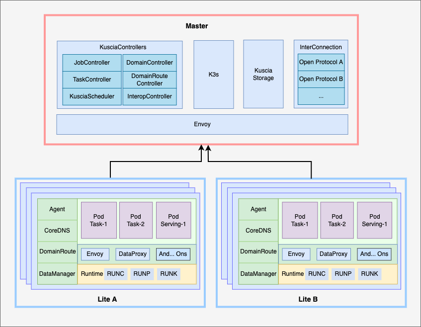

# Kuscia

<a href="./README.zh-CN.md">简体中文</a>｜<a href="./README.md">English</a>

Kuscia（Kubernetes-based Secure Collaborative InfrA）是一款基于 K8s 的隐私计算应用编排框架，旨在屏蔽异构基础设施和协议，并提供统一的隐私计算底座。通过 Kuscia：

* 你可以快速体验隐私计算功能。
* 你可以获得完整的隐私计算生产能力。
* 你可以与行业内多种隐私计算系统进行互联互通。
* 你可以使用不同的中心化或点对点业务组网模式。

## 文档

- [Kuscia](https://www.secretflow.org.cn/docs/kuscia/latest/zh-Hans/)
- [准备开始](https://www.secretflow.org.cn/docs/kuscia/latest/zh-Hans/getting_started/index.html)
- [参考手册](https://www.secretflow.org.cn/docs/kuscia/latest/zh-Hans/reference/index.html)
- [教程](https://www.secretflow.org.cn/docs/kuscia/latest/zh-Hans/tutorial/index.html)
- [开发](https://www.secretflow.org.cn/docs/kuscia/latest/zh-Hans/development/index.html)

## 贡献代码

请查阅 [CONTRIBUTING.md](./CONTRIBUTING.md)

## 声明

非正式发布的 Kusica 版本仅用于演示，请勿在生产环境中使用。尽管此版本已涵盖 Kuscia 的基础功能，但由于项目存在功能不足和待完善项，可能存在部分安全问题和功能缺陷。因此，我们欢迎你积极提出建议，并期待正式版本的发布。
