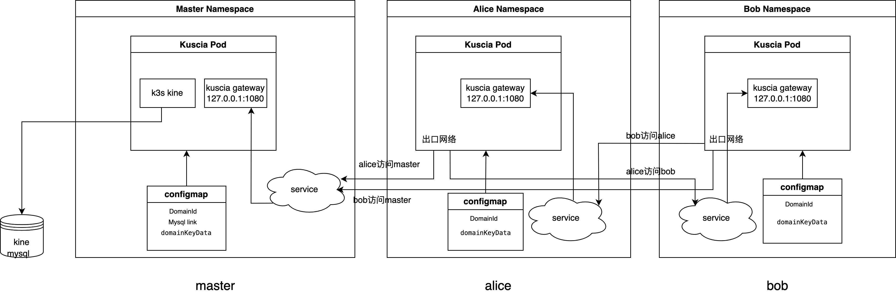

# 部署中心化集群

## 前言
本教程帮助你在 K8s 集群上使用 [中心化组网模式](../../reference/architecture_cn.md#中心化组网模式) 来部署 Kuscia 集群。

目前 Kuscia 在部署到 K8s 上时，隐私计算任务的运行态支持 RunK 和 RunP 两种模式， RunC 模式目前需要部署 Kuscia 的 Pod 有特权容器，暂时不是特别推荐。详情请参考[容器运行模式](../../reference/architecture_cn.md#agent)

本教程默认以 RunK 模式来进行部署（需要能够有权限在宿主的 K8s 上拉起任务 Pod）， RunP 模式的部署请参考 [使用进程运行时部署节点](../deploy_with_runp_cn.md)。



## 部署 Master

### 前置准备

部署 Master 需提前准备好 Mysql 数据库表并且符合[Kuscia配置](../kuscia_config_cn.md#id3)中的规范，数据库帐号密码等信息配置在步骤三 Configmap 中。

### 步骤一：创建 Namespace
> 创建 Namespace 需要先获取 create 权限，避免出现 "namespaces is forbidden" 报错

Namespace 名称可以按照自己的意愿来定，也可以复用已经有的，下文以 kuscia-master 为例（Namespace 名称需要与 yaml 文件里的 Namespace 字段对应起来）
```bash
kubectl create ns kuscia-master
```

### 步骤二：创建 Service

获取 [service.yaml](https://github.com/secretflow/kuscia/blob/main/hack/k8s/master/service.yaml) 文件，创建 service

<span style="color:red;">注意：<br>
1、需要对合作方暴露的 Kuscia 端口，可参考 [Kuscia 端口介绍](../kuscia_ports_cn.md) </span>

```bash
kubectl create -f service.yaml
```

### 步骤三：创建 Configmap
ConfigMap 是用来配置 Kuscia 的配置文件，详细的配置文件介绍参考[Kuscia配置](../kuscia_config_cn.md)

domainID、私钥以及 datastoreEndpoint 字段里的数据库连接串（user、password、host、database）需要替换成真实有效的信息，私钥可以通过命令 `docker run -it --rm secretflow-registry.cn-hangzhou.cr.aliyuncs.com/secretflow/kuscia scripts/deploy/generate_rsa_key.sh` 生成
> 注意：<br>
> - database 名称暂不支持 "-" 特殊字符<br>
> - 修改 Configmap 配置后，需执行 kubectl delete po {pod-name} -n {namespace} 重新拉起 Pod 生效<br>
> - 节点 ID 需要符合 DNS 子域名规则要求，详情请参考[这里](https://kubernetes.io/zh-cn/docs/concepts/overview/working-with-objects/names/#dns-subdomain-names)

获取 [configmap.yaml](https://github.com/secretflow/kuscia/blob/main/hack/k8s/master/configmap.yaml) 文件，创建 Configmap；因为这里面涉及很多敏感配置，请在生产时务必重新配置，不使用默认配置。

```bash
kubectl create -f configmap.yaml
```

### 步骤四：创建 Deployment

获取 [deployment.yaml](https://github.com/secretflow/kuscia/blob/main/hack/k8s/master/deployment.yaml) 文件，创建 Deployment
```bash
kubectl create -f deployment.yaml
```

## 部署 Lite

### 步骤一：创建 Namespace
> 创建 Namespace 需要先获取 create 权限，避免出现 "namespaces is forbidden" 报错

Namespace 名称可以按照自己的意愿来定，也可以复用已经有的，下文以 lite-alice 为例（Namespace 名称需要与 yaml 文件里的 Namespace 字段对应起来）
```bash
kubectl create ns lite-alice
```

### 步骤二：创建 Service

获取 [service.yaml](https://github.com/secretflow/kuscia/blob/main/hack/k8s/lite/service.yaml) 文件，如果 master 与 lite 不在一个 K8s 集群内，
可以将 master Service 的类型改为 [LoadBalancer](https://kubernetes.io/zh-cn/docs/concepts/services-networking/service/#loadbalancer)（公有云，
例如：[阿里云](https://help.aliyun.com/zh/ack/serverless-kubernetes/user-guide/use-annotations-to-configure-load-balancing)）或者 [NodePort](https://kubernetes.io/zh-cn/docs/concepts/services-networking/service/#type-nodeport)，
并在 Configmap 的 masterEndpoint 字段改为可正常访问的地址，创建 Service。

<span style="color:red;">注意：<br>
1、需要对合作方暴露的 Kuscia 端口，可参考 [Kuscia 端口介绍](../kuscia_ports_cn.md) </span>

```bash
kubectl create -f service.yaml
```

### 步骤三：创建 Configmap
ConfigMap 是用来配置 Kuscia 的配置文件，详细的配置文件介绍参考[Kuscia配置](../kuscia_config_cn.md)

部署 Configmap 需要提前在 Master 节点 Pod 内生成 domainID 以及 Token，并填写到 Configmap 的 domainID 和 liteDeployToken 字段中，私钥可以通过命令 `docker run -it --rm secretflow-registry.cn-hangzhou.cr.aliyuncs.com/secretflow/kuscia scripts/deploy/generate_rsa_key.sh` 生成并填写到 domainKeyData 字段中
> 注意：<br>
> - 目前节点私钥仅支持 pkcs#1 格式: "BEGIN RSA PRIVATE KEY/END RSA PRIVATE KEY"<br>
> - 修改 Configmap 配置后，需执行 kubectl delete po pod-name -n namespace 重新拉起 Pod 生效<br>
> - 节点 ID 需要符合 DNS 子域名规则要求，详情请参考[这里](https://kubernetes.io/zh-cn/docs/concepts/overview/working-with-objects/names/#dns-subdomain-names)

lite-bob 配置与 lite-alice 一样，下面以 Alice 为例：
```bash
kubectl exec -it ${master_pod_name} bash -n kuscia-master
# [pod 内部] 获取节点 Token
scripts/deploy/add_domain_lite.sh alice
# [pod 内部] 示例 Token
BMC4xjNqa7uAmWmyXLuJ4rrZw6brZeax
# [pod 内部] 如果 Token 遗忘了，可以通过该命令重新获取
kubectl get domain alice -o=jsonpath='{.status.deployTokenStatuses[?(@.state=="unused")].token}' && echo
```

特殊说明：为了使 ServiceAccount 具有创建、查看、删除等资源权限，RunK 模式提供两种方式：
- 方式一：在 Configmap 的 KubeconfigFile 字段配置具有同等权限的 Kubeconfig
- 方式二：不配置 KubeconfigFile，执行步骤四，创建具有所需权限的 Role 和 RoleBinding


获取 [configmap.yaml](https://github.com/secretflow/kuscia/blob/main/hack/k8s/lite/configmap.yaml) 文件，创建 Configmap；因为这里面涉及很多敏感配置，请在生产时务必重新配置，不使用默认配置。
```bash
kubectl create -f comfigmap.yaml
```

### 步骤四（可选）：创建 RBAC

获取 [rbac.yaml](https://github.com/secretflow/kuscia/blob/main/hack/k8s/lite/rbac.yaml) 文件，创建 Role 和 RoleBinding
```bash
kubectl create -f rbac.yaml
```

### 步骤五：创建 Deployment
拉起 lite Pod 前可以先检测下与 master 之前的通信是否正常

建议使用 curl -kvvv http://kuscia-master.kuscia-master.svc.cluster.local:1080;（此处以 HTTP 为例，HTTPS 可以删除 master Configmap 里的 Protocol: NOTLS 字段，重启 Pod 生效。LoadBalancer 或者 NodePort 方式可以用 curl -kvvv http://ip:port）检查一下是否访问能通，正常情况下返回的 HTTP 错误码是 401，内容是：unauthorized

示例如下：
```bash
* Rebuilt URL to: http://kuscia-master.kuscia-master.svc.cluster.local:1080/
*   Trying 192.168.72.65...
* TCP_NODELAY set
* Connected to kuscia-master.kuscia-master.svc.cluster.local (192.168.72.65) port 1080 (#0)
> GET / HTTP/1.1
> Host: kuscia-master.kuscia-master.svc.cluster.local:1080
> User-Agent: curl/7.61.1
> Accept: */*
>
< HTTP/1.1 401 Unauthorized
< x-accel-buffering: no
< content-length: 13
< content-type: text/plain
< kuscia-error-message: Domain kuscia-system.kuscia-master-7d588b4577-9zxbs<--kuscia-master.kuscia-master.svc.cluster.local return http code 401.
< date: Wed, 29 Nov 2023 07:59:04 GMT
< server: kuscia-gateway
<
* Connection #0 to host kuscia-master.kuscia-master.svc.cluster.local left intact
unauthorized.
```

<span style="color:red;">注意：如果 master 的入口网络存在网关时，为了确保节点与 master 之间通信正常，需要网关符合一些要求，详情请参考[这里](../networkrequirements.md)</span>

获取 [deployment.yaml](https://github.com/secretflow/kuscia/blob/main/hack/k8s/lite/deployment.yaml) 文件，创建 deployment
```bash
kubectl create -f deployement.yaml
```

### 创建 lite-alice、lite-bob 之间的授权
> PS：目前因为安全性和时间因素，节点之间授权还是需要很多手动的操作，未来会优化。

```bash
# 登录 Master
kubectl exec -it ${master_pod_name} bash -n kuscia-master
# [pod 内部] 创建 Alice 到 Bob 的授权
scripts/deploy/create_cluster_domain_route.sh alice bob http://kuscia-lite-bob.lite-bob.svc.cluster.local:1080
# [pod 内部] 创建 Bob 到 Alice 的授权
scripts/deploy/create_cluster_domain_route.sh bob alice http://kuscia-lite-alice.lite-alice.svc.cluster.local:1080
# [pod 内部] 执行以下命令，查看是否有内容，如果有说明 Alice 到 Bob 授权建立成功。
kubectl get cdr alice-bob -o=jsonpath="{.status.tokenStatus.sourceTokens[*]}"
# [pod 内部] 执行以下命令，查看是否有内容，如果有说明 Bob 到 Alice 授权建立成功
kubectl get cdr bob-alice -o=jsonpath="{.status.tokenStatus.sourceTokens[*]}"
```
`pod 内部` 在执行 Master Pod 内执行 `kubectl get cdr` 返回 Ready 为 True 时，表示授权成功，示例如下：
```bash
NAME                  SOURCE   DESTINATION     HOST                                             AUTHENTICATION   READY
alice-kuscia-system   alice    kuscia-system                                                    Token            True
bob-kuscia-system     bob      kuscia-system                                                    Token            True
alice-bob             alice    bob             kuscia-lite-bob.lite-bob.svc.cluster.local       Token            True
bob-alice             bob      alice           kuscia-lite-alice.lite-alice.svc.cluster.local   Token            True
```
授权失败，请参考[授权错误排查](../../reference/troubleshoot/networkauthorizationcheck.md)文档

## 确认部署成功
### 检查 Pod 状态
pod 处于 running 状态表示部署成功
```bash
kuebctl get po -n kuscia-master
kubectl get po -n lite-alice
```
### 检查数据库连接状态
数据库内生成表格 Kine 并且有数据表示数据库连接成功

## 运行任务

> RunK 模式不支持使用本地数据训练，请准备[OSS数据](K8s_master_lite_cn.md#准备-oss-测试数据)。使用本地数据请先切换至 RunP 模式，详情请参考 [使用 RunP 运行时部署节点](./deploy_with_runp_cn.md)。

### 准备本地测试数据
#### Alice 节点准备本地测试数据

登录到 Alice 节点的 Pod 中
```bash
kubectl exec -it ${alice_pod_name} bash -n lite-alice
```

为 Alice 节点创建本地数据源

创建 DomainData 的时候要指定 datasource_id，所以要先创建数据源，再创建 DomainData，示例如下：
```bash
# 在容器内执行示例
export CTR_CERTS_ROOT=/home/kuscia/var/certs
curl -k -X POST 'https://localhost:8082/api/v1/domaindatasource/create' \
 --header 'Content-Type: application/json' \
 --cacert ${CTR_CERTS_ROOT}/ca.crt \
 -d '{
  "domain_id": "alice",
  "datasource_id":"default-data-source",
  "type":"localfs",
  "name": "DemoDataSource",
  "info": {
      "localfs": {
          "path": "/home/kuscia/var/storage/data"
      }
  },
  "access_directly": true
}'
```

为 Alice 的测试数据创建 DomainData
```bash
# 在 alice 容器内执行示例
export CTR_CERTS_ROOT=/home/kuscia/var/certs
curl -X POST 'http://127.0.0.1:8082/api/v1/domaindata/create' \
--header 'Content-Type: application/json' \
--cacert ${CTR_CERTS_ROOT}/ca.crt \
-d '{
  "domaindata_id": "alice-table",
  "name": "alice.csv",
  "type": "table",
  "relative_uri": "alice.csv",
  "domain_id": "alice",
  "datasource_id": "default-data-source",
  "attributes": {
    "description": "alice demo data"
  },
  "columns": [
    {
      "comment": "",
      "name": "id1",
      "type": "str"
    },
    {
      "comment": "",
      "name": "age",
      "type": "float"
    },
    {
      "comment": "",
      "name": "education",
      "type": "float"
    },
    {
      "comment": "",
      "name": "default",
      "type": "float"
    },
    {
      "comment": "",
      "name": "balance",
      "type": "float"
    },
    {
      "comment": "",
      "name": "housing",
      "type": "float"
    },
    {
      "comment": "",
      "name": "loan",
      "type": "float"
    },
    {
      "comment": "",
      "name": "day",
      "type": "float"
    },
    {
      "comment": "",
      "name": "duration",
      "type": "float"
    },
    {
      "comment": "",
      "name": "campaign",
      "type": "float"
    },
    {
      "comment": "",
      "name": "pdays",
      "type": "float"
    },
    {
      "comment": "",
      "name": "previous",
      "type": "float"
    },
    {
      "comment": "",
      "name": "job_blue-collar",
      "type": "float"
    },
    {
      "comment": "",
      "name": "job_entrepreneur",
      "type": "float"
    },
    {
      "comment": "",
      "name": "job_housemaid",
      "type": "float"
    },
    {
      "comment": "",
      "name": "job_management",
      "type": "float"
    },
    {
      "comment": "",
      "name": "job_retired",
      "type": "float"
    },
    {
      "comment": "",
      "name": "job_self-employed",
      "type": "float"
    },
    {
      "comment": "",
      "name": "job_services",
      "type": "float"
    },
    {
      "comment": "",
      "name": "job_student",
      "type": "float"
    },
    {
      "comment": "",
      "name": "job_technician",
      "type": "float"
    },
    {
      "comment": "",
      "name": "job_unemployed",
      "type": "float"
    },
    {
      "comment": "",
      "name": "marital_divorced",
      "type": "float"
    },
    {
      "comment": "",
      "name": "marital_married",
      "type": "float"
    },
    {
      "comment": "",
      "name": "marital_single",
      "type": "float"
    }
  ],
  "vendor": "manual",
  "author": "alice"
}'
```

将 Alice 的 DomainData 授权给 Bob
```bash
# 在 alice 容器内执行示例
export CTR_CERTS_ROOT=/home/kuscia/var/certs
curl -X POST 'http://127.0.0.1:8082/api/v1/domaindatagrant/create' \
--cacert ${CTR_CERTS_ROOT}/ca.crt \
--header 'Content-Type: application/json' \
-d '{ "grant_domain": "bob",
      "description": {"domaindatagrant":"alice-bob"},
      "domain_id": "alice",
      "domaindata_id": "alice-table"
}'
```

#### Bob 节点准备本地测试数据

登录到 Bob 节点的 Pod 中
```bash
kubectl exec -it ${bob_pod_name} bash -n lite-bob
```

为 Bob 节点创建本地数据源

创建 DomainData 的时候要指定 datasource_id，所以要先创建数据源，再创建 DomainData，示例如下：
```bash
export CTR_CERTS_ROOT=/home/kuscia/var/certs
curl -k -X POST 'https://localhost:8082/api/v1/domaindatasource/create' \
 --header 'Content-Type: application/json' \
 --cacert ${CTR_CERTS_ROOT}/ca.crt \
 -d '{
  "domain_id": "bob",
  "datasource_id":"default-data-source",
  "type":"localfs",
  "name": "DemoDataSource",
  "info": {
      "localfs": {
          "path": "/home/kuscia/var/storage/data"
      }
  },
  "access_directly": true
}'
```

为 Bob 的测试数据创建 domaindata
```bash
# 在 bob 容器内执行示例
export CTR_CERTS_ROOT=/home/kuscia/var/certs
curl -X POST 'http://127.0.0.1:8082/api/v1/domaindata/create' \
--header 'Content-Type: application/json' \
--cacert ${CTR_CERTS_ROOT}/ca.crt \
-d '{
  "domaindata_id": "bob-table",
  "name": "bob.csv",
  "type": "table",
  "relative_uri": "bob.csv",
  "domain_id": "bob",
  "datasource_id": "default-data-source",
  "attributes": {
    "description": "bob demo data"
  },
  "columns": [
    {
      "comment": "",
      "name": "id2",
      "type": "str"
    },
    {
      "comment": "",
      "name": "contact_cellular",
      "type": "float"
    },
    {
      "comment": "",
      "name": "contact_telephone",
      "type": "float"
    },
    {
      "comment": "",
      "name": "contact_unknown",
      "type": "float"
    },
    {
      "comment": "",
      "name": "month_apr",
      "type": "float"
    },
    {
      "comment": "",
      "name": "month_aug",
      "type": "float"
    },
    {
      "comment": "",
      "name": "month_dec",
      "type": "float"
    },
    {
      "comment": "",
      "name": "month_feb",
      "type": "float"
    },
    {
      "comment": "",
      "name": "month_jan",
      "type": "float"
    },
    {
      "comment": "",
      "name": "month_jul",
      "type": "float"
    },
    {
      "comment": "",
      "name": "month_jun",
      "type": "float"
    },
    {
      "comment": "",
      "name": "month_mar",
      "type": "float"
    },
    {
      "comment": "",
      "name": "month_may",
      "type": "float"
    },
    {
      "comment": "",
      "name": "month_nov",
      "type": "float"
    },
    {
      "comment": "",
      "name": "month_oct",
      "type": "float"
    },
    {
      "comment": "",
      "name": "month_sep",
      "type": "float"
    },
    {
      "comment": "",
      "name": "poutcome_failure",
      "type": "float"
    },
    {
      "comment": "",
      "name": "poutcome_other",
      "type": "float"
    },
    {
      "comment": "",
      "name": "poutcome_success",
      "type": "float"
    },
    {
      "comment": "",
      "name": "poutcome_unknown",
      "type": "float"
    },
    {
      "comment": "",
      "name": "y",
      "type": "int"
    }
  ],
  "vendor": "manual",
  "author": "bob"
}'
```
将 Bob 的 DomainData 授权给 Alice

```bash
# 在 bob 容器内执行示例
export CTR_CERTS_ROOT=/home/kuscia/var/certs
curl -X POST 'http://127.0.0.1:8082/api/v1/domaindatagrant/create' \
--cacert ${CTR_CERTS_ROOT}/ca.crt \
--header 'Content-Type: application/json' \
-d '{ "grant_domain": "alice",
      "description": {"domaindatagrant":"bob-alice"},
      "domain_id": "bob",
      "domaindata_id": "bob-table"
}'
```

### 准备 OSS 测试数据
#### Alice 节点准备 OSS 数据

请先将 Alice 节点测试数据 [alice.csv](https://github.com/secretflow/kuscia/blob/main/testdata/alice.csv) 上传至 OSS

登录到 Alice 节点的 Pod 中
```bash
kubectl exec -it ${alice_pod_name} bash -n lite-alice
```

为 Alice 节点创建 OSS 数据源

创建 DomainData 的时候要指定 datasource_id，所以要先创建数据源，再创建 DomainData，示例如下：
```bash
# 在 alice 容器内执行示例
export CTR_CERTS_ROOT=/home/kuscia/var/certs
curl -k -X POST 'http://localhost:8082/api/v1/domaindatasource/create' \
--header 'Content-Type: application/json' \
--cacert ${CTR_CERTS_ROOT}/ca.crt \
-d '{
   "domain_id": "alice",
   "datasource_id":"default-data-source",
   "type":"oss",
   "name": "DemoDataSource",
   "info": {
      "oss": {
          "endpoint": "https://oss.xxx.cn-xxx.com",
          "bucket": "secretflow",
          "prefix": "kuscia/",
          "access_key_id":"ak-xxxx",
          "access_key_secret" :"sk-xxxx"
#         "virtualhost": true (阿里云 OSS 需要配置此项)
#         "storage_type": "minio" (Minio 需要配置此项)
      }
  },
  "access_directly": true
}'
```

为 Alice 的测试数据创建 DomainData
```bash
# 在 alice 容器内执行示例
export CTR_CERTS_ROOT=/home/kuscia/var/certs
curl -X POST 'http://127.0.0.1:8082/api/v1/domaindata/create' \
--header 'Content-Type: application/json' \
--cacert ${CTR_CERTS_ROOT}/ca.crt \
-d '{
  "domaindata_id": "alice-table",
  "name": "alice.csv",
  "type": "table",
  "relative_uri": "alice.csv",
  "domain_id": "alice",
  "datasource_id": "default-data-source",
  "attributes": {
    "description": "alice demo data"
  },
  "columns": [
    {
      "comment": "",
      "name": "id1",
      "type": "str"
    },
    {
      "comment": "",
      "name": "age",
      "type": "float"
    },
    {
      "comment": "",
      "name": "education",
      "type": "float"
    },
    {
      "comment": "",
      "name": "default",
      "type": "float"
    },
    {
      "comment": "",
      "name": "balance",
      "type": "float"
    },
    {
      "comment": "",
      "name": "housing",
      "type": "float"
    },
    {
      "comment": "",
      "name": "loan",
      "type": "float"
    },
    {
      "comment": "",
      "name": "day",
      "type": "float"
    },
    {
      "comment": "",
      "name": "duration",
      "type": "float"
    },
    {
      "comment": "",
      "name": "campaign",
      "type": "float"
    },
    {
      "comment": "",
      "name": "pdays",
      "type": "float"
    },
    {
      "comment": "",
      "name": "previous",
      "type": "float"
    },
    {
      "comment": "",
      "name": "job_blue-collar",
      "type": "float"
    },
    {
      "comment": "",
      "name": "job_entrepreneur",
      "type": "float"
    },
    {
      "comment": "",
      "name": "job_housemaid",
      "type": "float"
    },
    {
      "comment": "",
      "name": "job_management",
      "type": "float"
    },
    {
      "comment": "",
      "name": "job_retired",
      "type": "float"
    },
    {
      "comment": "",
      "name": "job_self-employed",
      "type": "float"
    },
    {
      "comment": "",
      "name": "job_services",
      "type": "float"
    },
    {
      "comment": "",
      "name": "job_student",
      "type": "float"
    },
    {
      "comment": "",
      "name": "job_technician",
      "type": "float"
    },
    {
      "comment": "",
      "name": "job_unemployed",
      "type": "float"
    },
    {
      "comment": "",
      "name": "marital_divorced",
      "type": "float"
    },
    {
      "comment": "",
      "name": "marital_married",
      "type": "float"
    },
    {
      "comment": "",
      "name": "marital_single",
      "type": "float"
    }
  ],
  "vendor": "manual",
  "author": "alice"
}'
```

将 Alice 的 DomainData 授权给 Bob
```bash
# 在 alice 容器内执行示例
export CTR_CERTS_ROOT=/home/kuscia/var/certs
curl -X POST 'http://127.0.0.1:8082/api/v1/domaindatagrant/create' \
--cacert ${CTR_CERTS_ROOT}/ca.crt \
--header 'Content-Type: application/json' \
-d '{ "grant_domain": "bob",
      "description": {"domaindatagrant":"alice-bob"},
      "domain_id": "alice",
      "domaindata_id": "alice-table"
}'
```

#### Bob 节点准备 OSS 测试数据

请先将 Bob 节点测试数据 [bob.csv](https://github.com/secretflow/kuscia/blob/main/testdata/bob.csv) 上传至 OSS

登录到 Bob 节点的 Pod 中
```bash
kubectl exec -it ${bob_pod_name} bash -n lite-bob
```

为 Bob 节点创建 OSS 数据源

创建 DomainData 的时候要指定 datasource_id，所以要先创建数据源，再创建 DomainData，示例如下：
```bash
# 在 bob 容器内执行示例
export CTR_CERTS_ROOT=/home/kuscia/var/certs
curl -k -X POST 'http://localhost:8082/api/v1/domaindatasource/create' \
--header 'Content-Type: application/json' \
--cacert ${CTR_CERTS_ROOT}/ca.crt \
-d '{
   "domain_id": "bob",
   "datasource_id":"default-data-source",
   "type":"oss",
   "name": "DemoDataSource",
   "info": {
      "oss": {
          "endpoint": "https://oss.xxx.cn-xxx.com",
          "bucket": "secretflow",
          "prefix": "kuscia/",
          "access_key_id":"ak-xxxx",
          "access_key_secret" :"sk-xxxx"
#         "virtualhost": true (阿里云 OSS 需要配置此项)
#         "storage_type": "minio" (Minio 需要配置此项)
      }
  },
  "access_directly": true
}'
```

为 Bob 的测试数据创建 DomainData
```bash
# 在 bob 容器内执行示例
export CTR_CERTS_ROOT=/home/kuscia/var/certs
curl -X POST 'http://127.0.0.1:8082/api/v1/domaindata/create' \
--header 'Content-Type: application/json' \
--cacert ${CTR_CERTS_ROOT}/ca.crt \
-d '{
  "domaindata_id": "bob-table",
  "name": "bob.csv",
  "type": "table",
  "relative_uri": "bob.csv",
  "domain_id": "bob",
  "datasource_id": "default-data-source",
  "attributes": {
    "description": "bob demo data"
  },
  "columns": [
    {
      "comment": "",
      "name": "id2",
      "type": "str"
    },
    {
      "comment": "",
      "name": "contact_cellular",
      "type": "float"
    },
    {
      "comment": "",
      "name": "contact_telephone",
      "type": "float"
    },
    {
      "comment": "",
      "name": "contact_unknown",
      "type": "float"
    },
    {
      "comment": "",
      "name": "month_apr",
      "type": "float"
    },
    {
      "comment": "",
      "name": "month_aug",
      "type": "float"
    },
    {
      "comment": "",
      "name": "month_dec",
      "type": "float"
    },
    {
      "comment": "",
      "name": "month_feb",
      "type": "float"
    },
    {
      "comment": "",
      "name": "month_jan",
      "type": "float"
    },
    {
      "comment": "",
      "name": "month_jul",
      "type": "float"
    },
    {
      "comment": "",
      "name": "month_jun",
      "type": "float"
    },
    {
      "comment": "",
      "name": "month_mar",
      "type": "float"
    },
    {
      "comment": "",
      "name": "month_may",
      "type": "float"
    },
    {
      "comment": "",
      "name": "month_nov",
      "type": "float"
    },
    {
      "comment": "",
      "name": "month_oct",
      "type": "float"
    },
    {
      "comment": "",
      "name": "month_sep",
      "type": "float"
    },
    {
      "comment": "",
      "name": "poutcome_failure",
      "type": "float"
    },
    {
      "comment": "",
      "name": "poutcome_other",
      "type": "float"
    },
    {
      "comment": "",
      "name": "poutcome_success",
      "type": "float"
    },
    {
      "comment": "",
      "name": "poutcome_unknown",
      "type": "float"
    },
    {
      "comment": "",
      "name": "y",
      "type": "int"
    }
  ],
  "vendor": "manual",
  "author": "bob"
}'
```

将 Bob 的 DomainData 授权给 Alice
```bash
# 在 bob 容器内执行示例
export CTR_CERTS_ROOT=/home/kuscia/var/certs
curl -X POST 'http://127.0.0.1:8082/api/v1/domaindatagrant/create' \
--cacert ${CTR_CERTS_ROOT}/ca.crt \
--header 'Content-Type: application/json' \
-d '{ "grant_domain": "alice",
      "description": {"domaindatagrant":"bob-alice"},
      "domain_id": "bob",
      "domaindata_id": "bob-table"
}'
```

### 创建 AppImage

- 登录到 Master pod
```bash
kubectl exec -it ${master_pod_name} bash -n kuscia-master
```
`pod 内部`获取 [AppImage.yaml](https://github.com/secretflow/kuscia/blob/main/hack/k8s/AppImage.yaml) 文件并创建 AppImage
```bash
kubectl apply -f AppImage.yaml
```

### 执行测试作业
- 登录到 Master pod
```bash
kubectl exec -it ${master_pod_name} bash -n kuscia-master
```

`pod 内部`创建并启动作业（两方 PSI 任务）
```bash
scripts/user/create_example_job.sh
```

`pod 内部`查看作业状态
```bash
kubectl get kj -n cross-domain
```

Runk 模式可以在 Kuscia Pod 所在集群中执行如下命令查看引擎日志
```bash
kubectl logs ${engine_pod_name} -n kuscia-master
```