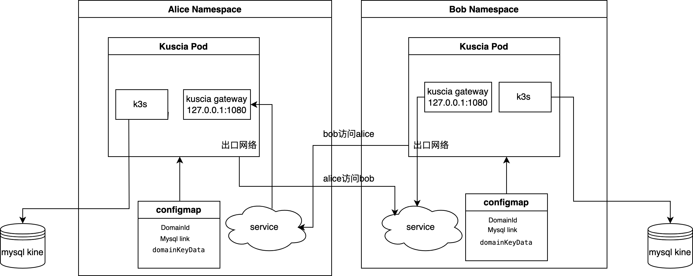

# 部署点对点集群

## 前言
本教程帮助你在 K8s 集群上使用 [点对点组网模式](../../reference/architecture_cn.md#点对点组网模式) 来部署 Kuscia 集群。

目前 Kuscia 在部署到 K8s 上时，隐私计算任务的运行态支持 RunK 和 RunP 两种模式， RunC 模式目前需要部署 Kuscia 的 Pod 有特权容器，暂时不是特别推荐。详情请参考[容器运行模式](../../reference/architecture_cn.md#agent)

本教程默认以 RunK 模式来进行部署（需要能够有权限在宿主的 K8s 上拉起任务 Pod）， RunP 模式的部署请参考 [使用进程运行时部署节点](../deploy_with_runp_cn.md)。



## 部署 Autonomy

### 前置准备

部署 Autonomy 需提前准备好 Mysql 数据库表并且符合 [Kuscia配置](../kuscia_config_cn.md#id3)中的规范，数据库帐号密码等信息配置在步骤三 Configmap 中。

### 步骤一：创建 Namespace
> 创建 Namespace 需要先获取 create 权限，避免出现 "namespaces is forbidden" 报错

Namespace 名称可以按照自己的意愿来定，也可以复用已经有的，下文以 autonomy-alice 为例（Namespace 名称需要与 yaml 文件里的 Namespace 字段对应起来）
```bash
kubectl create ns autonomy-alice
```

### 步骤二：创建 Service

获取 [service.yaml](https://github.com/secretflow/kuscia/blob/main/hack/k8s/autonomy/service.yaml) 文件，创建这个 Service

<span style="color:red;">注意：<br>
1、需要对合作方暴露的 Kuscia 端口，可参考 [Kuscia 端口介绍](../kuscia_ports_cn.md) </span>

```bash
kubectl create -f service.yaml
```

### 步骤三：创建 Configmap
ConfigMap 是用来配置 Kuscia 的配置文件，详细的配置文件介绍参考[Kuscia配置](../kuscia_config_cn.md)

domainID、私钥以及 datastoreEndpoint 字段里的数据库连接串（user、password、host、database）需要替换成真实有效的信息，私钥可以通过命令 `docker run -it --rm secretflow-registry.cn-hangzhou.cr.aliyuncs.com/secretflow/kuscia scripts/deploy/generate_rsa_key.sh`生成
> 注意：<br>
1、database 名称暂不支持 "-" 特殊字符<br>
2、目前节点私钥仅支持 pkcs#1 格式: "BEGIN RSA PRIVATE KEY/END RSA PRIVATE KEY"<br>
3、修改 Configmap 配置后，需执行 kubectl delete po pod-name -n namespace 重新拉起 Pod 生效

<span style="color:red;">注意：节点 ID 需要符合 DNS 子域名规则要求，详情请参考[这里](https://kubernetes.io/zh-cn/docs/concepts/overview/working-with-objects/names/#dns-subdomain-names)</span>

特殊说明：为了使 ServiceAccount 具有创建、查看、删除等资源权限，RunK 模式提供两种方式：
- 方式一：在 Configmap 的 KubeconfigFile 字段配置具有同等权限的 Kubeconfig
- 方式二：不配置 KubeconfigFile，执行步骤四，创建具有所需权限的 Role 和 RoleBinding

获取 [configmap.yaml](https://github.com/secretflow/kuscia/blob/main/hack/k8s/autonomy/configmap.yaml) 文件，创建这个 Configmap；因为这里面涉及很多敏感配置，请在生产时务必重新配置，不使用默认配置。
```bash
kubectl create -f configmap.yaml
```

### 步骤四（可选）：创建 RBAC

获取 [rbac.yaml](https://github.com/secretflow/kuscia/blob/main/hack/k8s/autonomy/rbac.yaml) 文件，创建 Role 和 RoleBinding
```bash
kubectl create -f rbac.yaml
```

### 步骤四：创建 Deployment

获取 [deployment-autonomy.yaml](https://github.com/secretflow/kuscia/blob/main/hack/k8s/autonomy/deployment.yaml) 文件里，创建这个 Deployment
```bash
kubectl create -f deployment.yaml
```

### 创建 autonomy-alice、autonomy-bob 之间的授权
> PS：目前因为安全性和时间因素，节点之间授权还是需要很多手动的操作，未来会优化。

alice 和 bob 授权之前可以先检测下相互之间的通信是否正常

建议使用 curl -kvvv http://kuscia-autonomy-bob.autonomy-bob.svc.cluster.local:1080;（此处以 HTTP 为例，HTTPS 可以删除 Configmap 里的 Protocol: NOTLS 字段，重启 Pod 生效。[LoadBalancer](https://kubernetes.io/zh-cn/docs/concepts/services-networking/service/#loadbalancer) 或者 [NodePort](https://kubernetes.io/zh-cn/docs/concepts/services-networking/service/#type-nodeport) 方式可以用 curl -kvvv http://ip:port）检查一下是否访问能通，正常情况下返回的 HTTP 错误码是 401，内容是：unauthorized

示例参考[这里](../K8s_deployment_kuscia/K8s_master_lite_cn.md#id6)

<span style="color:red;">注意：如果 alice/bob 的入口网络存在网关时，为了确保节点之间通信正常，需要网关符合一些要求，详情请参考[这里](../networkrequirements.md)</span>

建立 alice 到 bob 授权
```bash
# 将 alice 节点的 domain.crt 证书 cp 到 跳板机当前目录并改名 alice.domain.crt
kubectl cp autonomy-alice/kuscia-autonomy-alice-686d6747c-gc2kk:var/certs/domain.crt alice.domain.crt
# 将 alice.domain.crt 证书 cp 到 bob 节点的里
kubectl cp alice.domain.crt autonomy-bob/kuscia-autonomy-bob-89cf8bc77-cvn9f:var/certs/
# 登录到 bob 节点
kubectl exec -it kuscia-autonomy-bob-89cf8bc77-cvn9f bash -n autonomy-bob
# [pod 内部] 在 bob 里添加 alice 的证书等信息
scripts/deploy/add_domain.sh alice p2p
# 登录到 alice 节点
kubectl exec -it kuscia-autonomy-alice-686d6747c-gc2kk bash -n autonomy-alice
# [pod 内部] 建立 alice 到 bob 的通信
scripts/deploy/join_to_host.sh alice bob http://kuscia-autonomy-bob.autonomy-bob.svc.cluster.local:1080
```

建立 bob 到 alice 授权
```bash
# 将 bob 节点的 domain.crt 证书 cp 到 跳板机当前目录并改 bob.domain.crt
kubectl cp autonomy-bob/kuscia-autonomy-bob-89cf8bc77-cvn9f:var/certs/domain.crt bob.domain.crt
# 将 bob.domain.crt 证书 cp 到 alice 节点的里
kubectl cp bob.domain.crt autonomy-alice/kuscia-autonomy-alice-686d6747c-h78lr:var/certs/
# 登录到 alice 节点
kubectl exec -it kuscia-autonomy-alice-686d6747c-h78lr bash -n autonomy-alice
# [pod 内部] 在 alice 里添加 bob 的证书等信息
scripts/deploy/add_domain.sh bob p2p
# 登录到 bob 节点
kubectl exec -it kuscia-autonomy-bob-89cf8bc77-cvn9f bash -n autonomy-bob
# [pod 内部] 建立 bob 到 alice 的通信
scripts/deploy/join_to_host.sh bob alice http://kuscia-autonomy-alice.autonomy-alice.svc.cluster.local:1080
```

检查双方授权状态

`pod 内部`在 alice 节点内执行 `kubectl get cdr alice-bob -o=jsonpath="{.status.tokenStatus.sourceTokens[*]}"`，在 bob 节点内执行 `kubectl get cdr bob-alice -o=jsonpath="{.status.tokenStatus.sourceTokens[*]}"` 得到下面示例返回结果表示授权成功
```bash
{"effectiveInstances":["kuscia-autonomy-alice-686d6747c-h78lr","kuscia-autonomy-alice-686d6747c-qlh2m"],"expirationTime":"2123-11-24T02:42:12Z","isReady":true,"revision":1,"revisionTime":"2023-11-24T02:42:12Z","token":"dVYZ4Ld/i7msNwuLoT+F8kFaCXbgXk6FziaU5PMASl8ReFfOVpsUt0qijlQaKTLm+OKzABfMQEI4jGeJ/Qsmhr6XOjc+7rkSCa5bmCxw5YVq+UtIFwNnjyRDaBV6A+ViiEMZwuaLIiFMtsPLki2SXzcA7LiLZY3oZvHfgf0m8LenMfU9tmZEptRoTBeL3kKagMBhxLxXL4rZzmI1bBwi49zxwOmg3c/MbDP8JiI6zIM7/NdIAEJhqsbzC5/Yw1qajr7D+NLXhsdrtTDSHN8gSB8D908FxYvcxeUTHqDQJT1mWcXs2N4r/Z/3OydkwJiQQokpjfZsR0T4xmbVTJd5qw=="}
```

`pod 内部`在 alice、bob 节点 pod 内执行 `kubectl get cdr` 返回 Ready 为 True 时，表示授权成功，示例如下：
```bash
NAME        SOURCE   DESTINATION   HOST                                                 AUTHENTICATION   READY
alice-bob   alice    bob           kuscia-autonomy-bob.autonomy-bob.svc.cluster.local   Token            True
bob-alice   bob      alice                                                              Token            True
```
授权失败，请参考[授权错误排查](../../reference/troubleshoot/networkauthorizationcheck.md)文档

## 确认部署成功
### 检查 Pod 状态
pod 处于 running 状态表示部署成功
```bash
kubectl get po -n autonomy-alice
```
### 检查数据库连接状态
数据库内生成表格 kine 并且有数据表示数据库连接成功

## 运行任务

### 准备测试数据
- alice 节点准备测试数据

登录 alice pod
```bash
kubectl exec -it ${alice_pod_name} bash -n autonomy-alice
```

`pod 内部`为 alice 的测试数据创建 domaindata
```bash
scripts/deploy/create_domaindata_alice_table.sh alice
```

`pod 内部`为 alice 的测试数据创建 domaindatagrant
```bash
curl -X POST 'http://127.0.0.1:8082/api/v1/domaindatagrant/create' \
     --cert /home/kuscia/var/certs/kusciaapi-server.crt \
     --key /home/kuscia/var/certs/kusciaapi-server.key \
     --cacert /home/kuscia/var/certs/ca.crt \
     --header "Token: $(cat /home/kuscia/var/certs/token)" \
     --header 'Content-Type: application/json' \
     -d '{ "grant_domain": "bob",
           "description": {"domaindatagrant":"alice-bob"},
           "domain_id": "alice",
           "domaindata_id": "alice-table"
     }'
```
- bob 节点准备测试数据

登录 bob pod
```bash
kubectl exec -it ${bob_pod_name} bash -n autonomy-bob
```

`pod 内部`为 bob 的测试数据创建 domaindata
```bash
scripts/deploy/create_domaindata_bob_table.sh bob
```
`pod 内部`为 bob 的测试数据创建 domaindatagrant

```bash
curl -X POST 'http://127.0.0.1:8082/api/v1/domaindatagrant/create' \
     --cert /home/kuscia/var/certs/kusciaapi-server.crt \
     --key /home/kuscia/var/certs/kusciaapi-server.key \
     --cacert /home/kuscia/var/certs/ca.crt \
     --header "Token: $(cat /home/kuscia/var/certs/token)" \
     --header 'Content-Type: application/json' \
     -d '{ "grant_domain": "alice",
           "description": {"domaindatagrant":"bob-alice"},
           "domain_id": "bob",
           "domaindata_id": "bob-table"
     }'
```

### 创建 AppImage

- [alice 节点]

登录到 alice pod
```bash
kubectl exec -it ${alice_pod_name} bash -n autonomy-alice
```
`pod 内部`获取 [AppImage.yaml](https://github.com/secretflow/kuscia/blob/main/hack/k8s/AppImage.yaml) 文件并创建 AppImage
```bash
kubectl apply -f AppImage.yaml
```

- [bob 节点]

登录到 bob pod
```bash
kubectl exec -it ${bob_pod_name} bash -n autonomy-bob
```
`pod 内部`获取 [AppImage.yaml](https://github.com/secretflow/kuscia/blob/main/hack/k8s/AppImage.yaml) 文件并创建 AppImage
```bash
kubectl apply -f AppImage.yaml
```

### 执行测试作业
登录到 alice pod
```bash
kubectl exec -it ${alice_pod_name} bash -n autonomy-alice
```

`pod 内部`创建并启动作业（两方 PSI 任务）
```bash
scripts/user/create_example_job.sh
```

`pod 内部`查看作业状态
```bash
kubectl get kj -n cross-domain
```