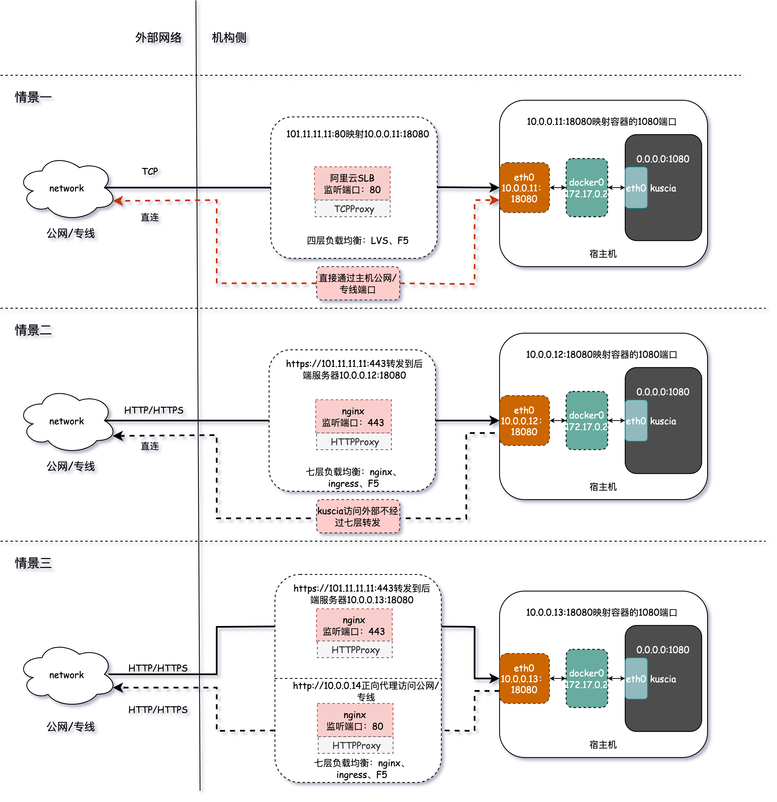

# 网络要求

## 前言

在部署的过程中，复杂的网络环境导致网络通信出现问题时需要花费更多时间去排查问题。特别是在引入了机构网关的情况，因此为了确保节点间通信正常，我们需要对机构网关提出一些要求。

## 参数要求

如果节点与节点、节点与 master 之间存在网关，网关参数则需要满足如下要求：
- 需要支持 HTTP/1.1 协议
- Keepalive 超时时间大于 20 分钟
- 网关支持发送 Body <= 2MB 的内容
- 不针对 request/response 进行缓冲，以免造成性能低下；如果是 nginx 网关可以参考下文的配置
- 隐私计算大量的随机数传输有可能会命中防火墙的一些关键词规则，请提前确保关闭关键词过滤

## 网络联通说明

在部署 kuscia 的过程中，大概会出现以下三种不同的网络映射场景：
- 场景1：机构与外网之间直接`4层`通信。
- 场景2：外部访问机构侧，机构侧有前置的`7层`网关，需要走`7层`代理访问 kusica；kuscia 访问外部正常直接`4层`出去。
- 场景3：机构侧有前置的`7层`网关，外部访问 kuscia 走`7层`代理进来，kuscia 访问外网也需要走`7层`代理出去。

其中：
- 4层：一般指TCP等协议；代理包含阿里云4层 SLB 映射，LVS，F5等方式。
- 7层：一般指 HTTP/HTTPS/GRPC/GRPCS 等协议；代理包含机构7层防火墙、阿里云7层 SLB 映射、nginx、ingress 等方式。

授权地址应该如何填写：
- 在场景 1 中，如果经过了`4层` SLB 映射到 kuscia，当配置外部节点访问本机构的 kuscia 节点时，授权的目标地址可以使用 SLB 对外暴露的 ip 和前端端口，例如：101.11.11.11:80；直连的情况可以授权宿主机 ip 和映射的端口。
- 在场景 2 中，如果经过了`7层` SLB 或者代理映射到 kuscia，当配置外部节点访问本机构的 kuscia 节点时，授权的目标地址可以使用 nginx 代理对外暴露的 ip 和前端端口，例如：https://101.11.11.11:443。
- 在场景 3 中，如果外部和机构侧之间都配置了前置的`7层`网关，当配置外部节点访问本机构的kuscia节点时，授权的目标地址填 https://101.11.11.11:443； 当配置本机构的kuscia节点访问外部节点时，授权的目标地址填 http://10.0.0.14。

> Tips：上述及图片中所使用的 http/https 协议以及 ip 和端口仅作为示例参考，部署时请结合实际需求调整。



## nginx 代理参数配置示例

```bash
http {
    # Default is HTTP/1, keepalive is only enabled in HTTP/1.1
    proxy_http_version 1.1;
    proxy_set_header Connection "";
    proxy_set_header Host $http_host;
    proxy_pass_request_headers on;

    # To allow special characters in headers
    ignore_invalid_headers off;

    # Maximum number of requests through one keep-alive connection
    keepalive_requests 1000;
    keepalive_timeout 20m;

    client_max_body_size 2m;

    # To disable buffering
    proxy_buffering off;
    proxy_request_buffering off;

    upstream backend {
    #   If kuscia is deployed to multiple machines, use the ip of each kuscia here
    #   server 0.0.0.1 weight=1 max_fails=5 fail_timeout=60s;
        server 0.0.0.2 weight=1 max_fails=5 fail_timeout=60s;
    #   Nginx_upstream_check_module can support upstream health check with Nginx
    #   Please refer to the document: https://github.com/yaoweibin/nginx_upstream_check_module/tree/master/doc
    #   check interval=3000 rise=2 fall=5 timeout=1000 type=http;

        keepalive 32;
        keepalive_timeout 600s;
        keepalive_requests 1000;
    }

    server {
        location / {
            proxy_read_timeout 10m;
            proxy_pass http://backend;
    #       Connect to kuscia with https
    #       proxy_pass https://backend;
    #       proxy_ssl_verify off;
    #       proxy_set_header Host $host;
        }
    }

    # This corresponds to case 3 above, kuscia needs to configure a proxy when accessing the internet
    # The port must be different with the reverse proxy port
    # server {
    #    resolver $dns_host_ip;
    #    location / {
    #    proxy_pass ${The address provided by the other organization};
    #    }
    # }
}
```