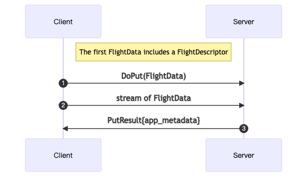

# 如何扩展其他数据源

## 1. 了解流程

在 Kuscia 中，数据源采用代理的方式时，使用 [Apache Arrow](https://arrow.apache.org/) 来完成数据 IO 的交互，Arrow
是一种内存中数据交互的格式标准，可以高效地进行数据传输。在开始之前，可以对 Apache Arrow Flight 进行一个初步了解。

### 1.1 了解 Kuscia 中 Arrow 的数据流

* 读取数据

  

* 写入数据

  

> Client 在 Kuscia 体系中可以理解为 Secretflow 任务节点，获取数据以及上传数据；
>
> Metadata Server 可以理解为 Kuscia 的 datamesh 服务模块，根据入参提供对应的 FlightInfo 信息的服务；
>
> Data Server 是具体提供数据服务 IO 的 Apache Arrow Flight 服务，处理数据获取以及写入；
>
> 写入数据时，也需要先获取一次 FlightInfo 信息，后续写入数据时将会访问此 FlightInfo 中提供的服务地址。

## 2. 业务要求

* 正确处理数据类型的映射，确保数据的正确读取与写入；
* 正确处理 NULL 值（读、写）；
* 数据写入时需保证写入的顺序，避免出现写入乱序；
* 数据写入时进行覆盖写（分区表的话对分区进行覆盖写），保证任务执行时写入数据都是最后一次任务写入的数据；
* 数据读取时需保证读取顺序是和写入一致，某些任务写入数据时已经进行了排序。

## 3. 如何添加

### 3.1 添加 API 类型校验

在添加数据源类型时，首先需要满足通过 Kuscia API
可以添加该数据源类型的支持，在类型校验判断中添加需要接入的数据源类型，并且此数据源类型的枚举需满足开发规范，**避免**后续对该值的
**修改**，以免出现版本升级后的兼容问题，以及其他接入应用的兼容问题。

### 3.2 选择实现语言

在 Kuscia 中，推荐使用 Golang 语言进行数据源扩展实现的开发语言，可以在 Kuscia 中提供原生支持，无需额外启动常驻服务。但某些数据库提供的
SDK 上对 Golang 语言的支持并不一定完善，此时需要使用其他语言进行数据源扩展实现上的开发，因此在 Kuscia
生态体系中提供了 [DataProxy](https://github.com/secretflow/dataproxy)
应用来对数据源提供扩展，DataProxy 采用 Java 语言实现，基于 Java 语言的生态丰富性，基本可以满足大部分数据源的扩展需求。

### 3.3 添加实现

#### 3.3.1 在 Kuscia 中实现 IO 交互

在 Kuscia 中添加扩展实现时，需要在 Kuscia 中添加 GetFlightInfo 接口的修改处理，并实现 IO 交互，
可从接口 `pkg/datamesh/dataserver/io/idataproxy.go` 中阅读并熟悉已有实现逻辑。

```go
type Server interface {
    GetFlightInfo(ctx context.Context, reqCtx *utils.DataMeshRequestContext) (flightInfo *flight.FlightInfo, err error)
    DoGet(tkt *flight.Ticket, fs flight.FlightService_DoGetServer) (err error)
    DoPut(stream flight.FlightService_DoPutServer) (err error)
}
```

了解已有实现后，可实现 `pkg/datamesh/dataserver/io/builtin/dataio.go` 中的 `DataMeshDataIOInterface` 接口来逐步完成数据
IO 扩展。

```go
type DataMeshDataIOInterface interface {
    Read(ctx context.Context, rc *utils.DataMeshRequestContext, w utils.RecordWriter) error
    Write(ctx context.Context, rc *utils.DataMeshRequestContext, stream *flight.Reader) error
    GetEndpointURI() string
}
```

参考代码：[GitHub - Kuscia](https://github.com/secretflow/kuscia/tree/main/pkg/datamesh/dataserver)

#### 3.3.2 在 DataProxy 中实现 IO 交互

参考上述读取数据的流程图中来看，Metadata Server 提供 GetFlightInfo 接口的总入口，
通过 GetFlightInfo 接口来统一提供对应数据源的 IO 服务，那么对于在 DataProxy 中实现的数据类型，需要在 Kuscia
的配置文件中显式配置出来，那么此类的数据源类型将转发至该服务。

显式配置及部署 DataProxy 参考：[如何使用 Kuscia API 部署 DataProxy](../tutorial/run_dp_on_kuscia_cn.md)

参考如下配置示例，可将 ODPS 数据类型转发至 DataProxy 服务中。

```yaml
dataMesh:
  dataProxyList:
    - endpoint: "dataproxy-grpc:8023"
      dataSourceTypes:
        - "odps"
```

##### 3.3.2.1 实现接口

> 约定：
> 1. 符合开发要求规范；
> 2. 添加必要的单元测试；
> 3. 添加集成测试用例；

1. 在 dataproxy-plugins 模块下添加对应数据源模块，并实现接口 `DataProxyFlightProducer`;
2. 将此实现采用 Java SPI 的形式注册，在服务启动时将加载该模块实现，数据请求时将对应数据源类型的数据 IO 请求采用此实现策略处理;
3. 继承 `org.apache.arrow.flight.NoOpFlightProducer` 并重写方法 `getFlightInfo`、`getStream`、`acceptPut`，
   分别完成数据 IO 交互（提供 Kuscia `getFlightInfo` 接口访问、提供 Client 端获取数据、提供 Client 端写入数据）扩展的实现；
4. 验证结果数据正确性，完成单元测试、集成测试用例的编写；
5. 验证大数据量场景下读取与写入性能符合预期；

### 3.4 功能测试

使用基于目标的数据源类型的数据（DomainData），配置任务，执行任务，确保任务成功执行结束，且结果数据可以存储至目标数据源。

## 4. 注意事项

* 日志打印时，不允许出现密码秘钥信息，需进行脱敏处理。
* 进行数据处理时需考虑合理的内存使用问题，避免内存溢出以及内存泄漏问题。
