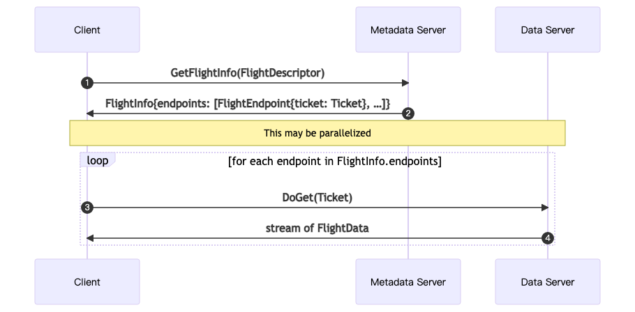
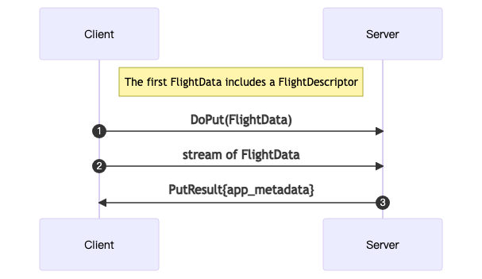

# DataMesh 数据读写

Kuscia DataMesh 提供了基于 gRRC 的数据读写操作，实现了 Arrow Flight 提供的标准的数据服务接口，您可以通过初始化一个 Flight Client 来发起数据的请求。

## 如何通过Arrow Flight访问DataMesh

FlightServiceClient 是 Apache Arrow Flight 框架中客户端的主要接口，它提供了一系列的方法来与 Flight 服务交互，例如获取数据集信息、上传和下载数据等。在本例中，使用 Go 语言展示如何使用 `flight.FlightServiceClient`。

要使用 FlightServiceClient，您需要先建立一个与 Flight 服务端的 gRPC 连接，然后通过这个连接创建一个 FlightServiceClient 实例。

### 查询数据



### 上传数据



## DataMesh 支持的数据服务

DataMesh 当前仅支持以下查询能力:

```go
type FlightServiceClient interface {
 GetFlightInfo(ctx context.Context, in *FlightDescriptor, opts ...grpc.CallOption) (*FlightInfo, error)
 // For a given FlightDescriptor, get the Schema as described in Schema.fbs::Schema
 // This is used when a consumer needs the Schema of flight stream. Similar to
 // GetFlightInfo this interface may generate a new flight that was not previously
 // available in ListFlights.
 GetSchema(ctx context.Context, in *FlightDescriptor, opts ...grpc.CallOption) (*SchemaResult, error)
 // Retrieve a single stream associated with a particular descriptor
 // associated with the referenced ticket. A Flight can be composed of one or
 // more streams where each stream can be retrieved using a separate opaque
 // ticket that the flight service uses for managing a collection of streams.
 DoGet(ctx context.Context, in *Ticket, opts ...grpc.CallOption) (FlightService_DoGetClient, error)
 // Push a stream to the flight service associated with a particular
 // flight stream. This allows a client of a flight service to upload a stream
 // of data. Depending on the particular flight service, a client consumer
 // could be allowed to upload a single stream per descriptor or an unlimited
 // number. In the latter, the service might implement a 'seal' action that
 // can be applied to a descriptor once all streams are uploaded.
 DoPut(ctx context.Context, opts ...grpc.CallOption) (FlightService_DoPutClient, error)
 // Flight services can support an arbitrary number of simple actions in
 // addition to the possible ListFlights, GetFlightInfo, DoGet, DoPut
 // operations that are potentially available. DoAction allows a flight client
 // to do a specific action against a flight service. An action includes
 // opaque request and response objects that are specific to the type action
 // being undertaken.
 DoAction(ctx context.Context, in *Action, opts ...grpc.CallOption) (FlightService_DoActionClient, error)
}
```

## 注意事项

在使用 DataMesh（DataProxy）向支持的各种类型的数据源进行输出时，如果目标文件/表不存在，会<span style="color: red;">自动创建</span>。如果输出目标已经存在，均会尝试进行<span style="color: red;">文件覆盖</span> ，具体来说

1. **localfs**：打开输出文件时进行清空。如果目标目录不存在，会自动逐层创建。
2. **OSS**：直接上传文件。需配置**OSS**为允许自动创建目录、允许文件覆盖。
3. **MySQL**：尝试 `DROP IF EXISTS` ，并重新创建表。 如果 `DROP` 失败，继续尝试 `DELETE` 全表。仍失败则返回报错，退出存储。因此建议为 MySQL 配置 `CREATE / INSERT / SELECT / DROP` 权限。如果不能提供 `DROP` 权限，至少需具备 `DELETE` 权限。但注意此时清表速度将会下降。
4. **ODPS**: 经过 DataProxy 服务代理实现
- 读取数据时，需确保提供的 AK/SK 具备表的读取权限（没有 `Download` 权限只能查询低于 1W 行的数据）。
- 写入数据时，需确保提供的 AK/SK 具备表的覆盖写权限；如果需要 DataProxy 自行建表，需确保具备创建表的权限。
- 写入数据时，若表不存在，将创建表（表结构按照 DomainData 的信息来创建）；若任务配置输出信息中包含分区信息，将创建分区表，并创建分区（分区字段类型断言为字符串类型）。
- 写入数据时，若表已存在，任务输出的分区不存在时，将按照任务配置中输出的分区信息创建分区，需保证分区信息正确并可正常创建，若创建失败，将导致失败报错。
- 写入数据时将采用覆盖写（普通表将覆盖整个表，分区表将覆盖分区）。
