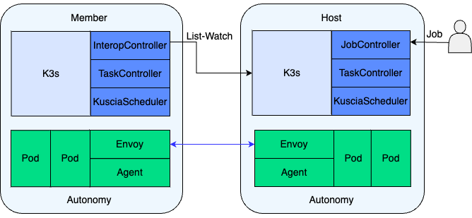

# 架构

Kuscia（Kubernetes-based Secure Collaborative InfrA）是一款基于 K8s 的隐私计算任务编排框架，旨在屏蔽异构基础设施和协议，并提供统一的隐私计算底座。在此基础上，kuscia 提供了资源管理、应用调度、容器加载、服务发现、数据安全访问、运维监控等诸多能力。

Kuscia 集群由控制平面（俗称调度面、Master）和节点组成。控制平面负责调度，节点负责计算。

一般来讲，控制平面和节点之间，1:N 组成了中心化网络，1:1 组成了点对点（P2P）网络。中心化网络中的节点称为 Lite 节点，点对点网络中的节点称为 Autonomy 节点。

Kuscia 支持 Lite 节点与 Autonomy 节点、以及两个中心化网络互联互通，并支持与第三方产商的节点互联互通，从而构建更大的隐私计算网络。

## Kuscia 组件

### 控制平面

控制平面监听和响应集群事件，实现资源管理和应用调度功能，核心组件包括 K3s、Kuscia Controllers、Kuscia Storage(暂未开源)、Envoy、互联互通适配器。

#### K3s

[K3s](https://K3s.io/) 是一个轻量级的 Kubernetes 发行版，用于处理 Kubernetes 的内置资源。

#### Kuscia Controllers

Kuscia 扩展了一组 Kubernetes 控制器，用于处理 Kuscia 的自定义资源，这些控制器包括：

- Job Controller：作业控制器，负责解析作业 DAG 的描述信息，进行 DAG 的编排与多任务调度、采集任务状态。
- Task Controller：任务控制器，负责解析任务的描述信息，实现多方任务的 Co-Scheduling 调度，对应作业 DAG 中的顶点。
- Kuscia Scheduler： Kuscia 调度器，负责多方 Pod 的 Co-Scheduling 调度，具备 All-or-Nothing 调度效果。
- Domain Controller：节点控制器，负责管理节点资源、为节点分配 Namespace。
- DomainRoute Controller：路由控制器，负责管理节点与节点、节点与 Master 的路由规则以及身份认证和鉴权策略。
- InterConn Controllers：互联互通控制器，负责不同控制平面下的节点互通，从而协同完成多方任务调度，支持多种互联互通协议。
- Data Controller: 数据控制器，负责数据授权管理，暂未开源。
- Serving Controller：服务控制器，负责常驻任务流的编排和调度，暂未开源。

#### Kuscia Storage

Kuscia Storage 是对 Kubernetes 原生集群存储的补充。Kubernetes 原生集群存储不适合存储大 value，因此对于大 value 的资源属性，如作业配置等，将存储在 Kuscia Storage
中。该模块暂未开源。

#### Envoy

[Envoy](https://www.Envoyproxy.io/) 是一个开源的边缘和服务代理。在控制平面中，Envoy 是节点与 Master、Master 与 Master 之间的流量代理，从 DomainRoute Controller 接收路由规则和身份认证、鉴权策略。

Envoy 将发送给互联互通合作方 Master 的请求转发到对端的 Envoy（若对端非 Kuscia 架构，则转发给对端网关），同时对来自节点和互联互通合作方 Master
的请求进行身份认证和鉴权，将合法请求转发给 K3s 的 ApiServer 或 Kuscia Storage。

### 节点

节点的全称为隐私计算节点，由一组工作机器（或虚拟机）组成，托管运行隐私计算应用的 Pod。
根据组网模式的不同，节点分为 Lite 和 Autonomy 两种类型：

- 中心化网络中的节点称为 Lite 节点，Lite 节点不包含控制平面。
- 点对点网络（P2P）中的节点称为 Autonomy 节点，每个 Autonomy 节点包含独立的控制平面。

Lite 节点主要由 Agent、NetworkMesh、DataMesh（功能暂不完备），提供容器管理、通信管理、数据管理等功能。

此外，节点支持服务组件可插拔，用户可根据实际场景使用所需要的服务组件。

#### Agent

Agent 主要负责节点实例注册和容器管理。将节点实例注册为 Kubernetes 集群的工作节点后，用于管理 Kubernetes 集群下发的任务 Pod，并对 Pod 生命周期和节点实例生命周期进行管理。

Agent 当前支持 RunC 运行时，后续还将支持 RunP 和 RunK 模式：

- RunK：对接 K8s 集群，以 K8s 的 Pod 形式拉起任务容器。
- RunP：直接在 Agent 容器内以进程形式启动任务进程。

#### NetworkMesh

NetworkMesh 是算法容器之间进行网络通信的基础设施，包含 CoreDNS、DomainRoute、Envoy、Transport 四个组件。

##### CoreDNS

CoreDNS 是一个灵活可扩展的 DNS 服务器，在 Kuscia 中，主要用于解析应用 Service 的域名，从而实现域内的服务发现。

##### DomainRoute

节点侧的 DomainRoute，一方面监听 DomainRoute Controller 配置的节点与节点、节点与 master 之间的路由规则、身份认证和鉴权策略；另一方面监听节点命名空间下的
Service 和 Endpoints，配置 Envoy 的 Upstream Cluster，从而实现跨域的服务发现。

##### Envoy

在节点侧，Envoy 是节点与 Master、节点与节点之间流量代理，从 DomainRoute 接收路由规则、身份认证和鉴权策略以及 Upstream Cluster 配置。

Envoy 将发送给 Master 和合作节点的请求转发给对端的 Envoy（若对端非 Kuscia 架构，则转发给对端网关），同时对来自合作节点的请求进行身份认证和鉴权，
将合法请求转发到目标应用的 Pod 上。

##### Transport

适配《北京金融科技产业联盟互联互通标准》的传输层通信组件，提供消息队列的传输模式。

#### DataMesh

负责数据源和数据集（数据表、模型、任务报告等）的注册和管理，元信息的查询修改功能。注意该组件暂未实现权限管控功能，请勿在生产环境中使用该组件。

## 组网模式

Kuscia 支持两种组网模式：中心化组网模式和点对点组网模式。

{#centralized}

### 中心化组网模式

中心化组网模式下，多个节点共享控制平面，控制平面负责管理多个节点的资源和任务调度。这种模式下节点占用资源较少，称为 Lite 节点。
中心化组网模式适合于大型机构内部的节点互联，通过统一的控制平面，可显著降低运维和资源成本，且便于快速新增节点。

{#peer-to-peer}

### 点对点组网模式

在点对点（P2P: Peer-to-Peer）组网模式下，节点拥有独立的控制平面，节点实例和控制平面在同一个子网中，这种类型的节点被称为 Autonomy 节点。
在该模式下，参与方通过 InterConn Controller，
从调度方同步 Pod 到本集群，由本方 Scheduler 绑定到节点实例。
点对点组网模式适合小型机构或是安全性要求高的场景。

## 部署模式

Kuscia 提供三种部署模式：Docker 模式、K8s 模式、K8s 控制器模式，以适配不同机构的基础设施。

- **Docker 模式**：适合基于物理机或虚拟机部署隐私计算任务的机构，可以直接在机器上以 Docker 容器方式部署控制平面和节点实例。
- **K8s 模式**：适合基于公有 K8s 集群部署隐私计算任务的机构，可将控制平面和节点以 K8s 应用的方式部署到机构 K8s 集群中。
- **K8s 控制器模式**：适合基于专有 K8s 集群部署隐私计算任务的机构，可将 Kuscia Controllers、Kuscia Storage、Envoy 部署在 K8s 集群的控制平面中。

## 作业编排与任务调度

在 Kuscia 编排框架中，作业（Job）编排和任务（Task）调度主要通过 Job Controller、Task Controller、InterConn Controller、Kuscia Scheduler 协同完成。

- Job Controller：负责 Job DAG 调度和 Job 生命周期管理。根据 Job DAG 中的 Task 依赖关系、调度参数等控制 Task 的调度顺序以及并行度。
- Task Controller：负责 Task 多个参与方之间的 Co-Scheduling 调度和 Task 生命周期管理。
- Kuscia Scheduler：负责 Task 在一个参与方下的多个 Pod 之间的 Co-Scheduling 调度和 Pod 生命周期管理。
- InterConn Controller：用于点对点（P2P）组网模式下，调度方与参与方之间的 Task 资源同步。

在点对点（P2P）组网模式下，Job 的调度时序图如下：

其中 Job 中的一个 Task 调度流程如下:

- Task Controller 在各参与方节点的 Namespace 下分别创建 TaskResource 对象和 PodGroup（包含一组 Label 相同的任务 Pod）。
- 任务参与方的 InterConn Controller 从调度方集群中将本方的 TaskResource 和 PodGroup 同步到参与方集群中。参与方集群中的 TaskResource 和 PodGroup 的状态也会通过
  InterConn Controller 同步到调度方集群中。
- Kuscia Scheduler 为各 PodGroup 中的 Pod 预留资源，当 PodGroup 中资源预留成功的 Pod 数量满足 MinReservedPods
  阀值时，将 PodGroup 对应的 TaskResource 状态更新为 Reserved。在点对点（P2P）组网模式下，调度方的 Kuscia Scheduler 不会调度本集群中非本方的 Pod。
- Task Controller 监听到 TaskResource 预留成功的数量满足 MinReservedMembers 阈值时，则将各参与方的 TaskResource 的状态更新为 Schedulable。
- Kuscia Scheduler 监听到 TaskResource 的状态变为 Schedulable 后，绑定 PodGroup 中的任务 Pod 到已分配的节点上。
