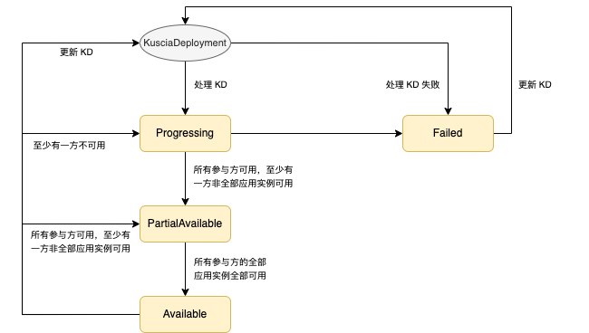

# KusciaDeployment

在 Kuscia 中，常驻服务是通过 KusciaDeployment 进行管理的。例如，可以通过 KusciaDeployment 管理联合预测服务。
如果要运行常驻服务，那么仅需创建一个 KusciaDeployment。KusciaDeployment Controller 将会根据 KusciaDeployment 的描述信息，在参与方节点下创建与常驻服务有关的 K3s 内置资源，例如 Service, Deployment 等。

基于 KusciaDeployment，你可以方便地管理类似联合预测这样的常驻服务。当前支持自定义应用输入配置、应用副本数量、应用运行资源大小、应用镜像以及应用更新策略等功能。

{#kuscia-deployment-state}
## 状态说明

下图为 KusciaDeployment(KD) 的状态流转图。



KusciaDeployment 在其生命周期中会处于以下几种状态：
- Progressing: 此时 KusciaDeployment 正在被处理，至少有一方不可用。
- PartialAvailable: 此时所有参与方可用，但是至少有一方非全部应用实例可用。
- Available: 此时所有参与方可用，且各参与方下的全部应用实例可用。
- Failed: 处理 KusciaDeployment 资源失败。在该状态下，若解决了失败的根因，可通过更新 KusciaDeployment，恢复 KusciaDeployment 的状态。

## 用例

以下是一些 KusciaDeployment 的典型用例：

- 创建 KusciaDeployment，你将体验如何创建一个 KusciaDeployment，管理参与方下的常驻服务。
- 查看 KusciaDeployment，你将熟悉如何查看已创建的 KusciaDeployment 的运行状态。
- 清理 KusciaDeployment，你将熟悉如何删除已创建的 KusciaDeployment。
- 参考 KusciaDeployment 对象定义，你将获取详细的 KusciaDeployment 描述信息。

## 创建 KusciaDeployment

下面以名称为`secretflow-serving.yaml`的内容为例，介绍创建 KusciaDeployment。

```yaml
apiVersion: kuscia.secretflow/v1alpha1
kind: KusciaDeployment
metadata:
  labels:
    kuscia.secretflow/app-type: serving
  name: secretflow-serving
  namespace: cross-domain
spec:
  initiator: alice
  inputConfig: '{"partyConfigs":{"alice":{"serverConfig":{"featureMapping":{"v24":"x24","v22":"x22","v21":"x21","v25":"x25","v23":"x23"}},"modelConfig":{"modelId":"glm-test-1","basePath":"/tmp/alice","sourceMd5":"4216c62acba4a630d5039f917612780b","sourcePath":"examples/alice/glm-test.tar.gz","sourceType":"ST_FILE"},"featureSourceConfig":{"mockOpts":{}},"channel_desc":{"protocol":"http"}},"bob":{"serverConfig":{"featureMapping":{"v6":"x6","v7":"x7","v8":"x8","v9":"x9","v10":"x10"}},"modelConfig":{"modelId":"glm-test-1","basePath":"/tmp/bob","sourceMd5":"1ded1513dab8734e23152ef906c180fc","sourcePath":"examples/bob/glm-test.tar.gz","sourceType":"ST_FILE"},"featureSourceConfig":{"mockOpts":{}},"channel_desc":{"protocol":"http"}}}}'
  parties:
  - appImageRef: secretflow-serving-image
    domainID: alice
  - appImageRef: secretflow-serving-image
    domainID: bob
```

在该示例中:

- `.metadata.labels`：表示 KusciaDeployment 的标签。当前示例`kuscia.secretflow/app-type: serving`表示管理的应用为预测类型。
- `.metadata.name`：表示 KusciaDeployment 的名称，当前示例为`secretflow-serving`。
- `.spec.initiator`：表示发起方的节点标识，当前示例为`alice`。
- `.spec.inputConfig`：表示输入参数配置。当前，该字段中的内容是临时的，预计下一期会有调整，后续也会补充该字段中的内容详细解释。
- `.spec.parties`：表示所有参与方的信息。当前示例中，该字段包含以下子字段：
  - `.spec.parties[0].appImageRef`：表示节点标识为`alice`的参与方所依赖的应用镜像 AppImage 名称为`secretflow-serving-image`，详细定义请参考 [Serving Appimage](https://www.secretflow.org.cn/zh-CN/docs/serving/0.2.0b0/topics/deployment/serving_on_kuscia)
  - `.spec.parties[0].domainID`：表示参与方节点标识为`alice`。
  - `.spec.parties[1].appImageRef`：表示节点标识为`bob`的参与方所依赖的应用镜像 AppImage 名称为`secretflow-serving-image`，详细定义请参考 [Serving Appimage](https://www.secretflow.org.cn/zh-CN/docs/serving/0.2.0b0/topics/deployment/serving_on_kuscia)
  - `.spec.parties[1].domainID`：表示参与方节点标识为`bob`。

1. 运行以下命令创建 KusciaDeployment。

```shell
kubectl apply -f secretflow-serving.yaml
```

## 查看 KusciaDeployment

下面以名称为`secretflow-serving`的 KusciaDeployment 为例，介绍如何查看相关资源。

1. 运行以下命令查看 KusciaDeployment。

```shell
kubectl get kd secretflow-serving -n cross-domain
NAME                 TOTALPARTIES   AVAILABLEPARTIES   PHASE       AGE
secretflow-serving   2              2                  Available   89m
```

上述命令输出内容，各列字段的含义如下：

- `NAME`：表示 KusciaDeployment 的名称。
- `TOTALPARTIES`：表示所有参与方个数。
- `AVAILABLEPARTIES`：表示可用参与方个数。
- `PHASE`：表示 KusciaDeployment 当前所处的阶段。
- `AGE`：表示 KusciaDeployment 从创建到现在经历的时间。

2. 运行以下命令查看 KusciaDeployment 详细的状态信息。

```shell
kubectl get kd secretflow-serving -n cross-domain -o jsonpath={.status} | jq
{
  "availableParties": 2,
  "lastReconcileTime": "2023-09-19T08:37:27Z",
  "partyDeploymentStatuses": {
    "alice": {
      "secretflow-serving": {
        "availableReplicas": 1,
        "conditions": [
          {
            "lastTransitionTime": "2023-09-19T08:22:11Z",
            "lastUpdateTime": "2023-09-19T08:22:11Z",
            "message": "Deployment has minimum availability.",
            "reason": "MinimumReplicasAvailable",
            "status": "True",
            "type": "Available"
          },
          {
            "lastTransitionTime": "2023-09-19T08:22:11Z",
            "lastUpdateTime": "2023-09-19T08:37:27Z",
            "message": "ReplicaSet \"secretflow-serving-d7db48cc7\" has successfully progressed.",
            "reason": "NewReplicaSetAvailable",
            "status": "True",
            "type": "Progressing"
          }
        ],
        "creationTimestamp": "2023-09-19T08:22:11Z",
        "phase": "Available",
        "replicas": 1,
        "unavailableReplicas": 0,
        "updatedReplicas": 1
      }
    },
    "bob": {
      "secretflow-serving": {
        "availableReplicas": 1,
        "conditions": [
          {
            "lastTransitionTime": "2023-09-19T08:22:21Z",
            "lastUpdateTime": "2023-09-19T08:22:21Z",
            "message": "Deployment has minimum availability.",
            "reason": "MinimumReplicasAvailable",
            "status": "True",
            "type": "Available"
          },
          {
            "lastTransitionTime": "2023-09-19T08:22:11Z",
            "lastUpdateTime": "2023-09-19T08:22:21Z",
            "message": "ReplicaSet \"secretflow-serving-76bf99c985\" has successfully progressed.",
            "reason": "NewReplicaSetAvailable",
            "status": "True",
            "type": "Progressing"
          }
        ],
        "creationTimestamp": "2023-09-19T08:22:11Z",
        "phase": "Available",
        "replicas": 1,
        "unavailableReplicas": 0,
        "updatedReplicas": 1
      }
    }
  },
  "phase": "Available",
  "totalParties": 2
}
```

3. 运行以下命令查看 KusciaDeployment 相关的 K3s 内置 Service 资源。

下面以 alice 节点为例：

```shell
kubectl get service -l kuscia.secretflow/kd-name=secretflow-serving -n alice
NAME                              TYPE        CLUSTER-IP   EXTERNAL-IP   PORT(S)     AGE
secretflow-serving-internal       ClusterIP   None         <none>        53510/TCP   89m
secretflow-serving-service        ClusterIP   None         <none>        53509/TCP   89m
secretflow-serving-brpc-builtin   ClusterIP   None         <none>        53511/TCP   89m
```

4. 运行以下命令查看 KusciaDeployment 相关的 K3s 内置 ConfigMap 资源。

下面以 alice 节点为例：

```shell
kubectl get cm -l kuscia.secretflow/kd-name=secretflow-serving -n alice
NAME                                DATA   AGE
secretflow-serving-configtemplate   1      89m
```

5. 运行以下命令查看 KusciaDeployment 相关的 K3s 内置 Deployment 资源。

下面以 alice 节点为例：

```shell
kubectl get deployment -l kuscia.secretflow/kd-name=secretflow-serving -n alice
NAME                 READY   UP-TO-DATE   AVAILABLE   AGE
secretflow-serving   1/1     1            1           89m
```

6. 运行以下命令查看 KusciaDeployment 相关的 K3s 内置 Pod 资源。

下面以 alice 节点为例：

```shell
kubectl get pod -l kuscia.secretflow/kd-name=secretflow-serving -n alice
NAME                                 READY   STATUS    RESTARTS   AGE
secretflow-serving-d7db48cc7-wbqv6   1/1     Running   0          89m
```

## 清理 KusciaDeployment

下面以名称为`secretflow-serving`的 KusciaDeployment 为例，介绍如何清理 KusciaDeployment。

1. 运行以下命令清理 KusciaDeployment。

```shell
kubectl delete kd secretflow-serving -n cross-domain
```

2. 检查 KusciaDeployment 是否已被清理。

```shell
kubectl get kd secretflow-serving -n cross-domain
Error from server (NotFound): kusciadeployments.kuscia.secretflow "secretflow-serving" not found
```

## 参考

### KusciaDeployment 详细介绍

下面以名称为`secretflow-serving`的 KusciaDeployment 模版为例，介绍 KusciaDeployment 所包含的完整字段。

```yaml
apiVersion: kuscia.secretflow/v1alpha1
kind: KusciaDeployment
metadata:
  labels:
    kuscia.secretflow/app-type: serving
  name: secretflow-serving
  namespace: cross-domain
spec:
  initiator: alice
  inputConfig: '{"partyConfigs":{"alice":{"serverConfig":{"featureMapping":{"v24":"x24","v22":"x22","v21":"x21","v25":"x25","v23":"x23"}},"modelConfig":{"modelId":"glm-test-1","basePath":"/tmp/alice","sourceMd5":"4216c62acba4a630d5039f917612780b","sourcePath":"examples/alice/glm-test.tar.gz","sourceType":"ST_FILE"},"featureSourceConfig":{"mockOpts":{}},"channel_desc":{"protocol":"http"}},"bob":{"serverConfig":{"featureMapping":{"v6":"x6","v7":"x7","v8":"x8","v9":"x9","v10":"x10"}},"modelConfig":{"modelId":"glm-test-1","basePath":"/tmp/bob","sourceMd5":"1ded1513dab8734e23152ef906c180fc","sourcePath":"examples/bob/glm-test.tar.gz","sourceType":"ST_FILE"},"featureSourceConfig":{"mockOpts":{}},"channel_desc":{"protocol":"http"}}}}'
  parties:
  - appImageRef: secretflow-serving-image
    domainID: alice
    template:
      replicas: 1
      strategy:
        type: RollingUpdate
        rollingUpdate:
          maxSurge: 30%
          maxUnavailable: 30%
      spec:
        containers:
        - name: serving
          resources:
            limits:
              cpu: 100m
              memory: 100Mi
            requests:
              cpu: 100m
              memory: 100Mi
  - appImageRef: secretflow-serving-image
    domainID: bob
status:
  phase: Available
  totalParties: 2
  availableParties: 2
  lastReconcileTime: "2023-09-19T08:37:27Z"
  message: ""
  reason: ""
  partyDeploymentStatuses:
    alice:
      secretflow-serving:
        conditions:
          - lastTransitionTime: "2023-09-19T08:22:11Z"
            lastUpdateTime: "2023-09-19T08:22:11Z"
            message: Deployment has minimum availability.
            reason: MinimumReplicasAvailable
            status: "True"
            type: Available
          - lastTransitionTime: "2023-09-19T08:22:11Z"
            lastUpdateTime: "2023-09-19T08:37:27Z"
            message: ReplicaSet "secretflow-serving-d7db48cc7" has successfully progressed.
            reason: NewReplicaSetAvailable
            status: "True"
            type: Progressing
        creationTimestamp: "2023-09-19T08:22:11Z"
        phase: Available
        replicas: 1
        availableReplicas: 1
        unavailableReplicas: 0
        updatedReplicas: 1
    bob:
      secretflow-serving:
        conditions:
          - lastTransitionTime: "2023-09-19T08:22:21Z"
            lastUpdateTime: "2023-09-19T08:22:21Z"
            message: Deployment has minimum availability.
            reason: MinimumReplicasAvailable
            status: "True"
            type: Available
          - lastTransitionTime: "2023-09-19T08:22:11Z"
            lastUpdateTime: "2023-09-19T08:22:21Z"
            message: ReplicaSet "secretflow-serving-76bf99c985" has successfully progressed.
            reason: NewReplicaSetAvailable
            status: "True"
            type: Progressing
        creationTimestamp: "2023-09-19T08:22:11Z"
        phase: Available
        replicas: 1
        availableReplicas: 1
        unavailableReplicas: 0
        updatedReplicas: 1
```

KusciaDeployment `metadata` 的子字段详细介绍如下：

- `labels`：表示 KusciaDeployment 的标签。当前示例`kuscia.secretflow/app-type: serving`表示管理的应用为预测类型。
- `name`：表示 KusciaDeployment 的名称。

KusciaDeployment `spec` 的子字段详细介绍如下：

- `initiator`：表示发起方的节点标识。
- `inputConfig`：表示应用输入参数配置。
- `parties`：表示所有参与方的信息。
  - `parties[].appImageRef`：表示参与方所依赖的应用镜像名称。有关 AppImage 的详细介绍，请参考 [AppImage](./appimage_cn.md)。
  - `parties[].domainID`：表示参与方的节点标识。
  - `parties[].role`：表示参与方的角色。
  - `parties[].template`：表示参与方应用的模版信息。若配置了该模版，则使用该模版中配置的信息替换从`parties[].appImageRef`获取的对应模版信息。
    - `template.replicas`：表示应用的期望副本数。
    - `template.strategy`：表示应用的更新策略。当前支持`Recreate`和`RollingUpdate`两种策略，详细解释请参考 [Strategy](https://kubernetes.io/zh-cn/docs/concepts/workloads/controllers/deployment/#strategy)
    - `template.spec`：表示应用容器配置信息。所支持的子字段请参考 AppImage 描述中的 [deployTemplates[].spec](./appimage_cn.md/#appimage-ref)

KusciaDeployment `status` 的子字段详细介绍如下：

- `phase`：表示 KusciaDeployment 当前所处的阶段。[状态流转详情](#kuscia-deployment-state)。当前包括以下几种 PHASE：
  - `Progressing`：表示该资源正在被 KusciaDeployment Controller 处理。KusciaDeployment Controller 会根据 KusciaDeployment 的描述信息，在各参与方节点下创建相关的资源，例如：Deployment、Configmap、Service 等。
  - `PartialAvailable`：表示所有参与方可用，但是在某些参与方节点下，应用可用副本数小于期望副本数。
  - `Available`：表示所有参与方可用，且各个参与方下应用可用副本数等于期望副本数。
  - `Failed`：表示 KusciaDeployment Controller 处理 KusciaDeployment 资源失败，详细失败描述可以从`message`和`reason`中获取。
- `totalParties`：表示所有参与方的个数。
- `availableParties`：表示可用参与方的个数。
- `lastReconcileTime`：表示 KusciaDeployment 最近一次更新的时间戳。
- `message`：表示 KusciaDeployment 处于该阶段的详细描述信息，用于对`reason`的补充。一般用于记录详细失败信息。
- `reason`：表示为什么 KusciaDeployment 处于该阶段。一般用于记录失败原因。
- `partyDeploymentStatuses`：表示参与方的详细状态。其结构使用`map[string]map[string]Object`方式表示。其中，第一个 map 的字符串类型 key 表示节点标识，第二个 map 的字符串类型 key 表示节点下 Deployment 资源的名称，
最后 Object 类型的 value 表示状态信息。下面以参与方 `alice` 为例，介绍各字段的含义：
  - `alice.secretflow-serving`：表示参与方的节点名称为`alice`，Deployment 资源名称为`secretflow-serving`。
  - `alice.secretflow-serving.conditions`：表示名称为`secretflow-serving`的 Deployment 资源的详细状况信息。
  - `alice.secretflow-serving.creationTimestamp`：表示名称为`secretflow-serving`的 Deployment 资源的创建时间。
  - `alice.secretflow-serving.phase`：表示名称为`secretflow-serving`的 Deployment 资源的状态。当前包括以下几种 PHASE：
    - `Progressing`：表示该资源正在被 KusciaDeployment Controller 处理。
    - `PartialAvailable`：表示该参与方下的应用部分可用，即应用可用副本数小于期望副本数。
    - `Available`：表示该参与方下的应用全部可用，即应用可用副本数等于期望副本数。
  - `alice.secretflow-serving.replicas`：表示应用期望副本数。
  - `alice.secretflow-serving.availableReplicas`：表示应用可用副本数。
  - `alice.secretflow-serving.unavailableReplicas`：表示应用不可用副本数。
  - `alice.secretflow-serving.updatedReplicas`：表示应用已更新的副本数。