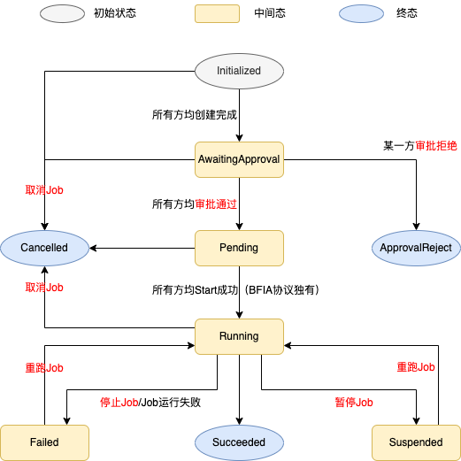

# KusciaJob

在 Kuscia 中，你可以使用 KusciaJob 来表示一个任务流程。一个 KusciaJob 是由 KusciaTask 组成的有向无环图，其中对于边 a -> b ，我们称任务 a 是任务 b 的依赖。
你可以创建一个 KusciaJob， KusciaJob Controller 将会按照你在 KusciaJob 中指定的调度模式自动推动 KusciaJob 中描述的 KusciaTask 的创建，直到所有的 KusciaTask
都完成或失败。
每一个 KusciaTask 将会在多方之间执行一个联合计算的算子任务。


上面是一个典型的 KusciaJob 示例：

- **隐私求交** 将参与方的数据作为输入，求出参与方的交集。
- **随机分割** 将参与方的交集作为输入，切分成训练集和测试集。
- **模型训练** 将参与方的训练集作为输入，训练出算法模型。
- **预测** 将算法模型和测试集作为输入，计算出预测结果。

{#kuscia-state}
## KusciaJob 状态说明

下图为 KusciaJob 的状态流转图，其中红色字体表示 KusciaAPI 接口操作。


KusciaJob 在其生命周期中会处于以下几种状态：
- Initialized: 此时 Job 刚被发起方在发起方侧创建完成，但 Job 信息还未同步至其他参与方。若 Job 已同步至其他所有参与方则 Job 进入 AwaitingApproval 状态。
- AwaitingApproval: 进入到 AwaitingApproval 状态的 Job 需要各参与方调用 KusciaAPI 的[ ApproveJob 接口](../apis/kusciajob_cn.md#approval-job)进行审核，若参与方设置了自动审核([参见配置文档enableWorkloadApprove字段](../../deployment/kuscia_config_cn.md#configuration-detail))则无需调用 ApproveJob 接口进行审核。待 Job 的所有参与方审核通过则 Job 进入 Pending 状态。若某一参与方审核拒绝则 Job 进入到 ApprovalReject 状态。
- Pending: 此时 Job 已被所有参与方审批通过，等待 Job 的发起方发起 Start 命令，待所有参与方接收到 Start 信令后，Job 进入到 Running状态（注：仅 BFIA 互联互通协议时发起方会向各参与方显式的发送 Start 信令，在 Kusica 内部协议中无需显式发送 Start 信令，Job 会自动从 Pending 状态进入到 Running 状态）。 
- Running: 此时 Job 已进入到调度状态，注：Job 是 Running 状态时，'并不意味' 着 Job 中至少有一个 Task 是 Running 状态，因 Job 刚进入 Running 状态时，Task 并未创建完成。 当 Job 的所有 Task 均执行成功时，Job 进入 Succeeded 状态。 当 Job 中的 [关键 Task ](#task-classification) 执行失败，则 Job 进入到 Failed 状态。
- Suspended: Running 状态的 Job 被某一参与方执行了[ Suspend 操作](../apis/kusciajob_cn.md#suspend-job)，则会进入此状态，执行 Suspend 操作后，Job 中处于 Running 状态的 Task 会被终止掉，Task进入到Failed状态。 Suspended 状态的 Job 可通过 [Restart 接口](../apis/kusciajob_cn.md#restart-job)重新运行。
- Succeeded: 所有 Task 都是 Succeeded 或 Failed 状态且所有 Critical KusciaTask 都是 Succeeded 状态。 Succeeded 状态是一种终态，终态则不会再流转到其他状态。
- Failed: 所有 Task 都是 Succeeded 或 Failed 状态且至少有一个 Critical KusciaTask 是 Failed 状态。 Failed 状态的 Job 可通过 [Restart 接口](../apis/kusciajob_cn.md#restart-job)重新运行。
- ApprovalReject: Job 被某一参与方审批为拒绝执行。 ApprovalReject 状态是一种终态，终态则不会再流转到其他状态。
- Cancelled: Job 被某一方取消，被取消的 Job 不可被再次执行。 Cancelled 状态是一种终态，终态则不会再流转到其他状态。

## 用例

以下是一些 KusciaJob 的典型用例:

- 创建 KusciaJob 以完成一个任务流程。例如你可以创建一个 KusciaJob 来描述 _隐私求交->随机分割->训练模型->预测_ 这样的任务流程。
- 区分任务类型 以及 为 KusciaJob 指定调度模式。
  - 对于 KusciaJob 中那些即使失败也没关系的 KusciaTask， 通过`tasks[].tolerable`，你可以指定其为可容忍任务。
  - 通过设置 KusciaJob 的`scheduleMode`， 你可以为 KusciaJob 指定不同的调度模式。目前支持 BestEffort 和 Strict 两种策略。
- 停止 KusciaJob。
- 清理 KusciaJob。

{#create-kuscia-job}

## 创建 KusciaJob

下面是一个 KusciaJob 的示例。

job-best-effort-linear.yaml:

```yaml
apiVersion: kuscia.secretflow/v1alpha1
kind: KusciaJob
metadata:
  name: job-best-effort-linear
  namespace: cross-domain
spec:
  initiator: alice
  scheduleMode: BestEffort
  maxParallelism: 2
  tasks:
    - taskID: job-psi
      alias: job-psi
      priority: 100
      taskInputConfig: '{"sf_datasource_config":{"alice":{"id":"default-data-source"},"bob":{"id":"default-data-source"}},"sf_cluster_desc":{"parties":["alice","bob"],"devices":[{"name":"spu","type":"spu","parties":["alice","bob"],"config":"{\"runtime_config\":{\"protocol\":\"REF2K\",\"field\":\"FM64\"},\"link_desc\":{\"connect_retry_times\":60,\"connect_retry_interval_ms\":1000,\"brpc_channel_protocol\":\"http\",\"brpc_channel_connection_type\":\"pooled\",\"recv_timeout_ms\":1200000,\"http_timeout_ms\":1200000}}"},{"name":"heu","type":"heu","parties":["alice","bob"],"config":"{\"mode\": \"PHEU\", \"schema\": \"paillier\", \"key_size\": 2048}"}],"ray_fed_config":{"cross_silo_comm_backend":"brpc_link"}},"sf_node_eval_param":{"domain":"data_prep","name":"psi","version":"0.0.1","attr_paths":["input/receiver_input/key","input/sender_input/key","protocol","precheck_input","bucket_size","curve_type"],"attrs":[{"ss":["id1"]},{"ss":["id2"]},{"s":"ECDH_PSI_2PC"},{"b":true},{"i64":"1048576"},{"s":"CURVE_FOURQ"}]},"sf_input_ids":["alice-table","bob-table"],"sf_output_ids":["psi-output"],"sf_output_uris":["psi-output.csv"]}'
      appImage: secretflow-image
      parties:
        - domainID: alice
        - domainID: bob
    - taskID: job-split
      alias: job-split
      priority: 100
      dependencies: ['job-psi']
      taskInputConfig: '{"sf_datasource_config":{"alice":{"id":"default-data-source"},"bob":{"id":"default-data-source"}},"sf_cluster_desc":{"parties":["alice","bob"],"devices":[{"name":"spu","type":"spu","parties":["alice","bob"],"config":"{\"runtime_config\":{\"protocol\":\"REF2K\",\"field\":\"FM64\"},\"link_desc\":{\"connect_retry_times\":60,\"connect_retry_interval_ms\":1000,\"brpc_channel_protocol\":\"http\",\"brpc_channel_connection_type\":\"pooled\",\"recv_timeout_ms\":1200000,\"http_timeout_ms\":1200000}}"},{"name":"heu","type":"heu","parties":["alice","bob"],"config":"{\"mode\": \"PHEU\", \"schema\": \"paillier\", \"key_size\": 2048}"}],"ray_fed_config":{"cross_silo_comm_backend":"brpc_link"}},"sf_node_eval_param":{"domain":"data_prep","name":"train_test_split","version":"0.0.1","attr_paths":["train_size","test_size","random_state","shuffle"],"attrs":[{"f":0.75},{"f":0.25},{"i64":1234},{"b":true}]},"sf_output_uris":["train-dataset.csv","test-dataset.csv"],"sf_output_ids":["train-dataset","test-dataset"],"sf_input_ids":["psi-output"]}'
      appImage: secretflow-image
      parties:
        - domainID: alice
        - domainID: bob
```

在该例中：

- 创建名为 job-best-effort-linear （由`.metadata.name`字段标明）的 KusciaJob。
- 有两个 KusciaTask 将会被依次创建，分别是用于隐私求交的 job-psi 和用于随机分割的 job-split。 KusciaJob Controller 将会先创建 job-psi，
  当 job-psi 任务成功后，job-split 才会被创建，这个依赖关系由 job-split 的`dependencies`指定。**创建的 KusciaTask 的`.metadata.name`将会由这里的
  `taskID`指定。若你自行指定该 `taskID`，那么你应当保证当前系统中没有同名的 KusciaTask ，同时还需要保证所有的`taskID`满足
  [DNS 子域名规则要求](https://kubernetes.io/zh-cn/docs/concepts/overview/working-with-objects/names/#dns-subdomain-names)**。
  若你不指定 KusciaJob 中的 taskID，则 KusciaJob Controller 会生成该 taskID。
- `parties`指定了任务参与方的 ID 和角色，这个字段说明了这个算子将会在哪些参与方以什么角色执行。
- `appImage`用于表明 KusciaTask 在多方计算中执行的算法镜像。你可以通过查看 [AppImage](./appimage_cn.md) 获得更多的信息。
- `taskInputConfig`用于指定 KusciaTask 在算子运行时使用的算子参数。其中 job-psi 将会分别读取 alice 和 bob 的 alice.csv 和 bob.csv 进行隐私求交，
  计算出两方的交集数据并分别保存为 alice 和 bob 的 psi-output.csv ，而 job-split 将会读取新产生的两个求交数据，并进行随机分割，
  随机分割的结果也会保存在 alice 和 bob 两方。

## KusciaJob 的调度

{#task-classification}

### 任务分类

某些情况下，你可能有一些非关键的任务需要编排到 KusciaJob 中，这些任务即使失败也不应该对整个 KusciaJob 的调度结果有影响。

比如有这样一个任务流：某个 KusciaJob 含有隐私求交和数据统计两个任务，但是你可能只希望隐私求交的任务是必须成功的，但是数据统计的任务是允许失败的，换句话说，
你只想要隐私求交的结果文件，而这个结果文件的统计信息你只是希望尽可能拿到。

按照上述的情景，我们将任务分为了两种：

- Critical Task: 关键任务，失败了会影响 KusciaJob 的调度逻辑和最终状态，如上例中的隐私求交任务。
- Tolerable Task: 可容忍任务，失败了不会影响 KusciaJob 的调度逻辑和最终状态，如上例中的数据统计任务。

字段`tasks[].tolerable`可以描述 KusciaJob 中的 Task 是否是容忍失败的， 默认值为 false。

{#scheduling-mode}

### KusciaJob 的调度模式

KusciaJob 目前支持两种调度模式，分别是 BestEffort 尽力模式和 Strict 严格模式。
这两种模式决定了当 KusciaJob 中的某个 Critical KusciaTask （注意不包括 Tolerable KusciaTask） 失败时，整个 KusciaJob 是否继续进行调度。

#### BestEffort

在 BestEffort 模式下，当 KusciaJob 中的某个 Critical KusciaTask 失败后，所以依赖该失败 KusciaTask 的后续 Task 都不会再执行， 但是所有不依赖该失败 KusciaTask 的
KusciaTask 将会继续进行调度， 此时整个 KusciaJob 的状态仍处于 Running 状态。 当所有的 KusciaTask 都调度完成后，KusciaJob 的状态会变更为 Failed 状态。

#### Strict

而在 Strict 模式下，当 KusciaJob 中的某个 Critical KusciaTask 失败后，整个 KusciaJob 的所有 Task 都不再进行调度，并且 KusciaJob 的状态立即变更为
Failed 状态。

### 理解 KusciaJob 调度的关键点

- KusciaJob 最终状态取决于 是否有 Critical KusciaTask 失败，任意一个 Critical KusciaTask 失败，都会使得 KusciaJob 最终状态为 Failed。**Tolerable Task
  并不参与 KusciaJob 最终状态的计算。**
- KusciaJob 的 `scheduleMode`， 当某个 **Critical KusciaTask** 失败，对于剩下仍然可调度的任务是否继续进行调度。

### 可容忍任务示例

当该字段值为 true 时，如果这个 KusciaTask 失败了，那么整个 KusciaJob 的调度将会继续进行，并且这个 KusciaTask 的结果不影响最终整个 KusciaJob 的状态。

下面的示例展示了这样的场景：

```yaml
apiVersion: kuscia.secretflow/v1alpha1
kind: KusciaJob
metadata:
  name: job-best-effort-linear-tolerable
  namespace: cross-domain
spec:
  initiator: alice
  scheduleMode: BestEffort
  maxParallelism: 2
  tasks:
    - alias: job-psi
      taskID: job-psi
      priority: 100
      taskInputConfig: '{"sf_datasource_config":{"alice":{"id":"default-data-source"},"bob":{"id":"default-data-source"}},"sf_cluster_desc":{"parties":["alice","bob"],"devices":[{"name":"spu","type":"spu","parties":["alice","bob"],"config":"{\"runtime_config\":{\"protocol\":\"REF2K\",\"field\":\"FM64\"},\"link_desc\":{\"connect_retry_times\":60,\"connect_retry_interval_ms\":1000,\"brpc_channel_protocol\":\"http\",\"brpc_channel_connection_type\":\"pooled\",\"recv_timeout_ms\":1200000,\"http_timeout_ms\":1200000}}"},{"name":"heu","type":"heu","parties":["alice","bob"],"config":"{\"mode\": \"PHEU\", \"schema\": \"paillier\", \"key_size\": 2048}"}],"ray_fed_config":{"cross_silo_comm_backend":"brpc_link"}},"sf_node_eval_param":{"domain":"data_prep","name":"psi","version":"0.0.1","attr_paths":["input/receiver_input/key","input/sender_input/key","protocol","precheck_input","bucket_size","curve_type"],"attrs":[{"ss":["id1"]},{"ss":["id2"]},{"s":"ECDH_PSI_2PC"},{"b":true},{"i64":"1048576"},{"s":"CURVE_FOURQ"}]},"sf_input_ids":["alice-table","bob-table"],"sf_output_ids":["psi-output"],"sf_output_uris":["psi-output.csv"]}'
      appImage: secretflow-image
      parties:
        - domainID: alice
        - domainID: bob
    - alias: job-split
      taskID: job-split
      priority: 100
      dependencies: ['job-psi']
      taskInputConfig: '{"sf_datasource_config":{"alice":{"id":"default-data-source"},"bob":{"id":"default-data-source"}},"sf_cluster_desc":{"parties":["alice","bob"],"devices":[{"name":"spu","type":"spu","parties":["alice","bob"],"config":"{\"runtime_config\":{\"protocol\":\"REF2K\",\"field\":\"FM64\"},\"link_desc\":{\"connect_retry_times\":60,\"connect_retry_interval_ms\":1000,\"brpc_channel_protocol\":\"http\",\"brpc_channel_connection_type\":\"pooled\",\"recv_timeout_ms\":1200000,\"http_timeout_ms\":1200000}}"},{"name":"heu","type":"heu","parties":["alice","bob"],"config":"{\"mode\": \"PHEU\", \"schema\": \"paillier\", \"key_size\": 2048}"}],"ray_fed_config":{"cross_silo_comm_backend":"brpc_link"}},"sf_node_eval_param":{"domain":"data_prep","name":"train_test_split","version":"0.0.1","attr_paths":["train_size","test_size","random_state","shuffle"],"attrs":[{"f":0.75},{"f":0.25},{"i64":1234},{"b":true}]},"sf_output_uris":["train-dataset.csv","test-dataset.csv"],"sf_output_ids":["train-dataset","test-dataset"],"sf_input_ids":["psi-output"]}'
      appImage: secretflow-image
      tolerable: true
      parties:
        - domainID: alice
        - domainID: bob
```

这个叫做 job-best-effort-linear-tolerable 的 KusciaJob 和 [创建 KusciaJob](#create-kuscia-job) 中的示例 job-best-effort-linear 的区别在于， 这个
KusciaJob 的 job-split 的 `tolerable` 字段是 true。

- 对于 job-best-effort-linear ，如果 job-psi 成功 而 job-split 失败了，那么整个 KusciaJob 的状态将会是 Failed。
- 对于 job-best-effort-linear-tolerable ，如果 job-psi 成功 而 job-split 失败了，那么整个 KusciaJob 的状态将会是 Succeeded 。因为 job-split
  是容忍失败的，所以它的状态不会影响整个 KusciaJob 的状态。

### BestEffort 和 Strict 示例

下面准备了两个 KusciaJob 的示例，它们的任务流程完全一样：执行两个隐私求交任务 psi1 和 psi2 ，并在 psi1 结束后，执行 job-split， 并且因为 psi1 的 priority 大于 psi2 的，所以
psi1 总是先于 psi2 启动。 它们的区别仅在于它们的`scheduleMode`分别为 BestEffort 和 Strict。

```yaml
apiVersion: kuscia.secretflow/v1alpha1
kind: KusciaJob
metadata:
  name: job-best-effort-dual-psi
  namespace: cross-domain
spec:
  initiator: alice
  scheduleMode: BestEffort
  maxParallelism: 1
  tasks:
    - alias: job-psi1
      taskID: job-psi1
      priority: 100
      taskInputConfig: '{"sf_datasource_config":{"alice":{"id":"default-data-source"},"bob":{"id":"default-data-source"}},"sf_cluster_desc":{"parties":["alice","bob"],"devices":[{"name":"spu","type":"spu","parties":["alice","bob"],"config":"{\"runtime_config\":{\"protocol\":\"REF2K\",\"field\":\"FM64\"},\"link_desc\":{\"connect_retry_times\":60,\"connect_retry_interval_ms\":1000,\"brpc_channel_protocol\":\"http\",\"brpc_channel_connection_type\":\"pooled\",\"recv_timeout_ms\":1200000,\"http_timeout_ms\":1200000}}"},{"name":"heu","type":"heu","parties":["alice","bob"],"config":"{\"mode\": \"PHEU\", \"schema\": \"paillier\", \"key_size\": 2048}"}],"ray_fed_config":{"cross_silo_comm_backend":"brpc_link"}},"sf_node_eval_param":{"domain":"data_prep","name":"psi","version":"0.0.1","attr_paths":["input/receiver_input/key","input/sender_input/key","protocol","precheck_input","bucket_size","curve_type"],"attrs":[{"ss":["id1"]},{"ss":["id2"]},{"s":"ECDH_PSI_2PC"},{"b":true},{"i64":"1048576"},{"s":"CURVE_FOURQ"}]},"sf_input_ids":["alice-table","bob-table"],"sf_output_ids":["psi-output"],"sf_output_uris":["psi-output.csv"]}'
      appImage: secretflow-image
      parties:
        - domainID: alice
        - domainID: bob
    - alias: job-psi2
      taskID: job-psi2
      priority: 80
      taskInputConfig: '{"sf_datasource_config":{"alice":{"id":"default-data-source"},"bob":{"id":"default-data-source"}},"sf_cluster_desc":{"parties":["alice","bob"],"devices":[{"name":"spu","type":"spu","parties":["alice","bob"],"config":"{\"runtime_config\":{\"protocol\":\"REF2K\",\"field\":\"FM64\"},\"link_desc\":{\"connect_retry_times\":60,\"connect_retry_interval_ms\":1000,\"brpc_channel_protocol\":\"http\",\"brpc_channel_connection_type\":\"pooled\",\"recv_timeout_ms\":1200000,\"http_timeout_ms\":1200000}}"},{"name":"heu","type":"heu","parties":["alice","bob"],"config":"{\"mode\": \"PHEU\", \"schema\": \"paillier\", \"key_size\": 2048}"}],"ray_fed_config":{"cross_silo_comm_backend":"brpc_link"}},"sf_node_eval_param":{"domain":"data_prep","name":"psi","version":"0.0.1","attr_paths":["input/receiver_input/key","input/sender_input/key","protocol","precheck_input","bucket_size","curve_type"],"attrs":[{"ss":["id1"]},{"ss":["id2"]},{"s":"ECDH_PSI_2PC"},{"b":true},{"i64":"1048576"},{"s":"CURVE_FOURQ"}]},"sf_input_ids":["alice-table","bob-table"],"sf_output_ids":["psi-output2"],"sf_output_uris":["psi-output2.csv"]}'
      appImage: secretflow-image
      parties:
        - domainID: alice
        - domainID: bob
    - alias: job-split
      taskID: job-split
      priority: 100
      dependencies: ['job-psi1']
      taskInputConfig: '{"sf_datasource_config":{"alice":{"id":"default-data-source"},"bob":{"id":"default-data-source"}},"sf_cluster_desc":{"parties":["alice","bob"],"devices":[{"name":"spu","type":"spu","parties":["alice","bob"],"config":"{\"runtime_config\":{\"protocol\":\"REF2K\",\"field\":\"FM64\"},\"link_desc\":{\"connect_retry_times\":60,\"connect_retry_interval_ms\":1000,\"brpc_channel_protocol\":\"http\",\"brpc_channel_connection_type\":\"pooled\",\"recv_timeout_ms\":1200000,\"http_timeout_ms\":1200000}}"},{"name":"heu","type":"heu","parties":["alice","bob"],"config":"{\"mode\": \"PHEU\", \"schema\": \"paillier\", \"key_size\": 2048}"}],"ray_fed_config":{"cross_silo_comm_backend":"brpc_link"}},"sf_node_eval_param":{"domain":"data_prep","name":"train_test_split","version":"0.0.1","attr_paths":["train_size","test_size","random_state","shuffle"],"attrs":[{"f":0.75},{"f":0.25},{"i64":1234},{"b":true}]},"sf_output_uris":["train-dataset.csv","test-dataset.csv"],"sf_output_ids":["train-dataset","test-dataset"],"sf_input_ids":["psi-output"]}'
      appImage: secretflow-image
      parties:
        - domainID: alice
        - domainID: bob
```

```yaml
apiVersion: kuscia.secretflow/v1alpha1
kind: KusciaJob
metadata:
  name: job-strict-dual-psi
  namespace: cross-domain
spec:
  initiator: alice
  scheduleMode: Strict
  maxParallelism: 1
  tasks:
    - alias: job-psi1
      taskID: job-psi1
      priority: 100
      taskInputConfig: '{"sf_datasource_config":{"alice":{"id":"default-data-source"},"bob":{"id":"default-data-source"}},"sf_cluster_desc":{"parties":["alice","bob"],"devices":[{"name":"spu","type":"spu","parties":["alice","bob"],"config":"{\"runtime_config\":{\"protocol\":\"REF2K\",\"field\":\"FM64\"},\"link_desc\":{\"connect_retry_times\":60,\"connect_retry_interval_ms\":1000,\"brpc_channel_protocol\":\"http\",\"brpc_channel_connection_type\":\"pooled\",\"recv_timeout_ms\":1200000,\"http_timeout_ms\":1200000}}"},{"name":"heu","type":"heu","parties":["alice","bob"],"config":"{\"mode\": \"PHEU\", \"schema\": \"paillier\", \"key_size\": 2048}"}],"ray_fed_config":{"cross_silo_comm_backend":"brpc_link"}},"sf_node_eval_param":{"domain":"data_prep","name":"psi","version":"0.0.1","attr_paths":["input/receiver_input/key","input/sender_input/key","protocol","precheck_input","bucket_size","curve_type"],"attrs":[{"ss":["id1"]},{"ss":["id2"]},{"s":"ECDH_PSI_2PC"},{"b":true},{"i64":"1048576"},{"s":"CURVE_FOURQ"}]},"sf_input_ids":["alice-table","bob-table"],"sf_output_ids":["psi-output"],"sf_output_uris":["psi-output.csv"]}'
      appImage: secretflow-image
      parties:
        - domainID: alice
        - domainID: bob
    - alias: job-psi2
      taskID: job-psi2
      priority: 80
      taskInputConfig: '{"sf_datasource_config":{"alice":{"id":"default-data-source"},"bob":{"id":"default-data-source"}},"sf_cluster_desc":{"parties":["alice","bob"],"devices":[{"name":"spu","type":"spu","parties":["alice","bob"],"config":"{\"runtime_config\":{\"protocol\":\"REF2K\",\"field\":\"FM64\"},\"link_desc\":{\"connect_retry_times\":60,\"connect_retry_interval_ms\":1000,\"brpc_channel_protocol\":\"http\",\"brpc_channel_connection_type\":\"pooled\",\"recv_timeout_ms\":1200000,\"http_timeout_ms\":1200000}}"},{"name":"heu","type":"heu","parties":["alice","bob"],"config":"{\"mode\": \"PHEU\", \"schema\": \"paillier\", \"key_size\": 2048}"}],"ray_fed_config":{"cross_silo_comm_backend":"brpc_link"}},"sf_node_eval_param":{"domain":"data_prep","name":"psi","version":"0.0.1","attr_paths":["input/receiver_input/key","input/sender_input/key","protocol","precheck_input","bucket_size","curve_type"],"attrs":[{"ss":["id1"]},{"ss":["id2"]},{"s":"ECDH_PSI_2PC"},{"b":true},{"i64":"1048576"},{"s":"CURVE_FOURQ"}]},"sf_input_ids":["alice-table","bob-table"],"sf_output_ids":["psi-output1"],"sf_output_uris":["psi-output1.csv"]}'
      appImage: secretflow-image
      parties:
        - domainID: alice
        - domainID: bob
    - alias: job-split
      taskID: job-split
      priority: 100
      dependencies: ['job-psi1']
      taskInputConfig: '{"sf_datasource_config":{"alice":{"id":"default-data-source"},"bob":{"id":"default-data-source"}},"sf_cluster_desc":{"parties":["alice","bob"],"devices":[{"name":"spu","type":"spu","parties":["alice","bob"],"config":"{\"runtime_config\":{\"protocol\":\"REF2K\",\"field\":\"FM64\"},\"link_desc\":{\"connect_retry_times\":60,\"connect_retry_interval_ms\":1000,\"brpc_channel_protocol\":\"http\",\"brpc_channel_connection_type\":\"pooled\",\"recv_timeout_ms\":1200000,\"http_timeout_ms\":1200000}}"},{"name":"heu","type":"heu","parties":["alice","bob"],"config":"{\"mode\": \"PHEU\", \"schema\": \"paillier\", \"key_size\": 2048}"}],"ray_fed_config":{"cross_silo_comm_backend":"brpc_link"}},"sf_node_eval_param":{"domain":"data_prep","name":"train_test_split","version":"0.0.1","attr_paths":["train_size","test_size","random_state","shuffle"],"attrs":[{"f":0.75},{"f":0.25},{"i64":1234},{"b":true}]},"sf_output_uris":["train-dataset.csv","test-dataset.csv"],"sf_output_ids":["train-dataset","test-dataset"],"sf_input_ids":["psi-output"]}'
      appImage: secretflow-image
      parties:
        - domainID: alice
        - domainID: bob
```

现在，我们假设 job-psi1 任务失败了，那么：

- 对于 job-best-effort-dual-psi， job-split 将不会再被创建，而 job-psi2 仍然将会被创建，此时 KusciaJob 的状态为 Running，待 job-psi2 结束后，KusciaJob
  状态将会变更为 Failed。
- 对于 job-strict-dual-psi，job-split 和 job-psi2 都将不会再被创建，KusciaJob 状态会直接变更为 Failed。

## 停止 KusciaJob

在 KusciaJob 运行过程中，可以通过以下方式停止 KusciaJob。目前停止 KusciaJob 时，会将 KusciaJob 状态置为失败状态。未来会引入挂起状态。

```shell
kubectl label kj {job-name}  kuscia.secretflow/job-stage=Stop -n cross-domain
```

## 清理 KusciaJob

在 KusciaJob 提交后，你可以通过

```shell
kubectl delete kj {job-name} -n cross-domain
```

来取消一个正在执行的 KusciaJob 或者删除一个已经执行完成的 KusciaJob。这会删除这个 KusciaJob 和这个 KusciaJob 创建的 KusciaTask。

## 参考

### 完整定义

下面以`job-template`模版为例，介绍 KusciaJob 所包含的完整字段。

```yaml
apiVersion: kuscia.secretflow/v1alpha1
kind: KusciaJob
metadata:
  name: job-template
  namespace: cross-domain
spec:
  flowID: "flow-1"
  initiator: alice
  scheduleMode: BestEffort
  maxParallelism: 2
  tasks:
    - alias: job-psi
      taskID: job-psi
      priority: 100
      taskInputConfig: '{"sf_datasource_config":{"alice":{"id":"default-data-source"},"bob":{"id":"default-data-source"}},"sf_cluster_desc":{"parties":["alice","bob"],"devices":[{"name":"spu","type":"spu","parties":["alice","bob"],"config":"{\"runtime_config\":{\"protocol\":\"REF2K\",\"field\":\"FM64\"},\"link_desc\":{\"connect_retry_times\":60,\"connect_retry_interval_ms\":1000,\"brpc_channel_protocol\":\"http\",\"brpc_channel_connection_type\":\"pooled\",\"recv_timeout_ms\":1200000,\"http_timeout_ms\":1200000}}"},{"name":"heu","type":"heu","parties":["alice","bob"],"config":"{\"mode\": \"PHEU\", \"schema\": \"paillier\", \"key_size\": 2048}"}],"ray_fed_config":{"cross_silo_comm_backend":"brpc_link"}},"sf_node_eval_param":{"domain":"data_prep","name":"psi","version":"0.0.1","attr_paths":["input/receiver_input/key","input/sender_input/key","protocol","precheck_input","bucket_size","curve_type"],"attrs":[{"ss":["id1"]},{"ss":["id2"]},{"s":"ECDH_PSI_2PC"},{"b":true},{"i64":"1048576"},{"s":"CURVE_FOURQ"}]},"sf_input_ids":["alice-table","bob-table"],"sf_output_ids":["psi-output"],"sf_output_uris":["psi-output.csv"]}'
      appImage: secretflow-image
      parties:
        - domainID: alice
        - domainID: bob
    - alias: job-split
      taskID: job-split
      priority: 100
      tolerable: true
      dependencies: ['job-psi']
      taskInputConfig: '{"sf_datasource_config":{"alice":{"id":"default-data-source"},"bob":{"id":"default-data-source"}},"sf_cluster_desc":{"parties":["alice","bob"],"devices":[{"name":"spu","type":"spu","parties":["alice","bob"],"config":"{\"runtime_config\":{\"protocol\":\"REF2K\",\"field\":\"FM64\"},\"link_desc\":{\"connect_retry_times\":60,\"connect_retry_interval_ms\":1000,\"brpc_channel_protocol\":\"http\",\"brpc_channel_connection_type\":\"pooled\",\"recv_timeout_ms\":1200000,\"http_timeout_ms\":1200000}}"},{"name":"heu","type":"heu","parties":["alice","bob"],"config":"{\"mode\": \"PHEU\", \"schema\": \"paillier\", \"key_size\": 2048}"}],"ray_fed_config":{"cross_silo_comm_backend":"brpc_link"}},"sf_node_eval_param":{"domain":"data_prep","name":"train_test_split","version":"0.0.1","attr_paths":["train_size","test_size","random_state","shuffle"],"attrs":[{"f":0.75},{"f":0.25},{"i64":1234},{"b":true}]},"sf_output_uris":["train-dataset.csv","test-dataset.csv"],"sf_output_ids":["train-dataset","test-dataset"],"sf_input_ids":["psi-output"]}'
      appImage: secretflow-image
      parties:
        - domainID: alice
        - domainID: bob
status:
  phase: Succeeded
  taskStatus:
    job-psi: Succeeded
    job-split: Succeeded
  startTime: '2023-03-30T12:11:41Z'
  completionTime: '2023-03-30T12:12:07Z'
  lastReconcileTime: '2023-03-30T12:12:07Z'
```

KusciaJob `metadata`的子字段详细介绍如下：

- `name`：表示 KusciaTask 的名称。

KusciaJob `spec`的子字段详细介绍如下：

- `flowID`：表示 flow 标识。
- `initiator`：表示参与方中负责发起任务的节点标识。
- `scheduleMode`：表示调度模式，枚举值，可选：`BestEffort`和`Strict`，大小写敏感，详见 [KusciaJob 的调度模式](#scheduling-mode)。
- `maxParallelism`：表示可以同时处于 Running 状态的任务的最大数量，可选，默认为 1，范围为 1-128。
- `tasks`：表示要执行的任务列表，最多 128 个。
  - `alias`：表示任务的别名，必填。KusciaJob 中所有任务的别名不能重复。
  - `tasks[].taskID`：用作任务依赖标识，全局唯一，满足 [DNS 子域名规则要求](https://kubernetes.io/zh-cn/docs/concepts/overview/working-with-objects/names/#dns-subdomain-names)。
     若任务发起方为 Kuscia 中的节点，且未指定该标识，则 KusciaJob Controller 会生成全局唯一的任务标识。
  - `tasks[].priority`：表示任务优先级，根据 maxParallelism，当存在多个 KusciaTask 可以被创建时，该值较高的优先被创建。
  - `tasks[].tolerable`：表示是否可以容忍任务失败，详见 [任务分类](#task-classification)。
  - `tasks[].dependencies`：表示任务的前置依赖任务，每一个元素都是`tasks`列表中某一个任务的`alias`。
  - `tasks[].taskInputConfig`：表示任务参数配置。
  - `tasks[].appImage`： 表示任务使用的 AppImage，详见 [AppImage](./appimage_cn.md)。
  - `tasks[].parties`：表示任务参与方的信息。
    - `tasks[].parties[].domainID`：表示任务参与方的节点 ID。
    - `tasks[].parties[].role`：表示任务参与方的角色，这个是由引擎自定义的；比如常见的 Host 、Guest ，Kuscia 会结合 [appImage](./appimage_cn.md#appimage-ref) 中的 role 字段，选择对应的部署模版启动引擎。

KusciaJob `status`的子字段详细介绍如下：

- `phase`：表示 KusciaJob 当前所处的阶段。[状态详见](#kuscia-state)。
- `taskStatus`：表示 KusciaJob 已经启动的 KusciaTask 状态信息， key 为 KusciaTask 的名称，value 为 KusciaTask 的状态。
- `startTime`：表示 KusciaJob 第一次被 Kuscia 控制器处理的时间戳。
- `completionTime`：表示 KusciaJob 运行完成的时间戳。
- `lastReconcileTime`：表示 KusciaJob 上次更新的时间戳。

### 其它查看方式

1. 你可以直接查看完整 CRD 定义：[KusciaJob CRD](https://github.com/secretflow/kuscia/blob/main/crds/v1alpha1/kuscia.secretflow_kusciajobs.yaml)。

2. 如果你已经部署了 Kuscia ，你也可以通过 kubectl 查看：`kubectl explain kj`。
