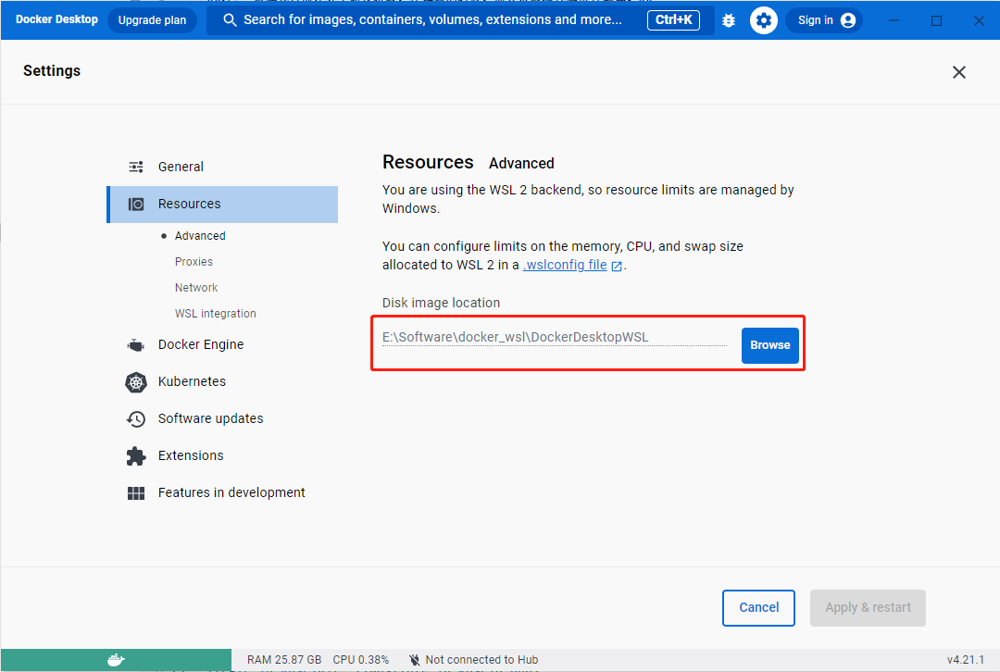

# 常见问题

## 使用 WSL 注意事项

### WSL 启动 Docker
**WSL 中想要使用 Docker，建议安装 docker desktop**，具体安装步骤如下：

1. **修改默认安装路径**

    Docker Desktop 默认安装在 "C:\Program Files\Docker"，该路径是一个只读路径，如果不修改，将无法进行写操作（比如创建或修改文件/文件夹），在部署时可能报错：
```shell
Error response from daemon: mkdir /var/lib/docker/temp/docker-export-709988460:read-only file system
```
需要在非只读目录（如 D 盘）下创建 Docker Desktop 默认安装路（如 D：\Docker），然后以管理员身份运行 cmd，通过以下命令创建链接:
```shell
mklink /J "C:\Program Files\Docker" "D:\Docker"
```
这样创建链接之后，按正常步骤安装 docker 就会安装在 D 盘里了。
2. 安装（参考 Docker 官方安装文档 [Install Docker Desktop on Windows](https://docs.docker.com/desktop/install/windows-install/)）

从 Docker 官网下载 [Docker Desktop for Windows](https://www.docker.com/products/docker-desktop/);

双击下载的 'Docker Desktop Installer.exe';

使用官方建议的 WSL2 选项安装（勾选："Use the WSL 2 based engine"）;

按照安装向导上的说明授权安装程序，并继续安装;

安装成功后，单击"关闭"完成安装过程;
3. 建议修改镜像保存路径

Docker 镜像默认保存在 C 盘， 如果要[部署和运行 FATE 作业](https://www.secretflow.org.cn/docs/kuscia/latest/zh-Hans/tutorial/run_fate_cn)，可能导致 C 盘空间不足，因此建议改为其他空间足够的磁盘。具体做法是，打开 Docker Desktop，找到 Settings->Resources->Browse，修改镜像保存路径。


## 部署失败

### 排查步骤

#### 检查机器配置

若机器不满足[官网推荐配置](https://www.secretflow.org.cn/docs/kuscia/latest/zh-Hans/getting_started/quickstart_cn#id2)，可能会造成部分服务无法正常工作，从而导致部署失败。

#### 查看服务日志

##### 中心化组网模式

查看 Master 日志

```shell
# 登陆到 master 容器中
docker exec -it ${USER}-kuscia-master bash

# 查看 kuscia 错误日志
cat /home/kuscia/var/logs/kuscia.log | grep -i error

# 查看 k3s 错误日志
cat /home/kuscia/var/logs/k3s.log | grep -i error
```

查看 Alice 节点日志

```shell
# 登陆到 alice 容器中
docker exec -it ${USER}-kuscia-lite-alice bash

# 查看 kuscia 错误日志
cat /home/kuscia/var/logs/kuscia.log | grep -i error
```

查看 Bob 节点日志

```shell
# 登陆到 bob 容器中
docker exec -it ${USER}-kuscia-lite-bob bash

# 查看 kuscia 错误日志
cat /home/kuscia/var/logs/kuscia.log | grep -i error
```

#####  点对点组网模式

查看 Alice 节点日志

```shell
# 登陆到 alice 容器中
docker exec -it ${USER}-kuscia-autonomy-alice bash

# 查看 kuscia 错误日志
cat /home/kuscia/var/logs/kuscia.log | grep -i error

# 查看 k3s 错误日志
cat /home/kuscia/var/logs/k3s.log | grep -i error
```

查看 Bob 节点日志

```shell
# 登陆到 bob 容器中
docker exec -it ${USER}-kuscia-autonomy-bob bash

# 查看 Kuscia 错误日志
cat /home/kuscia/var/logs/kuscia.log | grep -i error

# 查看 K3s 错误日志
cat /home/kuscia/var/logs/k3s.log | grep -i error
```

{#jon-run-failed}

## 作业运行失败

### 排查步骤

#### 检查机器配置

若机器不满足[官网推荐配置](https://www.secretflow.org.cn/docs/kuscia/latest/zh-Hans/getting_started/quickstart_cn#id2)，可能会造成部分服务无法正常工作，从而导致作业运行失败。

#### 查看作业失败原因

登陆查看作业的容器

- 若以中心化组网模式部署，请登陆到 Master 容器中

```shell
docker exec -it ${USER}-kuscia-master bash
```

- 若以点对点组网模式部署，请登陆到下发作业的容器中，下面以 Alice 容器为例

```shell
docker exec -it ${USER}-kuscia-autonomy-alice bash
```

查看作业信息

```shell
kubectl get kj
```

查看作业下任务的详细信息

- 具体失败原因可以查看 status 字段下的相关内容

```shell
# 列出所有任务
kubectl get kt

# 查看任务的详细信息，任务名称来自上述命令
kubectl get kt {任务名称} -o yaml
```

查看任务 Pod 的详细信息

- 具体失败原因可以查看 status 字段下的相关内容

```shell
# 查看 alice 节点下的 pod 列表
kubectl get pod -n alice

# 查看 alice 节点下某个 pod 的详细信息
kubectl get pod xxxx -o yaml -n alice

# 查看 bob 节点下的 pod 列表
kubectl get pod -n bob

# 查看 bob 节点下某个 pod 的详细信息
kubectl get pod xxxx -o yaml -n bob

# 若 pod 状态为 Pending，可以继续查看相应节点详细信息
kubectl get node

# 查看 node 详细信息
kubectl describe node xxxx
```


查看任务 Pod 详细日志

- 若以中心化组网模式部署，登陆到 Alice 和 Bob 容器命令如下

```shell
# 登陆到 alice 容器中
docker exec -it ${USER}-kuscia-lite-alice bash

# 查看 alice 节点上任务 pod 日志
cat /home/kuscia/var/stdout/pods/podName_xxxx/xxxx/x.log

# 登陆到 bob 容器中
docker exec -it ${USER}-kuscia-lite-bob bash

# 查看 bob 节点上任务 pod 日志
cat /home/kuscia/var/stdout/pods/podName_xxxx/xxxx/x.log
```

- 若以点对点组网模式部署，登陆到 Alice 和 Bob 容器命令如下

```shell
# 登陆到 alice 容器中
docker exec -it ${USER}-kuscia-autonomy-alice bash

# 查看 alice 节点上任务 pod 日志
cat /home/kuscia/var/stdout/pods/podName_xxxx/xxxx/x.log

# 登陆到 bob 容器中
docker exec -it ${USER}-kuscia-autonomy-bob bash

# 查看 bob 节点上任务 pod 日志
cat /home/kuscia/var/stdout/pods/podName_xxxx/xxxx/x.log
```

## FATE 部署失败
### Pod 镜像拉取失败
例如：
```shell
kubectl get pods -A

NAMESPACE   NAME                               READY   STATUS         RESTARTS   AGE
bob         fate-deploy-bob-6b85647f8b-5nvtz   0/1     ErrImagePull   0          43s
```

#### 检查容器内的镜像
FATE 部署时会把相关的镜像 import 到节点容器中。

进入节点，使用 ``crictl images`` 命令查看镜像。中心化组网的节点容器中完备的镜像如下：
```shell
docker exec -it ${USER}-kuscia-lite-bob bash

crictl images | grep fate

docker.io/secretflow/fate-adapter                                                    0.0.1               8b19bcdc69d4c       260MB
secretflow-registry.cn-hangzhou.cr.aliyuncs.com/secretflow/fate-adapter              0.0.1               8b19bcdc69d4c       260MB
docker.io/secretflow/fate-deploy-basic                                               0.0.1               38ba174f12520       3.23GB
secretflow-registry.cn-hangzhou.cr.aliyuncs.com/secretflow/fate-deploy-basic         0.0.1               38ba174f12520       3.23GB
```

P2P 组网的节点容器中完备的镜像如下：
```shell
docker exec -it ${USER}-kuscia-autonomy-bob bash

crictl images | grep fate

docker.io/secretflow/fate-adapter                                                    0.0.1               8b19bcdc69d4c       260MB
secretflow-registry.cn-hangzhou.cr.aliyuncs.com/secretflow/fate-adapter              0.0.1               8b19bcdc69d4c       260MB
docker.io/secretflow/fate-deploy-basic                                               0.0.1               38ba174f12520       3.23GB
secretflow-registry.cn-hangzhou.cr.aliyuncs.com/secretflow/fate-deploy-basic         0.0.1               38ba174f12520       3.23GB
```

如果缺少 ``secretflow/fate-adapter:0.0.1`` 和 ``secretflow/fate-deploy-basic:0.0.1`` 相关的任意镜像（注意镜像地址的前缀，一共有四个），请使用 ``crictl rmi`` 命令移除镜像。之后删除已部署好的 Kuscia 集群，按照[部署文档](https://www.secretflow.org.cn/docs/kuscia/latest/zh-Hans/tutorial/run_fate_cn)中的流程重新部署。
```shell
crictl rmi secretflow/fate-adapter:0.0.1
crictl rmi secretflow/fate-deploy-basic:0.0.1
```

## FATE 作业运行失败

### 排查步骤

#### 检查机器配置

若机器不满足[官网推荐配置](https://www.secretflow.org.cn/docs/kuscia/latest/zh-Hans/getting_started/quickstart_cn#id2)，可能会造成部分服务无法正常工作，从而导致作业运行失败。

#### 检查 fate-alice 容器是否运行正常

查看 fate-alice 容器日志，检查是否运行正常

```shell
docker logs -f fate-alice

# 正常日志输出示例:
wait to upload data, sleep 10
...
wait to upload data, sleep 10
/data/projects
upload guest data
{
    "data": {
        "board_url": "http://172.17.0.2:8080/index.html#/dashboard?job_id=202307270223007537850&role=local&party_id=0",
        "code": 0,
        "dsl_path": "/data/projects/fate/fateflow/jobs/202307270223007537850/job_dsl.json",
        "job_id": "202307270223007537850",
        "logs_directory": "/data/projects/fate/fateflow/logs/202307270223007537850",
        "message": "success",
        "model_info": {
            "model_id": "local-0#model",
            "model_version": "202307270223007537850"
        },
        "namespace": "experiment",
        "pipeline_dsl_path": "/data/projects/fate/fateflow/jobs/202307270223007537850/pipeline_dsl.json",
        "runtime_conf_on_party_path": "/data/projects/fate/fateflow/jobs/202307270223007537850/local/0/job_runtime_on_party_conf.json",
        "runtime_conf_path": "/data/projects/fate/fateflow/jobs/202307270223007537850/job_runtime_conf.json",
        "table_name": "lr_guest",
        "train_runtime_conf_path": "/data/projects/fate/fateflow/jobs/202307270223007537850/train_runtime_conf.json"
    },
    "jobId": "202307270223007537850",
    "retcode": 0,
    "retmsg": "success"
}

sleep 30
upload host data
{
    "data": {
        "board_url": "http://172.17.0.2:8080/index.html#/dashboard?job_id=202307270223327659150&role=local&party_id=0",
        "code": 0,
        "dsl_path": "/data/projects/fate/fateflow/jobs/202307270223327659150/job_dsl.json",
        "job_id": "202307270223327659150",
        "logs_directory": "/data/projects/fate/fateflow/logs/202307270223327659150",
        "message": "success",
        "model_info": {
            "model_id": "local-0#model",
            "model_version": "202307270223327659150"
        },
        "namespace": "experiment",
        "pipeline_dsl_path": "/data/projects/fate/fateflow/jobs/202307270223327659150/pipeline_dsl.json",
        "runtime_conf_on_party_path": "/data/projects/fate/fateflow/jobs/202307270223327659150/local/0/job_runtime_on_party_conf.json",
        "runtime_conf_path": "/data/projects/fate/fateflow/jobs/202307270223327659150/job_runtime_conf.json",
        "table_name": "lr_host",
        "train_runtime_conf_path": "/data/projects/fate/fateflow/jobs/202307270223327659150/train_runtime_conf.json"
    },
    "jobId": "202307270223327659150",
    "retcode": 0,
    "retmsg": "success"
}
```

#### 查看 fate-deploy-bob Pod 是否运行正常

登陆查看作业的容器

- 若以中心化组网模式部署，请登陆到 Master 容器中

```shell
docker exec -it ${USER}-kuscia-master bash
```

- 若以点对点组网模式部署，请登陆到 Bob 容器中

```shell
docker exec -it ${USER}-kuscia-autonomy-bob bash
```

检查 fate-deploy-bob Pod 运行情况

- 确保 fate-deploy-bob 前缀开头的 Pod 状态为 Running

```shell
# 查看 bob 节点下的 pod 列表
kubectl get pod -n bob

## 正常输出示例:
NAME                               READY   STATUS    RESTARTS   AGE
fate-deploy-bob-6798765d84-84rm7   1/1     Running   0          6m34s
...

# 若 fate-deploy-bob Pod 状态非 Running，通过以下命令查看 Pod 详细信息，具体原因可以查看 status 字段下的相关内容
kubectl get pod fate-deploy-bob-6798765d84-84rm7 -o yaml -n bob 

# 若 fate-deploy-bob Pod 状态为 Pending 且由于机器内存不足无法完成调度，则可以尝试使用下面命令减小 Pod 的请求内存大小
# 不推荐：调整后，虽然 Pod 可以 Running, 但是也可能会由于机器内存不足而导致任务失败
kubectl patch deploy fate-deploy-bob -n bob --patch '{"spec": {"template": {"spec": {"containers": [{"name": "fate-deploy-bob","resources": {"requests": {"memory": "1G"}}}]}}}}'
```

#### 查看作业失败原因

请参考[作业运行失败](#jon-run-failed)


