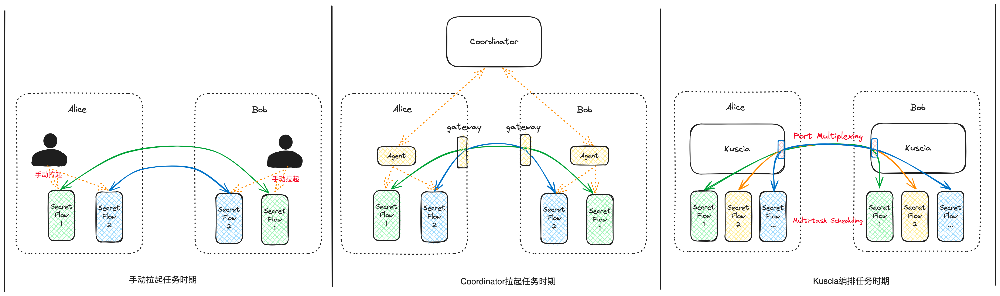
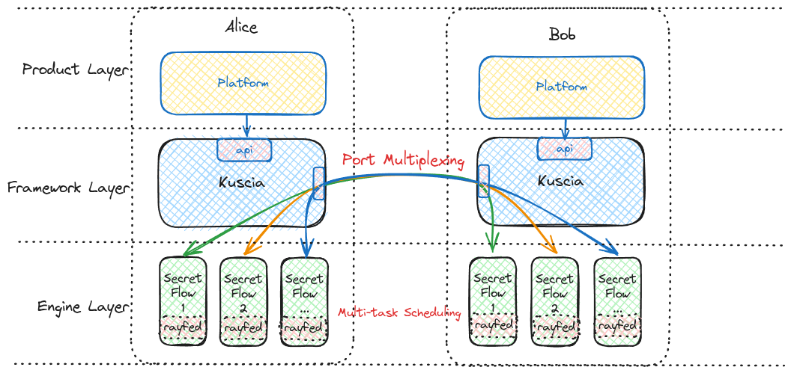

# 概述

在落地隐私计算的过程中，您可能会遇到下面的问题：

1. 我手上只有很少的机器资源/计算资源，同时还计划快速进行 poc 验证，有没有快速部署且容易上手的方法？
2. 公司为了安全考虑，只提供了一个对外端口，但是作为业务系统还希望支持多任务并发计算，怎么办？
3. 我想使用 SecretFlow 引擎落地生产，但是运维一套 SecretFlow 依赖的 ray 集群成本比较大，并且需要解决 ray 集群的多任务资源隔离、端口合并、高可用等问题。
4. 业务上现在只需要基本的 PSI 能力，但是未来我期望能够使用联合分析能力，联合建模和联合在线预测能力，会不会出现重复部署重复建设的问题，或如何做到平滑升级？
5. 我想把隐私计算能力快速的集成到公司的系统中，但是 API 接口太多，接入成本非常高。
6. 合作公司部署的隐私计算平台五花八门，是不是每和一个公司合作都需要采购并部署和他们一样的平台？
7. 隐私计算节点部署在其他机构的时候，会被对方挑战安全性，该如何打消用户的顾虑？

以上这些问题只是隐私计算落地问题中的冰山一角。Kuscia 是一个跨域的隐私计算任务编排框架，致力于解决隐私计算落地过程中的共性问题，如： 轻量化部署、跨域网络互通、多引擎集成、API接口简化、互联互通等问题。

## 您可以使用 Kuscia 做什么

### PoC 验证

当您在进行 PoC（概念验证 Proof of Concept）时，可能会遇到各种挑战，比如环境配置复杂、网络环境复杂、引擎集成困难等。Kuscia 旨在解决这些问题，让您能够专注于验证您的隐私计算方案，而无需担心底层技术的复杂性和资源限制。

1. 轻量级部署：不同机构基础设施多样，Kuscia 支持无论是在 Linux、Mac 或 Windows（WSL）系统上，您可以使用 1C2G 的资源进行一键化部署并进行 100w 级数据的 PSI 求交，并支持多种部署环境如物理机、虚拟机或 Kubernetes。
2. 灵活的网络适配：为解决跨机构合作公网端口开通受限制问题，Kuscia 可做到多任务并发运行时复用一个公网端口，并采用更加通用的 HTTP 协议进行数据转发以避免一些机构网关不支持4层网络转发问题。
3. 多引擎集成：Kuscia 集成了多种隐私计算引擎，如隐语 PSI、SecretFlow、TrustedFlow（TEE）和 SecretFlow Serving，让您可以快速使用上述引擎能力。通过部署 Kuscia，您可以只选择需要的引擎，且可以动态升级支持其他引擎而无需再次部署。
4. 简化 API 调用：通过统一的 API 调用，您可以轻松启动任意算法任务，最简化的情况下仅需调用一个 API 就可完成任务执行。

Kuscia 除解决以上问题外，也提供了任务流调度、多引擎协同、数据安全访问等能力。Kuscia 提供的能力详见 [为什么需要 Kuscia](#why-kuscia) 章节。

### 生产部署

在实际生产环境中使用隐私计算，除上文提到 PoC 时可能遇到的挑战外，您可能会关心整个系统的隐私计算能力的快速演进、任务流调度能力、机构间异构数据源的支持、系统运维稳定性等问题。Kuscia 针对这些常见问题提供了一系列解决方案，让您可以更加专注于业务本身。

1. 一站式迭代演进：隐私计算技术仍处于快速发展阶段，引擎的更新迭代会比较频繁。Kuscia 凭借其良好的分层设计，使得新增引擎和升级现有引擎都无需重建已有的基础设施，从而简化了更新过程并降低了维护成本。同时为了应对不断扩大的数据流通市场规模，Kuscia 利用 RunC（容器运行时）和 RunK（Kubernetes 运行时）等技术，支持从小规模任务平滑过渡到大规模任务处理。这为应对将来可能出现的大量数据流通需求提供了准备。Kuscia 致力于成为用户在隐私计算领域长期的伙伴，陪伴用户一起成长和适应未来的技术变革和市场需求。
2. 任务流与引擎协同：在实际的业务需求中，机器学习建模通常需要运行一组隐私计算任务（即任务流 Pipeline），Kuscia 支持 DAG（Directed Acyclic Graph）模式的任务流，并提供多引擎间的任务串联能力，增强了任务管理的灵活性。
3. 丰富的数据源支持：不同机构的数据可能存储在不同的数据源中，Kuscia 已支持与 Local path、OSS、MySQL 等多种数据源的无缝对接，并允许用户自定义扩展新的数据源，一次扩展即可让多个引擎受益。
4. 运维监控扩展能力：在实际生产中用户会比较关注整个系统的运行状况，Kuscia 基于 K3s 开发实现，内置了 K3s 已有的 Kubectl 观测工具。同时用户也可以基于云原生已有的监控与日志采集能力，来扩展 Kuscia 的监控与日志能力。
5. 任务运行的安全性：使用隐私计算技术的机构对数据安全和隐私保护是非常关注的。Kuscia 通过数据授权与任务审核机制防止未经授权的任务执行。此外 Kuscia 支持 Nsjail 和 Kata 等安全运行时环境，为动态逻辑算子的执行提供额外的安全保障。

以上是 Kuscia 已支持的功能，其他如多引擎版本兼容管理、系统监控、日志采集、审计合规等生产所需能力亦在持续建设中，敬请期待。

### 加速隐私计算引擎生产落地

   集成了 Kuscia 框架之后，您自研的隐私计算引擎可以迅速地从开发过渡到业务生产环节。避免了跨域网络配置、数据存取位置和运行时资源管理相关的常见难题。这样，您可以专注于引擎的核心功能和性能优化，而不是底层的基础设施问题。Kuscia 为引擎提供了如下便利：

1. 无缝跨域通信：引擎启动时，Kuscia 会自动提供各方的通讯地址，消除了手动配置网关、验证链路安全或确认对方身份的繁琐过程。引擎可以直接使用这些地址安全地与其他方通信。
2. 简化数据存取：无需担心数据存储的具体位置—无论是本地磁盘、对象存储服务（OSS）还是数据库（如 MySQL）。Kuscia 为您提供一个统一的接口，通过它您可以直接读写所需数据。
3. 自动资源管理：Kuscia 负责资源的分配和隔离，确保您的引擎运行在最合适的机器上，以免资源不足或遭遇资源争抢的问题。而无需您亲自进行资源管理。

## Kuscia是什么

隐语是从蚂蚁集团内部使用隐私计算技术助力业务发展的经验中沉淀而来的。在过往的隐私计算技术落地实际业务过程中共经历了三个时期：手动拉起任务时期、Coordinator 发起任务时期、Kuscia 编排任务时期。

### 手动拉起任务时期

最初企业内部使用隐私计算技术主要应用于隐私求交场景。求交的双方需要准备好数据，事先知会对方各自的网络地址及端口号，并在约定的时间同时手动运行各自的隐私计算引擎完成隐私求交任务。手动拉起任务时期限制较多，如：需要双方在同一时间手动运行任务、同时运行多个任务时端口无法复用，合作双方需要暴露多个公网端口、仅可适用于简单的 PSI 任务，无法像常规的 AI 平台一样实现复杂的任务流 Pipeline 的编排工作、任务失败后需要人工拉起等问题。

### Coordinator 发起任务时期

经历手动拉起任务时期后，进入 Coordinator 发起任务时期。隐私计算技术不再仅仅应用于隐私求交场景，而是应用于更多的传统机器学习与隐私保护的数据分析场景。隐私计算任务由 Coordinator 统一下发给双方的 Agent，并由双方的 Agent 分别拉起引擎，双方引擎通过统一的 Gateway 进行网络通信。Coordinator 解决了任务需要手动拉起的问题，Gateway 解决了多任务并发时需要暴露多个公网端口问题。Coordinator 时期已经可以支持复杂的 Pipeline 任务流的调度。但 Coordinator 时代存在的问题是需要依赖可信的第三方部署 Coordinator，比较适用于大集团解决总公司与各个子公司之间数据使用合规问题场景下使用。

### Kuscia 编排任务时期

Kuscia 编排任务时期，即当前开源的 Kuscia 。经历了 Coordinator 时代的经验沉淀与积累，去除了对可信第三方的依赖，重新设计了整体架构及代码。聚焦于解决隐私计算技术工业化生产落地可能遇到的共性问题（如跨域的网络互通、任务编排、异构数据源、多引擎集成、互联互通等问题）。
在工业化落地隐私计算场景下，大部分隐私计算平台可以简化为三层去理解，分别是产品层、框架层、引擎层。对应到隐语的开源体系分别是： SecretPad、Kuscia 、SecretFlow/TrustedFlow/SCQL 。

- 产品层：一般为图形化界面应用，是直接面向终端用户的产品，用户可通过可视化界面的操作完成隐私求交、隐私保护机器学习、隐私保护数据分析等任务。无需感知底层系统的实现细节。隐语开源的 SecretPad 即位于平台层。平台层可通过 Kuscia 层提供的 KusciaAPI 执行隐私计算任务。
- 框架层：Kuscia聚焦于解决隐私计算技术工业化生产落地可能遇到的共性问题（如跨域的网络互通、任务编排、异构数据源、多引擎集成、互联互通等问题）。
- 引擎层：完成核心的隐私计算任务，如 PSI 求交，PIR，隐私保护的特征处理、LR XGB 模型训练、模型预测等。

通过这样的分层设计，让每一层聚焦于自己本层的核心职责。平台层专注于终端用户体验及实际的业务场景适配。Kuscia 层专注于解决隐私计算技术生产落地遇到的问题，引擎开发者专注于隐私计算任务核心逻辑的开发，无需考虑复杂的跨域网络环境及不同机构可能存在的异构数据源等问题。

{#why-kuscia}

## 为什么需要 Kuscia

从一个隐私计算引擎开发完成到真正的生产级可用有多远，Kuscia 在隐私计算任务部署、执行、运维等整个生命周期中解决了哪些问题？

### 轻量化部署

为降低用户安装部署使用的门槛，Kuscia 提供了轻量化的部署方式。主要包括：

- 资源占用低：允许最低 1C2G 的机器（avx512 指令集）部署 Kuscia 完成 100w 级数据的 PSI 求交。
- 一键式部署：为方便用户体验和减少用户部署成本，Kuscia 提供了一键式部署脚本可快速完成安装部署。
- 部署方式多样：考虑到机构的运维基础设施不同，Kuscia 目前支持服务器与K8s两种部署方式，且可在 Linux/MacOS/Windows(WSL) 上快速部署体验 Kuscia 功能。

### 跨域网络安全通信

隐私计算任务一般需要 2 方或 2 方以上参与完成，那么多方之间如何安全且便捷的通信？

- 安全通信：通信安全是数据安全的基础，Kuscia 通过证书认证各参与方的身份，并在各参与方之间建立一个安全的网络通信链路（支持 MTLS 和 HTTPS ）。
- 端口复用：Kuscia可做到多任务并发运行时复用一个公网端口（一些条件下甚至可以不暴露公网端口）。
- 高适配性：根据以往实际的部署经验，几乎所有机构的网关都支持 HTTP 转发，但并不是所有机构网关都支持4层网络转发，所以 Kuscia 选择使用 HTTP 协议转发的方式进行网络打通。
- 代理转发：在机构之间无法直连通信的场景下，部署了Kuscia的双方可通过第三方kuscia节点（代理）完成流量转发，进而实现机构之间无法直连场景下的通信。

### 跨域任务调度

在实际的业务需求中，隐私保护的传统机器学习建模通常需要运行一组隐私计算任务（即任务流 Pipeline），同时希望跨域的任务能够并发执行且互不影响。

- 任务调度：Kuscia 支持任务流调度，即用户只需要将任务流 Pipeline 提交给 Kuscia，Kuscia 就会自动的根据任务间的依赖关系、优先级、资源配额等信息完成任务的跨域调度与执行。
- 丰富的运行时支持：Kuscia 支持轻量级的 RunP（Run Process）运行时和容器化的 RunC（Run Containerd）/RunK（Run Kubernetes）运行时，分别解决部署效率、任务资源隔离、大规模任务等多种场景需求。
- 任务安全运行：任务审核机制防止未经授权的任务执行。此外 Kuscia 支持 Nsjail 和 Kata 等安全运行时环境，为动态逻辑的执行提供额外的安全保障。
- 多引擎支持：实际场景中不存在一个引擎即可满足所有业务需求，一定是不同引擎有其各自擅长解决的问题。Kuscia 目前已支持 SecretFlow、TrustedFlow、Easy PSI，同时也支持用户自定义扩展引擎。
- 在线服务：Kuscia 除支持跨域离线任务（如模型训练和大数据分析）外，也支持跨域在线服务（如实时联合预测打分服务），对于在线服务，Kuscia 支持常规的负载均衡、缩扩容、滚动升级等能力。
- 资源管理：Kuscia 可以完成域内的资源管理及跨域的资源协同，保证任务被调度到资源充足的节点上运行。

### 异构数据源

在实际的业务场景中，参与隐私计算的不同机构可能使用的数据源并不一致，比如使用本地磁盘、网络磁盘、OSS、ODPS、MySQL 等，如何保证使用不同数据源的机构也能够进行数据交换？

- 多数据源支持：目前 Kuscia 支持本地磁盘、OSS 类型数据源。通过对不同类型数据源的支持，让引擎开发者只需要对接 Kuscia 的 DataMesh 即可以读取和写入数据，无需关心数据存储在哪里。
- 扩展数据源：Kuscia 也支持用户自定义数据源插件，用户可通过新增数据源插件的方式扩展 Kuscia 支持其他类型数据源。

### 数据安全使用【进行中】

使用隐私计算技术的机构用户都是对数据安全和隐私保护非常关注的。如何保证合作方合理的使用数据？

- 数据授权：Kuscia 提供了完善的数据授权机制，数据方可将自己的指定数据授权给数据使用方，授权包括：使用方可以使用哪些数据及数据的哪些列、使用的次数、使用范围等。
- 数据鉴权：Kuscia 在执行任务时，会校验任务发起方是否有此数据的授权，保障合作方按照用户预期内的方式去使用数据，即合作方无法使用其未被授权的数据，以及无法使用非预期内的方式使用数据。

### 互联互通

数据流通网络或隐私计算网络中会存在不同的隐私计算技术厂商，那么使用不同厂商技术栈的数据机构又形成了一个个新数据孤岛无法互通，如何解决此问题？

- Kuscia InterOp 协议：部署了 Kuscia 的机构之间可直接通过 Kuscia-InterOp 协议进行互通。

### 统一 API 接口

隐私计算技术可应用的实际业务场景多样，不同场景或行业很难使用统一的平台界面产品。如何方便用户按照自己的实际业务场景需要开发自己的隐私计算产品？

- [KusciaAPI](./apis/summary_cn.md) ：Kuscia 提供了统一的对外 API 接口，将自身提供的任务编排能力以 GRPC 和 HTTP 的接口方式对外提供。

### 引擎版本管理【敬请期待】

随着隐私计算引擎的功能迭代，会存在很多不同版本引擎，不同机构间也会存在不同版本的引擎，如何解决不同机构之间版本兼容问题，如何保证引擎的平滑升级？

- 版本兼容：Kuscia 通过在拉起任务时判定不同机构间的兼容版本，确保每个机构都可以根据自己的需求独立升级，而不会影响到其他机构。
- 平滑升级：Kuscia 可支持机构引擎升级时不影响已有任务的运行，且在升级完成后，新任务执行时自动使用新版本。

### 监控日志【敬请期待】

在系统运行中，稳定性至关重要。Kuscia 提供了监控和日志记录工具，帮助用户及时发现并解决问题，保持系统运行的稳定性。

- 日志采集与查询：Kuscia 可采集域内的隐私计算引擎运行日志、网络通信的 Trace 信息并提供任务维度的查询检索，跨域的日志查询需审核通过后查看。
- 任务状态监控：Kuscia 可监控系统内部资源使用情况、并发运行的任务数量、任务运行状态等指标监控，帮助您了解资源使用情况，识别运行异常任务故障，并对系统进行优化，以提高效率和响应时间。

### 存证审计【敬请期待】

为了满足合规性要求和审计目的，用户必须能够记录和审查系统中发生的所有操作。Kuscia 提供日志存证审计功能，它能够确保用户操作的完整性和可追溯性。

- 不可篡改的日志：日志存储后会在隐私计算的双方分别记录日志文件的 Hash 值或采用区块链技术，保证文件内容不可篡改或篡改后可被发现，进而保障了审计日志的完整性。
- 详尽的操作追踪：所有用户操作、系统事件和数据访问活动都会被记录下来，确保每一项活动都可以被追溯和审查。

## 总结

Kuscia 是一个跨域的轻量级隐私计算任务编排框架，致力于解决隐私计算落地过程中的共性问题并成为隐私计算引擎的运行底座。Kuscia 不是大而全的系统，一些默认解决方案都是可选、可插拔的。 Kuscia 为构建隐私计算平台提供了基础，但同时希望在重要的地方保留用户的选择权，提供更高的灵活性与扩展性。
