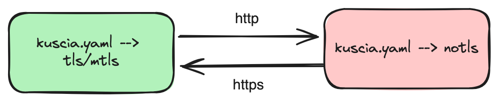
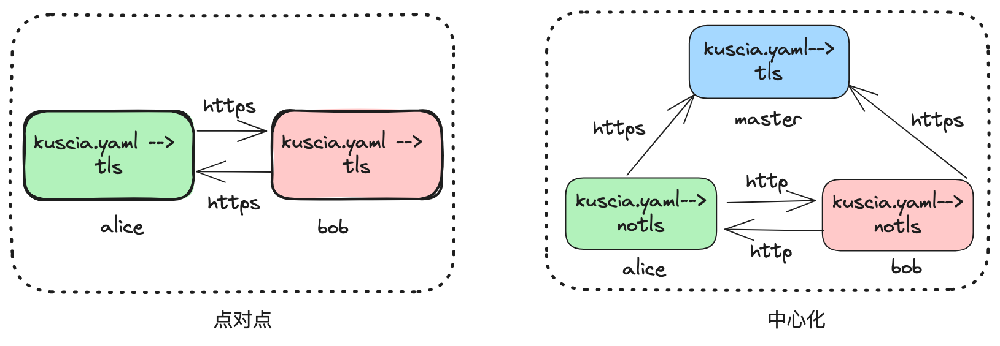

# Protocol 通信协议

## 前言
Protocol 是指 KusciaAPI 以及节点对外网关使用的通信协议，有三种通信协议可供选择：NOTLS/TLS/MTLS（不区分大小写），详情请参考[Kuscia 配置文件](../../deployment/kuscia_config_cn.md#id3)。

## 不同 Protocol 对应的 KusicaAPI 请求
KusicaAPI 支持 NOTLS/TLS/MTLS 三种通信协议，在点对点和中心化部署模式中，KusciaAPI 接口默认使用的是 MTLS 协议，不同协议使用 KusciaAPI 示例如下（此处以查询 domaindatasource 为例）：
- NOTLS 协议下，KusciaAPI 接口使用 HTTP 协议，无需指定任何证书文件，示例如下：
```bash
curl -kv -X POST 'http://localhost:8082/api/v1/domaindatasource/query' \
--header 'Content-Type: application/json' \
-d '{
    "domain_id": "alice",
    "datasource_id": "default-data-source"
}'
```
- MTLS 协议下，KusciaAPI 接口使用 HTTPS 协议，需要指定 TOKEN、CA 以及 KusciaAPI 证书文件，示例如下：
```bash
curl -X POST 'https://localhost:8082/api/v1/domaindatasource/query' \
--header "Token: $(cat /home/kuscia/var/certs/token)" \
--header 'Content-Type: application/json' \
--cert '/home/kuscia/var/certs/kusciaapi-server.crt' \
--key '/home/kuscia/var/certs/kusciaapi-server.key' \
--cacert '/home/kuscia/var/certs/ca.crt' \
-d '{
    "domain_id": "alice",
    "datasource_id": "default-data-source"
}'
```
- TLS协议下，KusciaAPI 接口使用 HTTPS 协议，需要指定 TOKEN、CA 证书文件，无需指定 KusciaAPI 证书文件，示例如下：
```bash
curl -kv -X POST 'https://localhost:8082/api/v1/domaindatasource/query' \
--cacert '/home/kuscia/var/certs/ca.crt' \
--header "Token: $(cat /home/kuscia/var/certs/token)" \
--header 'Content-Type: application/json' \
-d '{
    "domain_id": "alice",
    "datasource_id": "default-data-source"
}'
```


## 不同 Protocol 对应的节点授权
Kusica 支持的协议类型请参考[Kuscia 配置文件](../../deployment/kuscia_config_cn.md#id3)。当本节点配置的 Protocol 为 TLS/MTLS 时，对端节点访问本节点使用 HTTPS 协议，当本节点配置的 Protocol 为 NOTLS 时，对端节点访问本节点使用 HTTP 协议，如下图所示。


在[点对点模式部署](../../deployment/Docker_deployment_kuscia/deploy_p2p_cn.md)文档中，默认节点配置为 TLS 协议，即节点之间使用 HTTPS 协议进行通信。在[中心化模式部署](../../deployment/Docker_deployment_kuscia/deploy_master_lite_cn.md)文档中，默认 master 节点配置为 TLS 协议，lite 节点配置为 NOTLS 协议，即 lite 节点之间使用 HTTP 协议进行通信，lite 访问 master 使用 HTTPS 协议进行通信，如下图所示。



## 修改 Protocol 的影响以及解决方法
用户在修改 [Kusica 配置文件](../../deployment/kuscia_config_cn.md#id4)中的 Protocol 协议之后，会导致 KusciaAPI 使用方式变化以及节点间的路由状态变为不可用，使用以下方法进行解决：
- KusicaApi 调用方式参考上述[不同 Protocol 对应的 KusicaAPI 请求](#protocol-kusicaapi)进行调整。
- 通过 KusciaAPI 删除节点路由，按照上述[不同 Protocol 对应的节点授权](#id2)再重新创建。