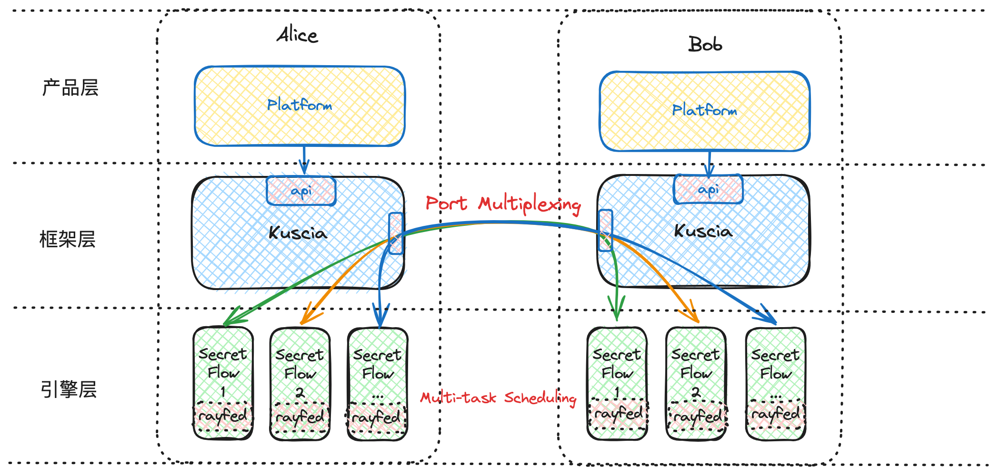
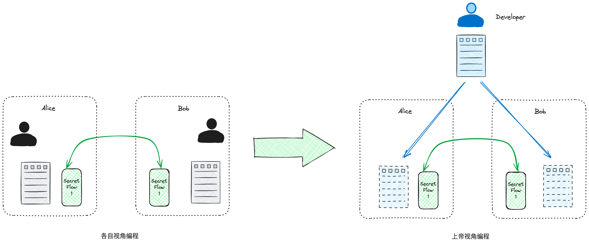

# Kuscia 与 Ray 的区别

近期收到一些社区用户反馈的困惑，比如：SecretFlow 依赖 Ray 调度框架，Kuscia 也是调度框架，那么 Ray 与 Kuscia 的关系是什么？似乎 Ray 和 Kuscia 都可以调度 SecretFlow ？我该如何选择他们呢？

## 写在前面

Kuscia 和 Ray 通常被误认为只能二选一，其实 Kuscia 与 Ray 所在的分层不同，彼此不同但相互补充。如下图所示，Ray 位于引擎层作为 SecretFlow 底层的函数级调度框架。Kuscia 位于框架层致力于解决隐私计算生产落地过程中的共性问题[详见 Kuscia 概述文档](../../reference/overview.md)。

### SecretFlow 使用 Ray 做了什么

[Ray](https://github.com/ray-project/ray) 是一个统一的框架可以无缝地将 Python 和 AI 应用程序从笔记本电脑规模化（Scaling）到集群。Ray 使分布式应用的开发工作变的更加便捷，SecretFlow 作为隐私计算应用也属于分布式应用的范畴，SecretFlow 选择使用 Ray 框架来提高隐私计算应用的开发效率，让开发者能够以上帝视角开发隐私计算算法。与开发传统应用不同，隐私计算一般涉及2方或n方，常规的隐私计算应用的开发方式是分别以不同参与方的视角编写各自的逻辑，然后在实际运行时再根据当前运行程序的角色决定跑哪一段逻辑。那么能否像开发传统应用一样开发隐私计算应用呢（如下图所示），SecretFlow 选择了 Ray 来实现这一诉求，让用户能够以上帝视角开发隐私计算应用。

下面给出以各自视角和以上帝视角编程的伪代码示例，让大家可以直观感受到两者编程的差异：

<table style="border-collapse: collapse; width: 100%;">
  <tr>
    <th colspan="2" style="border: 1px solid black;">各自视角</th>
    <th style="border: 1px solid black;">上帝视角</th>
  </tr>
  <tr>
    <td style="border: 1px solid black;">Alice</td>
    <td style="border: 1px solid black;">for each epoch: 
        &nbsp;&nbsp;&nbsp;&nbsp;for each batch: 
        &nbsp;&nbsp;&nbsp;&nbsp;&nbsp;&nbsp;&nbsp;&nbsp;a_g = Alice.calculate_grad() 
        &nbsp;&nbsp;&nbsp;&nbsp;&nbsp;&nbsp;&nbsp;&nbsp;send a_g to Server 
        &nbsp;&nbsp;&nbsp;&nbsp;&nbsp;&nbsp;&nbsp;&nbsp;wait for g 
        &nbsp;&nbsp;&nbsp;&nbsp;&nbsp;&nbsp;&nbsp;&nbsp;Alice.update_param(g) 
    </td>
    <td rowspan="3" style="border: 1px solid black;">for each epoch: 
                    &nbsp;&nbsp;&nbsp;&nbsp;for each batch: 
                    &nbsp;&nbsp;&nbsp;&nbsp;&nbsp;&nbsp;&nbsp;&nbsp;a_g = Alice.calculate_grad() 
                    &nbsp;&nbsp;&nbsp;&nbsp;&nbsp;&nbsp;&nbsp;&nbsp;b_g = Bob.calculate_grad() 
                    &nbsp;&nbsp;&nbsp;&nbsp;&nbsp;&nbsp;&nbsp;&nbsp;g = Server.agg(a_g, b_g) 
                    &nbsp;&nbsp;&nbsp;&nbsp;&nbsp;&nbsp;&nbsp;&nbsp;Alice.update_param(g) 
                    &nbsp;&nbsp;&nbsp;&nbsp;&nbsp;&nbsp;&nbsp;&nbsp;Bob.update_param(g) 
    </td>
  </tr>
  <tr>
    <td style="border: 1px solid black;">Bob</td>
        <td style="border: 1px solid black;">for each epoch: 
            &nbsp;&nbsp;&nbsp;&nbsp;for each batch: 
            &nbsp;&nbsp;&nbsp;&nbsp;&nbsp;&nbsp;&nbsp;&nbsp;b_g = Bob.calculate_grad() 
            &nbsp;&nbsp;&nbsp;&nbsp;&nbsp;&nbsp;&nbsp;&nbsp;send b_g to Server 
            &nbsp;&nbsp;&nbsp;&nbsp;&nbsp;&nbsp;&nbsp;&nbsp;wait for g 
            &nbsp;&nbsp;&nbsp;&nbsp;&nbsp;&nbsp;&nbsp;&nbsp;Bob.update_param(g) 
        </td>
  </tr>
    <tr>
      <td style="border: 1px solid black;">Server</td>
          <td style="border: 1px solid black;">for each epoch: 
              &nbsp;&nbsp;&nbsp;&nbsp;for each batch: 
              &nbsp;&nbsp;&nbsp;&nbsp;&nbsp;&nbsp;&nbsp;&nbsp;wait for a_g, b_g 
              &nbsp;&nbsp;&nbsp;&nbsp;&nbsp;&nbsp;&nbsp;&nbsp;g = Server.agg(a_g, b_g) 
              &nbsp;&nbsp;&nbsp;&nbsp;&nbsp;&nbsp;&nbsp;&nbsp;send g to Alice, Bob 
          </td>
    </tr>
</table>

## Kuscia 做了什么

SecretFlow 通过借助 Ray 的函数级调度能力，让算法开发者保持他们开发单体应用时的开发习惯，降低开发成本提高开发效率。但仍然有一些问题不是通过 Ray 解决的，比如在 POC/生产环境中部署与使用 SecretFlow 时, 仍然会面临着以下问题：

1. Rayfed 和 SPU 各有一个端口，机构只能开一个端口，如何做到端口合并。
2. SecretFlow 仅支持读取本地 CSV 文件，当数据存储在 OSS、MySQL、ODPS 中时，需要人工操作导出数据至本地 CSV 文件。
3. 当将 Secretflow 集成到系统时，有没有 HTTP/GRPC API，而不需要自己来写 Python 代码集成。
4. 当和多个机构合作时，会不会存在某个机构伪装成另外一个机构给我发请求，并且会不会访问一个我没有授权的文件？
5. 当和多个机构合作，每个任务应该使用多少资源，以及如何限制？

以上这些问题正是 Kuscia 致力于解决的隐私计算落地过程中可能遇到的共性问题。当 Kuscia 和 SecretFlow 集成的时候，Kuscia 会自动在每一个参与方拉起 Ray 集群，然后通过 Rayfed 来组织起一个隐私计算任务执行环境；任务结束后，会自动清理 Rayfed/Ray 集群资源。这样对于：

1. SecretFlow 算法的开发者（或者二开用户）能够专注于算法引擎的核心功能与性能提升，而不必分心于基础设施、跨域网络配置、任务调度等复杂问题。
2. SecretFlow 算法的集成者不需要关注 Ray 或者 SecretFlow 的底层细节，Kuscia 会自动帮助屏蔽隐私计算底层细节，让隐语能够轻量部署和简单易用。

当然 Kuscia 的能力远不止如此，更多信息请参考 [Kuscia 概述文档](../../reference/overview.md)。

## 总结一下

通过上面的介绍，Kuscia 与 Ray 的区别如下：

1. Kuscia 与 Ray 所在架构分层的层级不同。Kuscia 位于框架层，Ray 位于引擎层，当使用 Kuscia 时，用户并不需要感知 Ray，把 SecretFlow 当做黑盒即可。
2. Kuscia 是任务（容器 or 进程）级别的调度，Ray 是函数级别的调度（在 SecretFlow 引擎中）。
3. Ray 在 SecretFlow 中解决的是隐私计算应用开发效率与成本的问题。Kuscia 聚焦于解决的是跨域网络、跨域任务调度、安全性等隐私计算生产落地的问题。
4. Ray 解决的是 SecretFlow 引擎中函数级调度的问题，Kuscia 解决的是所有隐私计算引擎在落地生产过程中都可能遇到的共性问题。
