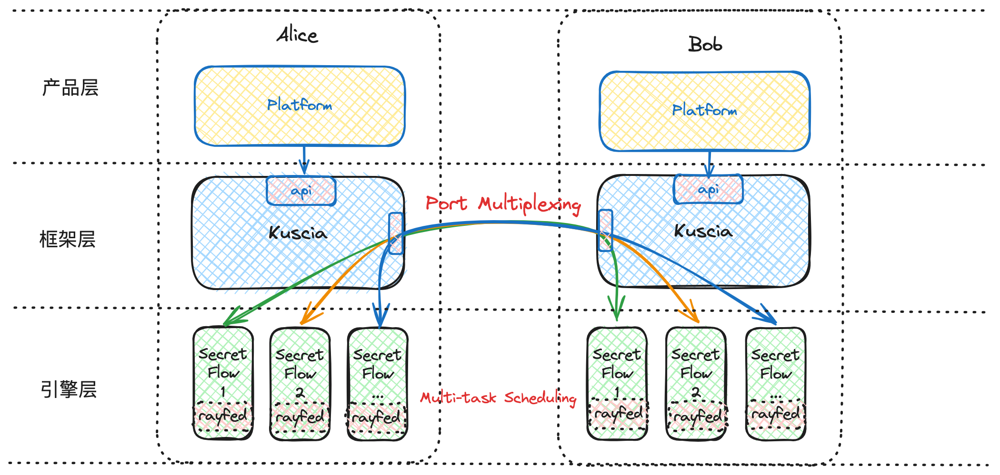
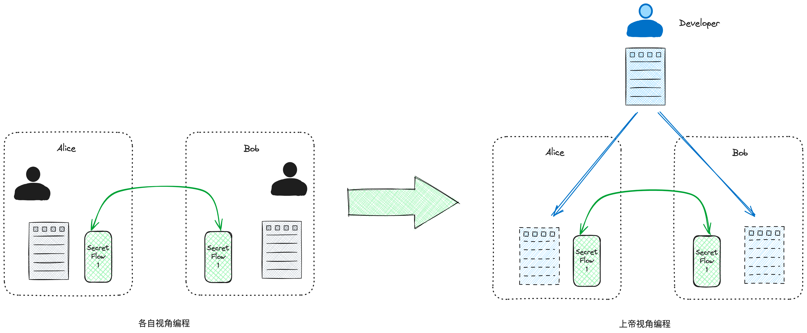

# Differences Between Kuscia and Ray

Recently, we've received feedback from community users expressing confusion, such as: SecretFlow depends on the Ray scheduling framework, and Kuscia is also a scheduling framework, so what is the relationship between Ray and Kuscia? It seems that both Ray and Kuscia can schedule SecretFlow? How should I choose between them?

## Preface

Kuscia and Ray are often mistakenly thought to be mutually exclusive, but in fact, Kuscia and Ray operate at different layers, being different yet complementary to each other. As shown in the figure below, Ray is positioned at the engine layer as a function-level scheduling framework for SecretFlow. Kuscia is positioned at the framework layer, dedicated to solving common problems in the production deployment of privacy computing [see Kuscia Overview Document for details](../../reference/overview.md).

### What SecretFlow Uses Ray For

[Ray](https://github.com/ray-project/ray) is a unified framework that seamlessly scales Python and AI applications from laptop to cluster. Ray makes the development of distributed applications more convenient. As a privacy computing application, SecretFlow also falls within the category of distributed applications. SecretFlow chooses to use the Ray framework to improve the development efficiency of privacy computing applications, allowing developers to develop privacy computing algorithms from a god's-eye view. Unlike developing traditional applications, privacy computing typically involves 2 or n parties. The conventional approach to developing privacy computing applications is to write separate logic from the perspective of different participants, and then decide which logic to run based on the role of the current running program during actual execution. So, is it possible to develop privacy computing applications like traditional applications (as shown in the figure below)? SecretFlow chose Ray to achieve this goal, allowing users to develop privacy computing applications from a god's-eye view.

Below are pseudocode examples of programming from individual perspectives and from a god's-eye view, allowing everyone to intuitively feel the difference between the two programming approaches:

<table style="border-collapse: collapse; width: 100%;">
  <tr>
    <th colspan="2" style="border: 1px solid black;">Individual Perspectives</th>
    <th style="border: 1px solid black;">God's-Eye View</th>
  </tr>
  <tr>
    <td style="border: 1px solid black;">Alice</td>
    <td style="border: 1px solid black;">for each epoch: 
        &nbsp;&nbsp;&nbsp;&nbsp;for each batch: 
        &nbsp;&nbsp;&nbsp;&nbsp;&nbsp;&nbsp;&nbsp;&nbsp;a_g = Alice.calculate_grad() 
        &nbsp;&nbsp;&nbsp;&nbsp;&nbsp;&nbsp;&nbsp;&nbsp;send a_g to Server 
        &nbsp;&nbsp;&nbsp;&nbsp;&nbsp;&nbsp;&nbsp;&nbsp;wait for g 
        &nbsp;&nbsp;&nbsp;&nbsp;&nbsp;&nbsp;&nbsp;&nbsp;Alice.update_param(g) 
    </td>
    <td rowspan="3" style="border: 1px solid black;">for each epoch: 
                    &nbsp;&nbsp;&nbsp;&nbsp;for each batch: 
                    &nbsp;&nbsp;&nbsp;&nbsp;&nbsp;&nbsp;&nbsp;&nbsp;a_g = Alice.calculate_grad() 
                    &nbsp;&nbsp;&nbsp;&nbsp;&nbsp;&nbsp;&nbsp;&nbsp;b_g = Bob.calculate_grad() 
                    &nbsp;&nbsp;&nbsp;&nbsp;&nbsp;&nbsp;&nbsp;&nbsp;g = Server.agg(a_g, b_g) 
                    &nbsp;&nbsp;&nbsp;&nbsp;&nbsp;&nbsp;&nbsp;&nbsp;Alice.update_param(g) 
                    &nbsp;&nbsp;&nbsp;&nbsp;&nbsp;&nbsp;&nbsp;&nbsp;Bob.update_param(g) 
    </td>
  </tr>
  <tr>
    <td style="border: 1px solid black;">Bob</td>
        <td style="border: 1px solid black;">for each epoch: 
            &nbsp;&nbsp;&nbsp;&nbsp;for each batch: 
            &nbsp;&nbsp;&nbsp;&nbsp;&nbsp;&nbsp;&nbsp;&nbsp;b_g = Bob.calculate_grad() 
            &nbsp;&nbsp;&nbsp;&nbsp;&nbsp;&nbsp;&nbsp;&nbsp;send b_g to Server 
            &nbsp;&nbsp;&nbsp;&nbsp;&nbsp;&nbsp;&nbsp;&nbsp;wait for g 
            &nbsp;&nbsp;&nbsp;&nbsp;&nbsp;&nbsp;&nbsp;&nbsp;Bob.update_param(g) 
        </td>
  </tr>
    <tr>
      <td style="border: 1px solid black;">Server</td>
          <td style="border: 1px solid black;">for each epoch: 
              &nbsp;&nbsp;&nbsp;&nbsp;for each batch: 
              &nbsp;&nbsp;&nbsp;&nbsp;&nbsp;&nbsp;&nbsp;&nbsp;wait for a_g, b_g 
              &nbsp;&nbsp;&nbsp;&nbsp;&nbsp;&nbsp;&nbsp;&nbsp;g = Server.agg(a_g, b_g) 
              &nbsp;&nbsp;&nbsp;&nbsp;&nbsp;&nbsp;&nbsp;&nbsp;send g to Alice, Bob 
          </td>
    </tr>
</table>

## What Kuscia Does

SecretFlow leverages Ray's function-level scheduling capabilities to allow algorithm developers to maintain their development habits from single application development, reducing development costs and improving efficiency. However, there are still some issues that are not solved through Ray, such as when deploying and using SecretFlow in POC/production environments, the following problems still exist:

1. Rayfed and SPU each have a port, but institutions can only open one port, so how to achieve port consolidation.
2. SecretFlow only supports reading local CSV files. When data is stored in OSS, MySQL, ODPS, manual operations are required to export data to local CSV files.
3. When integrating Secretflow into a system, is there an HTTP/GRPC API available, so that writing Python code for integration is not necessary.
4. When collaborating with multiple institutions, is there a risk of one institution impersonating another to send requests to me, and could they access a file that I haven't authorized?
5. When collaborating with multiple institutions, how many resources should each task use, and how to set limits?

These are precisely the common problems in privacy computing deployment that Kuscia aims to solve. When Kuscia integrates with SecretFlow, Kuscia automatically starts a Ray cluster at each participant, and then organizes a privacy computing task execution environment through Rayfed; after the task is completed, it automatically cleans up Rayfed/Ray cluster resources. This way:

1. SecretFlow algorithm developers (or secondary development users) can focus on the core functionality and performance improvement of the algorithm engine, without being distracted by infrastructure, cross-domain network configuration, task scheduling, and other complex issues.
2. SecretFlow algorithm integrators don't need to be concerned with the underlying details of Ray or SecretFlow. Kuscia will automatically help shield the underlying details of privacy computing, making SecretFlow lightweight to deploy and simple to use.

Of course, Kuscia's capabilities extend far beyond this. For more information, please refer to the [Kuscia Overview Document](../../reference/overview.md).

## Summary

Through the above introduction, the differences between Kuscia and Ray are as follows:

1. Kuscia and Ray are at different levels in the architectural layering. Kuscia is at the framework layer, while Ray is at the engine layer. When using Kuscia, users do not need to be aware of Ray and can treat SecretFlow as a black box.
2. Kuscia schedules at the task (container or process) level, while Ray schedules at the function level (within the SecretFlow engine).
3. Ray solves the issues of development efficiency and cost for privacy computing applications in SecretFlow. Kuscia focuses on solving problems in production deployment of privacy computing, such as cross-domain networking, cross-domain task scheduling, and security.
4. Ray solves the problem of function-level scheduling within the SecretFlow engine, while Kuscia solves common problems that all privacy computing engines may encounter during production deployment.
