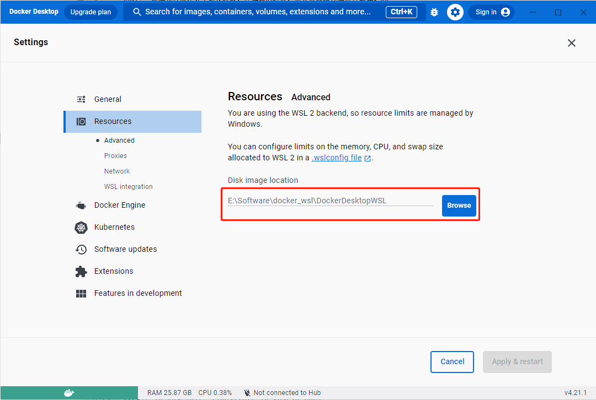

# Notes on Using WSL

## Starting Docker in WSL

**When using Docker in WSL, it is recommended to install Docker Desktop**. The specific installation steps are as follows:

1. **Modify the default installation path**

   Docker Desktop is installed by default in "C:\Program Files\Docker", which is a read-only path. If not modified, you will not be able to perform write operations (such as creating or modifying files/folders), and may encounter errors during deployment:
  
   ```shell
   Error response from daemon: mkdir /var/lib/docker/temp/docker-export-709988460:read-only file system
   ```

   You need to create a Docker Desktop installation path in a non-read-only directory (such as D drive) (e.g., D:\Docker), then run cmd as administrator and create a link with the following command:

   ```shell
   mklink /J "C:\Program Files\Docker" "D:\Docker"
   ```

After creating this link, installing Docker normally will install it on the D drive.

2. Installation (refer to the official Docker installation documentation [Install Docker Desktop on Windows](https://docs.docker.com/desktop/install/windows-install/))

   1. Download [Docker Desktop for Windows](https://www.docker.com/products/docker-desktop/) from the Docker official website;
   2. Double-click the downloaded 'Docker Desktop Installer.exe';
   3. Install using the officially recommended WSL2 option (check: "Use the WSL 2 based engine");
   4. Follow the instructions on the installation wizard to authorize the installer and continue with the installation;
   5. After successful installation, click "Close" to complete the installation process;

3. Recommended to modify the image storage path

   Docker images are stored on the C drive by default. If you need to [deploy and run FATE jobs](../../tutorial/run_fate_cn.md), this may cause insufficient space on the C drive. Therefore, it is recommended to change to another disk with sufficient space. Specifically, open Docker Desktop, go to Settings->Resources->Browse, and modify the image storage path.
   
