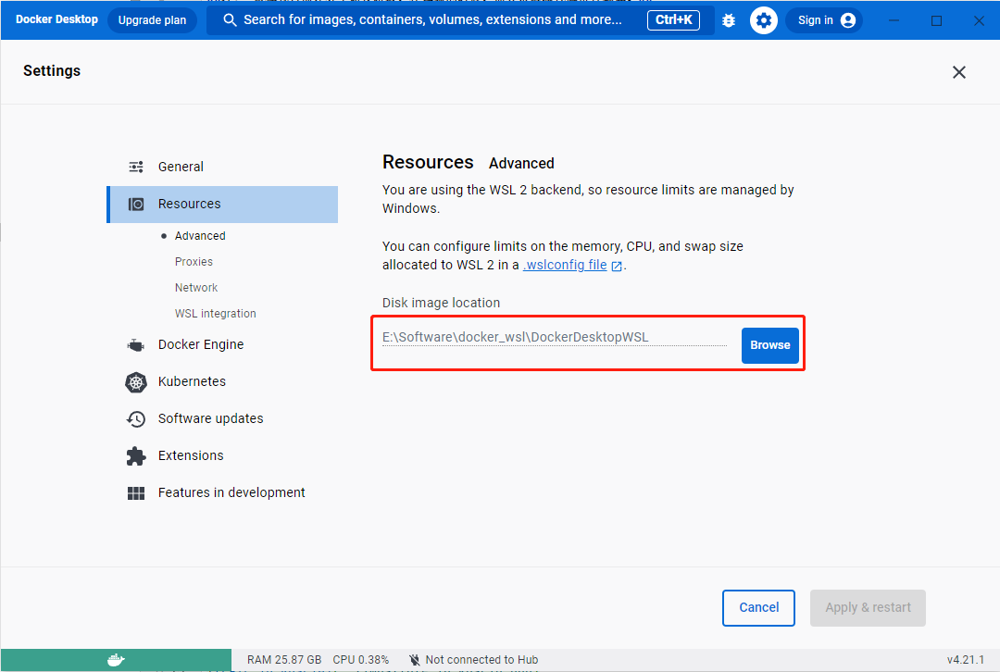

# 使用 WSL 注意事项

## WSL 启动 Docker
**WSL 中想要使用 Docker，建议安装 docker desktop**，具体安装步骤如下：

1. **修改默认安装路径**

    Docker Desktop 默认安装在 "C:\Program Files\Docker"，该路径是一个只读路径，如果不修改，将无法进行写操作（比如创建或修改文件/文件夹），在部署时可能报错：
```shell
Error response from daemon: mkdir /var/lib/docker/temp/docker-export-709988460:read-only file system
```
需要在非只读目录（如 D 盘）下创建 Docker Desktop 默认安装路（如 D：\Docker），然后以管理员身份运行 cmd，通过以下命令创建链接:
```shell
mklink /J "C:\Program Files\Docker" "D:\Docker"
```
这样创建链接之后，按正常步骤安装 docker 就会安装在 D 盘里了。
2. 安装（参考 Docker 官方安装文档 [Install Docker Desktop on Windows](https://docs.docker.com/desktop/install/windows-install/)）

从 Docker 官网下载 [Docker Desktop for Windows](https://www.docker.com/products/docker-desktop/);

双击下载的 'Docker Desktop Installer.exe';

使用官方建议的 WSL2 选项安装（勾选："Use the WSL 2 based engine"）;

按照安装向导上的说明授权安装程序，并继续安装;

安装成功后，单击"关闭"完成安装过程;
3. 建议修改镜像保存路径

Docker 镜像默认保存在 C 盘， 如果要[部署和运行 FATE 作业](https://www.secretflow.org.cn/docs/kuscia/latest/zh-Hans/tutorial/run_fate_cn)，可能导致 C 盘空间不足，因此建议改为其他空间足够的磁盘。具体做法是，打开 Docker Desktop，找到 Settings->Resources->Browse，修改镜像保存路径。
