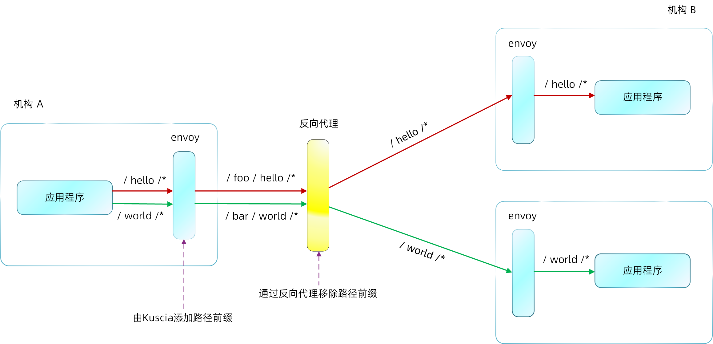

# 如何配置 Kuscia 对请求进行 Path Rewrite

## 背景

隐私计算合作机构之间的网络较为复杂，经常存在多层次的网关，网关根据 Path 将请求路由到真正的业务节点。为了给这种组网提供支持，Kuscia 能够对业务请求进行 Path Rewrite，将对应的路由前缀添加到请求 Path。



:::{tip}
网关要求：机构网关处需要进行 Path 前缀卸载。
:::

## 多机部署配置 Path Rewrite

- Kuscia 中心化部署参考[这里](../deployment/Docker_deployment_kuscia/deploy_master_lite_cn.md)
- Kuscia 点对点部署参考[这里](../deployment/Docker_deployment_kuscia/deploy_p2p_cn.md)

下面以 Alice 机构访问 Bob、Carol 机构的通信配置作为示例，其中 Nginx 服务器地址为 1.1.1.1，Bob 机构地址为 2.2.2.2，Carol 机构地址为 3.3.3.3。

```bash
# alice accesses bob's address
http://1.1.1.1/foo

# alice accesses carol's address
http://1.1.1.1/bar
```

Nginx 配置示例如下：

```bash
http {
    # Default is HTTP/1, keepalive is only enabled in HTTP/1.1
    proxy_http_version 1.1;
    proxy_set_header Connection "";
    proxy_set_header Host $http_host;
    proxy_pass_request_headers on;

    access_log /var/log/access.log;
    # To allow special characters in headers
    ignore_invalid_headers off;

    # Maximum number of requests through one keep-alive connection
    keepalive_requests 1000;
    keepalive_timeout 20m;

    client_max_body_size 2m;

    # To disable buffering
    proxy_buffering off;
    proxy_request_buffering off;

    upstream bob {
        server 2.2.2.2:11080 weight=1 max_fails=5 fail_timeout=60s;
        keepalive 32;
        keepalive_timeout 600s;
        keepalive_requests 1000;
    }

    upstream carol {
        server 3.3.3.3:21080 weight=1 max_fails=5 fail_timeout=60s;
        keepalive 32;
        keepalive_timeout 600s;
        keepalive_requests 1000;
    }

    # The reverse proxy needs to remove the prefix path before forwarding
    server {
        location /foo/ {
            proxy_read_timeout 10m;
            proxy_pass https://bob/;
        }
        location /bar/ {
            proxy_read_timeout 10m;
            proxy_pass https://carol/;
        }
    }
}
```

## 使用 KusciaAPI 配置 Path Rewrite

使用 KusciaAPI 要配置一条 Path Rewrite 路由规则，需要设置 `endpoint` 的 `prefix` 字段。

下面以机构 Alice 访问机构 Bob 的场景为例，当机构 Bob 网关地址带 Path 时如何调用 KusciaAPI 设置 `endpoint` 的 `prefix` 字段。

```bash
# Execute the example inside the container
# --cert is the certificate used for mutual authentication with the server
export CTR_CERTS_ROOT=/home/kuscia/var/certs
curl -k -X POST 'https://localhost:8082/api/v1/route/create'
--header "Token: $(cat ${CTR_CERTS_ROOT}/token)"
--header 'Content-Type: application/json'
--cert ${CTR_CERTS_ROOT}/kusciaapi-server.crt
--key ${CTR_CERTS_ROOT}/kusciaapi-server.key
--cacert ${CTR_CERTS_ROOT}/ca.crt  -d '{
  "authentication_type": "Token",
  "destination": "bob",
  "endpoint": {
    "host": "1.1.1.1",
    "ports": [
      {
        "port": 80,
        "protocol": "HTTP",
        "isTLS": true, # If the gateway is a domain and supports https, set to true, otherwise set to false
        "path_prefix": "/foo"
      }
    ]
  },
  "source": "alice",
  "token_config": {
    "token_gen_method": "RSA-GEN"
  }
}'
```
