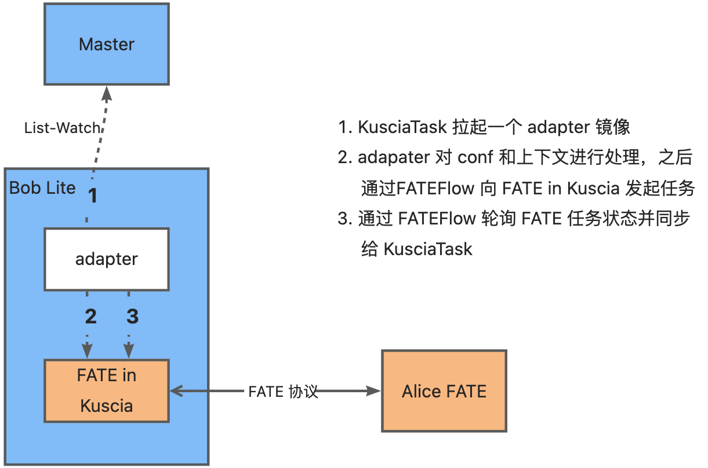

# 如何运行一个 FATE 作业

本教程介绍了如何通过 Kuscia 运行一个 LR 流程的 [FATE](https://fate.readthedocs.io) Pipeline 作业。

**注： 该模式目前还处于研发阶段，在体验的时候，需要依赖源代码进行编译。**

## 准备节点

准备 Kuscia 节点请参考 [快速入门](../getting_started/quickstart_cn.md)。

## 准备 FATE 集群

这里假定 Alice 与 Bob 两个机构间进行基于 FATE 的联邦学习实验。其中 Alice 是一家部署了 FATE 的机构，Bob 是一家部署 Kuscia 的机构，我们期望在 Bob 的 Kuscia 集群中部署 FATE，并达到与 Alice 的 FATE 集群进行联合计算的目的。后续我们将在 Bob 中发起 FATE 作业的 KusciaJob。


当然，如果你有已经部署好的 FATE 集群，可以跳过该步骤。**只要 FATEFlow 端口开放，无需进行任何修改就可以使用 KusciaJob 对 FATE 集群发起联邦学习作业！**

注意： FATE 默认使用 8G 的内存，请确保机器资源是否足够。

### 构建镜像

部署 FATE 集群首先要准备相应的镜像，包括 FATE 集群镜像（v1.11.1 版本的 FATE）以及运行 FATE 作业的 AppImage 镜像：

```shell
# Enter the FATE-related file directory
cd thirdparty/fate

# Build the FATE deployment image
make deploy-image

# Build the AppImage image
make fate-adaptor-app-image
```

#### adapter 镜像

每一个 KusciaTask 会通过 AppImage 中的 adapter 镜像向 FATE 集群发起任务，并保持 KusciaTask 状态与 FATE 任务的状态一致。

以中心化组网的 Kuscia 为例，整个过程为：



### 部署 FATE

在节点准备完毕后，运行 FATE 集群部署脚本，脚本会进行三步操作：

1. 检查部署 FATE 的 Kuscia 节点中是否包括上述镜像，若无则将镜像放入对应节点。
2. 在指定 Domain 下部署 Kuscia 外的 FATE 集群。
3. 在指定 Domain 下将 FATE 集群部署进 Kuscia 节点。

```shell
# The script includes 4 parameters: Kuscia control node name, Kuscia node name for deploying FATE, Kuscia Domain for deploying FATE, and a separate Domain for deploying FATE
bash ./thirdparty/fate/scripts/deploy/start_fate.sh {control_node} {kuscia_node_for_fate} {kuscia_domain_for_fate} {separate_domain_for_fate}
```

#### 中心化组网模式

中心化组网模式下，在容器外的 Kuscia 代码根目录执行脚本：

```shell
bash ./thirdparty/fate/scripts/deploy/start_fate.sh ${USER}-kuscia-master ${USER}-kuscia-lite-bob bob alice

# Check if Alice's FATE service is started (look for a container named fate-alice)
docker ps

# Enter the Master container to confirm that Bob's FATE service has started (ensure that the Pod status with the fate-deploy-bob prefix is Running)
docker exec -it ${USER}-kuscia-master bash
kubectl get pods -n bob
## Output example:
NAME                               READY   STATUS    RESTARTS   AGE
fate-deploy-bob-6798765d84-84rm7   1/1     Running   0          6m34s
```

脚本将在 Bob Lite 中部署 Bob 命名空间下的 FATE 集群以及 Kuscia 节点外 Alice 机构的 fate-alice FATE 集群。

#### P2P 组网模式

P2P 组网模式下，在容器外的 Kuscia 代码根目录下执行脚本：

```shell
bash ./thirdparty/fate/scripts/deploy/start_fate.sh ${USER}-kuscia-autonomy-bob ${USER}-kuscia-autonomy-bob bob alice

# Check if Alice's FATE service is started (look for a container named fate-alice)
docker ps

# Enter the Bob container to confirm that Bob's FATE service has started (ensure that the Pod status with the fate-deploy-bob prefix is Running)
docker exec -it ${USER}-kuscia-autonomy-bob bash
kubectl get pods -n bob
## Output example:
NAME                               READY   STATUS    RESTARTS   AGE
fate-deploy-bob-6798765d84-84rm7   1/1     Running   0          6m34s
```

脚本将在 Bob Autonomy 中部署 Bob 命名空间下的 FATE 集群，以及 Kuscia 节点外 Alice 机构的 fate-alice FATE 集群。

整个部署时长与部署的目标机器配置相关。在 4C16G 的节点上时间花销为 20 min 左右。可以登入对应的 节点|Pod 中查看 FATE 的部署日志，当打印出 **HAVE FUN** 则表明当前环境的 FATE 部署成功：


**中心化组网下 Bob Lite 中 FATE in Kuscia 部署日志：**

```shell
# Log in to the Bob lite container
docker exec -it ${USER}-kuscia-lite-bob bash

# View running containers and find the FATE deployment container: fate-deploy-bob, copy its CONTAINER-ID
crictl ps

# Log in to the container using the CONTAINER-ID
crictl exec -it ${CONTAINER-ID} bash

# View FATE deployment logs
tail -f fate_cluster_install_1.11.1_release/allInone/logs/deploy-host.log
```

**P2P 组网下 Bob Autonomy 中 FATE in Kuscia 部署日志：**

```shell
# Log in to the Bob Autonomy container
docker exec -it ${USER}-kuscia-autonomy-bob bash

# View running containers and find the FATE deployment container: fate-deploy-bob, copy its CONTAINER-ID
crictl ps

# Log in to the container using the CONTAINER-ID
crictl exec -it ${CONTAINER-ID} bash

# View FATE deployment logs
tail -f fate_cluster_install_1.11.1_release/allInone/logs/deploy-host.log
```

**Kuscia 节点外 Alice 机构的 fate-alice 部署日志：**

```shell
# Log in to the fate-alice container
docker exec -it fate-alice bash

# View FATE deployment logs
tail -f fate_cluster_install_1.11.1_release/allInone/logs/deploy-host.log
```

当 FATE 集群部署成功后，就可以通过 Kuscia 去运行 FATE 作业了。

## 准备数据

FATE 镜像中带有两份测试数据，分别为 10 维 1W 行不带 label 的 lr_host 与 4 维 1W 行带 label 的 lr_guest。当然你也可以参考 FATE 文档将自己的数据导入到 FATE 集群中。

镜像自带测试数据会在 FATE 部署成功后自动上传到 FATE 集群，数据上传的作业信息会在日志中打印。以 ``fate-alice`` 为例：

```shell
docker logs -f fate-alice

wait to upload data, sleep 10
...
wait to upload data, sleep 10
/data/projects
upload guest data
{
    "data": {
        "board_url": "http://xxx.xxx.xxx.xxx:8080/index.html#/dashboard?job_id={jobId}&role=local&party_id=0",
        "code": 0,
        "dsl_path": "/data/projects/fate/fateflow/jobs/{jobId}/job_dsl.json",
        "job_id": "{jobId}",
        "logs_directory": "/data/projects/fate/fateflow/logs/{jobId}",
        "message": "success",
        "model_info": {
            "model_id": "local-0#model",
            "model_version": "{jobId}"
        },
        "namespace": "experiment",
        "pipeline_dsl_path": "/data/projects/fate/fateflow/jobs/{jobId}/pipeline_dsl.json",
        "runtime_conf_on_party_path": "/data/projects/fate/fateflow/jobs/{jobId}/local/0/job_runtime_on_party_conf.json",
        "runtime_conf_path": "/data/projects/fate/fateflow/jobs/{jobId}/job_runtime_conf.json",
        "table_name": "lr_guest",
        "train_runtime_conf_path": "/data/projects/fate/fateflow/jobs/{jobId}/train_runtime_conf.json"
    },
    "jobId": "{jobId}",
    "retcode": 0,
    "retmsg": "success"
}

sleep 30
upload host data
{
    "data": {
        "board_url": "http://xxx.xxx.xxx.xxx:8080/index.html#/dashboard?job_id={jobId}&role=local&party_id=0",
        "code": 0,
        "dsl_path": "/data/projects/fate/fateflow/jobs/{jobId}/job_dsl.json",
        "job_id": "{jobId}",
        "logs_directory": "/data/projects/fate/fateflow/logs/{jobId}",
        "message": "success",
        "model_info": {
            "model_id": "local-0#model",
            "model_version": "{jobId}"
        },
        "namespace": "experiment",
        "pipeline_dsl_path": "/data/projects/fate/fateflow/jobs/{jobId}/pipeline_dsl.json",
        "runtime_conf_on_party_path": "/data/projects/fate/fateflow/jobs/{jobId}/local/0/job_runtime_on_party_conf.json",
        "runtime_conf_path": "/data/projects/fate/fateflow/jobs/{jobId}/job_runtime_conf.json",
        "table_name": "lr_host",
        "train_runtime_conf_path": "/data/projects/fate/fateflow/jobs/{jobId}/train_runtime_conf.json"
    },
    "jobId": "{jobId}",
    "retcode": 0,
    "retmsg": "success"
}
```

下文中的示例 FATE 作业会使用此处上传的测试数据。如要运行示例作业，需等待其上传成功后再发起作业。

## 运行示例 FATE 作业

确保 FATE 部署完毕后，就可以运行 FATE 作业了。

Kuscia 中已经内置了一份 FATE 示例作业，可以登入对应的管控容器去执行。

```shell
# Log in to the control container in the centralized networking
docker exec -it ${USER}-kuscia-master bash

# Log in to the node container in the P2P networking for deploying the FATE cluster
docker exec -it ${USER}-kuscia-autonomy-bob bash

# Run the example job script
sh scripts/templates/fate/lr_job.sh

# View the job
kubectl get kj -n cross-domain

# View the task
kubectl get kt -n cross-domain
```

示例作业的相关文件位于容器的 `/home/kuscia/scripts/templates/fate` 目录下，描述了由 读数据、数据转换、隐私求交、LR、二分类评估 算子构成的一个 LR 流程的 Pipeline。`lr_job.sh` 脚本完成了相应的 AppImage 与 KusciaJob 配置以及作业提交。


你可以修改相关的配置并依旧采用该流程来运行自己想要的 Pipeline。当然你也可以按照下文去定义配置并提交自己的 KusciaJob。

## 配置 AppImage

运行 FATE 作业的 AppImage 相对来说要简单很多。下述为示例作业的 AppImage yaml（位于容器 `/home/kuscia/scripts/templates/fate/fate_job.yaml`）。

如果想在已经部署好的 FATE 集群上发起作业，只需要将 yaml 中容器启动命令的 `{{.CLUSTER_IP}}` 修改为 initiator 的 FATE 集群 IP 即可。

```yaml
apiVersion: kuscia.secretflow/v1alpha1
kind: AppImage
metadata:
  name: fate-image
spec:
  configTemplates:
    task-config.conf: |
      {
        "task_id": "{{.TASK_ID}}",
        "task_input_config": "{{.TASK_INPUT_CONFIG}}",
        "task_input_cluster_def": "{{.TASK_CLUSTER_DEFINE}}",
        "allocated_ports": "{{.ALLOCATED_PORTS}}"
      }
  deployTemplates:
    - name: secretflow
      replicas: 1
      spec:
        containers:
          - name: fate-adapter
            command:
              - sh
              - -c
              - fate job -c /home/kuscia/etc/kuscia/task-config.conf -a {{.CLUSTER_IP}}
            configVolumeMounts:
              - mountPath: /home/kuscia/etc/kuscia/task-config.conf
                subPath: task-config.conf
        restartPolicy: Never
  image:
    id: fate-adapter
    name: secretflow/fate-adapter
    sign: fate-adapter
    tag: "0.0.1"

```

## 配置 KusciaJob

KusciaJob 描述了一个 Pipeline，其中一个 **KusciaTask 对应一个 op 算子**。当然你也可以让一个 KusciaTask 去执行整条 Pipeline，其取决于 `taskInputConfig` 中的定义。

对于示例中的 Pipeline，其 KusciaJob yaml 位于容器 `/home/kuscia/scripts/templates/fate/fate_job.yaml` 。如果需要查看可以进入发起任务的管控容器。

在该 yaml 中需要注意：

- `appImage` 需要指定为上述配置的 AppImage。
- `parties` 只填写 initiator 一方的 Domain name 即可。
- FATE 中相关的 dsl 与 conf 配置在每个 KusciaTask 的 `taskInputConfig` 字段中进行定义。
- 每个 KusciaTask 的 `alias` 和 `taskID` 需要与 `taskInputConfig` 中 dsl 的 op name 保持一致！

下述以 LR 算子为例，其 `taskInputConfig` 定义在 `/home/kuscia/scripts/templates/fate/task_input_config.hetero_lr.json`。在 KusciaJob yaml 中其 `alias` 为 `{{.JOB_NAME}}-hetero-lr`，依赖项为 `{{.JOB_NAME}}-intersection`；而在 `taskInputConfig` 中其 component name 同样为 `{{.JOB_NAME}}-hetero-lr`，依赖上游 `{{.JOB_NAME}}-intersection` 的输入。

```json
{
  "runtime_conf": {
    "dsl_version": 2,
    "initiator": {
      "role": "guest",
      "party_id": 10000
    },
    "role": {
      "host": [
        9999
      ],
      "guest": [
        10000
      ],
      "arbiter": [
        9999
      ]
    },
    "component_parameters": {
      "common": {
        "{{.JOB_NAME}}-hetero-lr": {
          "alpha": 0.01,
          "batch_size": -1,
          "cv_param": {
            "n_splits": 5,
            "need_cv": false,
            "random_seed": 103,
            "shuffle": false
          },
          "early_stop": "diff",
          "encrypt_param": {
            "key_length": 1024
          },
          "init_param": {
            "fit_intercept": true,
            "init_method": "zeros"
          },
          "learning_rate": 0.15,
          "max_iter": 30,
          "optimizer": "rmsprop",
          "penalty": "L2",
          "tol": 0.0001,
          "validation_freqs": 3
        }
      },
      "role": {}
    }
  },
  "dsl": {
    "components": {
      "{{.JOB_NAME}}-hetero-lr": {
        "module": "HeteroLR",
        "input": {
          "data": {
            "train_data": [
              "{{.JOB_NAME}}-intersection.data"
            ]
          }
        },
        "output": {
          "data": [
            "data"
          ],
          "model": [
            "model"
          ]
        }
      }
    }
  }
}
```
